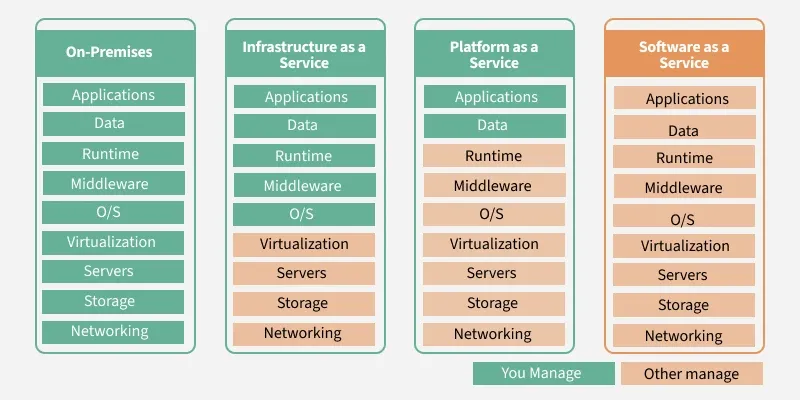

ec2 feature
price
components

# What is Cloud (Cloud Computing) ? 
Cloud computing refers to the delivery of computing services—like servers, storage, databases, networking, software, analytics, and intelligence—over the internet ("the cloud") instead of using local computers or servers.

Basically: “Cloud computing” is the act of consuming or providing IT services via the cloud.

---
Cloud = Renting computing resources over the internet instead of owning them.

Basically: “The Cloud” is the environment where everything lives and runs.

---
```
| Type     | Description                                               Example                        |
| -------- | ------------------------------------------------------- | ------------------------------ |
| **IaaS** | Infrastructure as a Service – virtual machines, storage | AWS EC2, Google Compute Engine |
| **PaaS** | Platform as a Service – app hosting + development tools | Heroku, Google App Engine      |
| **SaaS** | Software as a Service – complete apps via web           | Gmail, Google Docs, Dropbox    |

```
---
# what is Virtualization ?
Virtualization allows you to run multiple virtual computers (VMs) on a single physical machine by abstracting hardware resources.
Each behaves like a separate computer — but all are running on one physical machine using virtualization software (called a hypervisor).
```
| Type                      | Description                                  | Example          |
| ------------------------- | -------------------------------------------- | ---------------- |
| **Server**                | Multiple VMs on one physical server          | VMware ESXi, KVM |
| **Storage**               | Pooling multiple storage devices into one    | SAN, NAS         |
| **Network**               | Creating virtual networks from physical ones | VLAN, SDN        |
| **Desktop**               | Virtual desktops delivered over network      | VDI, Citrix      |
| **OS-level (Containers)** | Virtualization at OS level (lightweight)     | Docker, LXC      |

```

# Key Components:
- Hypervisor: Software that enables virtualization (e.g., VMware, VirtualBox, KVM).

- Virtual Machine (VM): Emulated computer running its own OS.

- Guest OS: The operating system inside a VM.

- Host Machine: The actual physical computer.

# Benefits:
- Efficient hardware use

- Cost savings

- Isolation (VMs are separated)

- Easier testing/development

- Disaster recovery & flexibility
# Public Cloud

- Definition: A cloud environment shared across multiple organizations, provided and managed by a third-party vendor.

- Ownership: Infrastructure is owned and operated by providers like AWS, Google Cloud, Microsoft Azure, etc.

- Access: Accessible to anyone (via internet) who wants to use or purchase services.

- Cost: Pay-as-you-go model; cost-effective for small to mid-sized businesses.

- Scalability: Highly scalable; resources can be expanded easily.

- Security: Shared responsibility model — vendor handles infrastructure security, client handles data/app security.

# Private Cloud
- Definition: A cloud environment dedicated to a single organization.

- Ownership: Infrastructure is owned and managed by the organization or a third party, either on-premises or hosted privately.

- Access: Restricted to the organization’s users.

- Cost: More expensive, as it includes hardware, maintenance, and operations.

- Scalability: Less scalable than public cloud (requires physical upgrades).

- Security: Offers higher control and customization, ideal for companies with strict compliance or sensitive data.
---
# Why Public Cloud ?
Choosing a public cloud over a private cloud often comes down to cost, flexibility, scalability, and ease of use. Here's why organizations typically prefer the public cloud:

# 1. Lower Cost
- No upfront hardware investment — you rent infrastructure instead of buying.

- Pay-as-you-go pricing model — pay only for what you use (CPU, storage, bandwidth).

- Ideal for startups or businesses with limited budgets.

#  2. Easy to Scale
- Instantly scale resources up or down based on demand.

- Perfect for workloads with fluctuating traffic (e.g., e-commerce, streaming services).

# 3. Faster Deployment
- Launch servers, storage, databases, and services in minutes.

- No need to wait for hardware setup or procurement.

# 4. Managed Infrastructure
- Cloud providers handle maintenance, upgrades, patches, and security of the infrastructure.

- Frees your team to focus on building applications or services instead of managing hardware.

# 5. Global Availability
- Deploy applications in data centers around the world with just a few clicks.

- Reduce latency for users in different geographic regions.

# 6. Reliability and Redundancy
- Built-in disaster recovery, load balancing, and automatic backups.

- High availability with SLA guarantees (e.g., 99.99% uptime).

# 7. Access to Advanced Services
Use cutting-edge technologies like:

- AI/ML (Amazon SageMaker, Google Vertex AI)

- Serverless (AWS Lambda, Azure Functions)

- Big Data & Analytics (BigQuery, Redshift)

#  When Public Cloud is Better:
- You want cost-effective solutions.

- You need to scale quickly.

- You have non-sensitive workloads.

- You don’t want to manage physical infrastructure.

```markdown

# 1. Region
## Definition: 
A region is a geographically distinct location where AWS clusters its data centers. Each region is completely independent of the others.
Purpose: Provides the ability to place resources close to end-users for lower latency and compliance with data sovereignty regulations.
## Characteristics:
Contains multiple Availability Zones (AZs).
Examples: us-east-1 (North Virginia), eu-west-1 (Ireland).
Communication between regions usually has higher latency and may incur data transfer costs.
# 2. Availability Zone (AZ)
## Definition: An availability zone is a distinct, isolated location within a region. Each AZ consists of one or more physical data centers.
Purpose: Provides redundancy and fault tolerance within a region.
## Characteristics:
Designed to be isolated from failures in other AZs in the same region.
Connected to other AZs in the region via low-latency, high-speed networking.
AWS resources like EC2 instances can be deployed across AZs for high availability.
# 3. Data Center
## Definition: A data center is a physical facility housing the servers, storage, and networking hardware that powers AWS services. It is the smallest unit of AWS's infrastructure.
Purpose: Forms the building blocks of AZs.
## Characteristics:
Each AZ contains multiple data centers, but the exact number is not disclosed by AWS.
Built with redundancy for power, networking, and cooling to maintain high availability.
add edge location in this
```
# 4 Edge Location -
 - Content delivery sites for low-latency access
 - That Edge Locations are separate and used for content delivery (CloudFront, Route 53) rather than infrastructure deployment
- There are 400+ edge locations globally vs. only 30+ regions
- Edge locations support services like CloudFront CDN, Lambda@Edge, Route 53 DNS, and AWS WAF.

