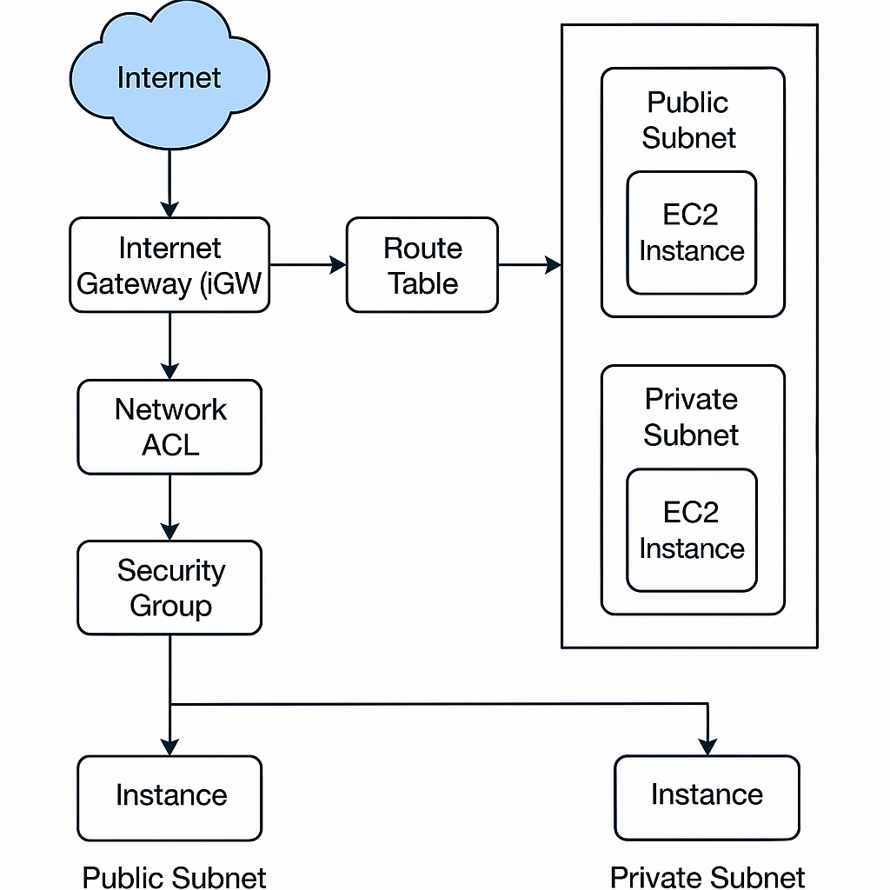

#  Amazon VPC (Virtual Private Cloud)

Amazon VPC allows you to **launch AWS resources** in a **logically isolated virtual network**. You have complete control over your virtual networking environment, including IP ranges, subnets, route tables, internet gateways, and security.

---

##  What is a VPC?

- A VPC is a **logically isolated network** within AWS.
- Functions like a **customizable data center** in the cloud.
- Control over:
  - IP address ranges
  - Subnet creation
  - Route tables
  - Internet and NAT gateways
  - Security (NACLs, Security Groups)

---

##  VPC Components

| Component           | Description |
|---------------------|-------------|
| **Subnets**         | Divide the VPC into public/private zones |
| **Route Tables**    | Define where traffic is directed |
| **Internet Gateway**| Enables internet access for public subnets |
| **NAT Gateway**     | Allows private subnets to access the internet |
| **Security Group**  | Acts at the instance level (stateful) |
| **NACL (Network ACL)** | Acts at the subnet level (stateless) |
| **Elastic IP**      | Static public IP |
| **DHCP Options Set**| Set custom DNS or domain name |

---

## 🔀 Traffic Flow Inside a VPC

### ✅ Incoming (Internet → Public EC2)

1. Internet Gateway (IGW)
2. Route Table (Public)
3. NACL (Inbound Rule)
4. Security Group (Inbound Rule)
5. EC2 Instance

### 🔁 Outgoing (Private EC2 → Internet)

1. EC2 Instance
2. Security Group (Outbound Rule)
3. Route Table (Private)
4. NAT Gateway
5. Internet Gateway

---

## 🔐 Security Components

### 🛡️ Security Group

- Works at **instance level**
- **Stateful** (response is automatically allowed)
- Default: Allow **all outbound**, deny **all inbound**
- Rules:
  - Allow/deny traffic on specific ports, IPs, or security groups

### 🚧 NACL (Network ACL)

- Works at **subnet level**
- **Stateless** (must allow both inbound and outbound)
- Applies to **all instances** in the subnet
- Can allow or deny based on rules

---

## 🌍 Internet Gateway (IGW)

- Connects **VPC to the Internet**
- Required for any public-facing EC2 instance
- Must be attached to the VPC
- Routes are defined in the **public route table**

---

## 🔄 NAT Gateway

- Allows **private subnet instances** to **access the internet**
- Prevents **unsolicited inbound traffic**
- Must

---


---
# Incomming trafic to ec2 in a vpc
## 1. For request in public subnet request goes like this
```
Internet → Internet Gateway (IGW) → Route Table (public subnet) → NACL → Security Group → EC2 instance

```
## 2. For request in private subnet
Incoming traffic from the internet cannot directly reach it.

Even though the path technically exists, there’s no valid public IP mapping, so the Internet Gateway cannot route the request.

To allow internet access to the private EC2:

- You use a Bastion Host (jump box) in the public subnet

- Or use VPN / AWS Direct Connect for private access

# Outegoing trafic from ec2 to internet
## 1. Request from public ec2 to internet
```
EC2 → Security Group → NACL → Route Table → Internet Gateway → Internet

```
## 2. Request from private ec2 to internet
```
EC2 → Security Group → NACL → Route Table → NAT Gateway → Internet Gateway → Internet
```
When an EC2 instance in a private subnet sends an outbound request (e.g., yum update, curl, etc.), the VPC Route Table for that subnet contains this rule:

```
Destination: 0.0.0.0/0 → Target: NAT Gateway ID
```
This tells the VPC:

- “All outbound traffic to the internet should be routed to the NAT Gateway.”

NAT Gateway’s Role:
- NAT (Network Address Translation) Gateway is public-facing and has an Elastic IP

- It translates the private EC2's private IP into a public IP for internet communication

- Incoming internet responses go back to the NAT Gateway → forwarded to the EC2
  
# Flow for private subnet vpc ec2
Your Local Machine
```
→ Internet → Internet Gateway (public subnet)→ Route Table (public subnet)→ Bastion Host (Jump Server - public EC2)→ Internal VPC network (private IP routing)→ Security Group (private EC2 allows SSH/RDP from bastion's private IP)→ Private EC2

```
#  Summary Table
```
| Component                      | Public Subnet | Notes                                            |
| ------------------------------ | ------------- | ------------------------------------------------ |
| Internet Gateway               | ❌ (VPC-level) | Routes public traffic; not bound to a subnet     |
| **NAT Gateway**                | ✅ Yes         | Needs public IP to translate private IPs         |
| **Jump Server (Bastion Host)** | ✅ Yes         | Needs to be publicly accessible (has public IP)  |
| **Route Table**                | ❌ (VPC-level) | Applied to subnets; not located in any subnet    |
| **Public EC2**                 | ✅ Yes         | Must be in public subnet with IGW route          |
| **Private EC2**                | ❌ No          | In private subnet; uses NAT Gateway for outbound |
| **ALB / NLB**                  | ✅ Yes         | Accepts internet traffic on behalf of EC2        |

```
- for jump sever create security group in that vpc.
