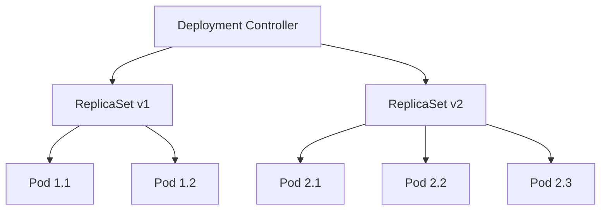

# Kubernetes Deployments: Complete Guide to Application Management

## Table of Contents
- [Introduction](#introduction)
- [Understanding Deployments](#understanding-deployments)
- [Deployment Architecture](#deployment-architecture)
- [Creating Deployments](#creating-deployments)
- [Managing Deployments](#managing-deployments)
- [Rolling Updates](#rolling-updates)
- [Rollbacks](#rollbacks)
- [Scaling Deployments](#scaling-deployments)
- [Advanced Deployment Strategies](#advanced-deployment-strategies)
- [Best Practices](#best-practices)
- [Troubleshooting](#troubleshooting)
- [Real-World Examples](#real-world-examples)
- [Key Takeaways](#key-takeaways)

## Introduction

Kubernetes Deployments are the cornerstone of application management in modern containerized environments. As one of the most frequently used objects by DevOps professionals, Deployments provide a declarative way to manage application updates, scaling, and rollbacks with zero-downtime deployments.

**Core Purpose**: Deployments enable you to describe the desired state of your applications and let Kubernetes automatically manage the transition from the current state to the desired state in a controlled, predictable manner.

## Understanding Deployments

### What is a Deployment?

A Deployment is a Kubernetes object that:
- **Manages ReplicaSets**: Automatically creates and manages ReplicaSets
- **Provides Declarative Updates**: Define desired state; Kubernetes handles the implementation
- **Enables Rolling Updates**: Update applications without downtime
- **Supports Rollbacks**: Revert to previous versions when issues occur
- **Handles Scaling**: Increase or decrease the number of running instances

### Deployment vs Other Controllers

| Controller | Purpose | Use Case | Update Strategy |
|------------|---------|----------|-----------------|
| **Pod** | Single instance | Testing, debugging | Manual recreation |
| **ReplicaSet** | Maintain replicas | Basic scaling | Replace all at once |
| **Deployment** | Manage ReplicaSets | Production apps | Rolling updates |
| **StatefulSet** | Ordered pods | Databases | Ordered updates |
| **DaemonSet** | One pod per node | Monitoring, logging | Node-by-node updates |

## Deployment Architecture

### Hierarchical Structure

```
Deployment
    ↓
ReplicaSet (Current)
    ↓
Pod → Pod → Pod

ReplicaSet (Previous)
    ↓
(Scaled down to 0)
```

### Controller Relationships



### Rolling Update Process

```
Initial State: v1.0 [Pod-A] [Pod-B] [Pod-C]
Step 1: v1.0   [Pod-A] [Pod-B] [Pod-C] [Pod-D(v2.0)]
Step 2: v1.0   [Pod-A] [Pod-B] [Pod-D(v2.0)] [Pod-E(v2.0)]
Step 3: v1.0   [Pod-A] [Pod-D(v2.0)] [Pod-E(v2.0)] [Pod-F(v2.0)]
Final: v2.0    [Pod-D] [Pod-E] [Pod-F]
```

## Creating Deployments

### Basic Deployment YAML

```yaml
apiVersion: apps/v1
kind: Deployment
metadata:
  name: nginx-deployment
  labels:
    app: nginx
    environment: production
    version: v1.0.0
spec:
  # Number of desired pods
  replicas: 3
  
  # Selector to match pods
  selector:
    matchLabels:
      app: nginx
      
  # Pod template
  template:
    metadata:
      labels:
        app: nginx
        environment: production
    spec:
      containers:
      - name: nginx
        image: nginx:1.20.0
        ports:
        - containerPort: 80
        resources:
          requests:
            memory: "64Mi"
            cpu: "100m"
          limits:
            memory: "128Mi"
            cpu: "200m"
```

### Advanced Deployment Configuration

```yaml
apiVersion: apps/v1
kind: Deployment
metadata:
  name: web-application
  namespace: production
  labels:
    app: web-app
    tier: frontend
    component: ui
spec:
  replicas: 5
  
  # Deployment strategy
  strategy:
    type: RollingUpdate
    rollingUpdate:
      maxUnavailable: 1      # Max pods that can be unavailable
      maxSurge: 2           # Max pods that can be created above desired
      
  # Progress deadline
  progressDeadlineSeconds: 300
  
  # Revision history limit
  revisionHistoryLimit: 10
  
  selector:
    matchLabels:
      app: web-app
      tier: frontend
      
  template:
    metadata:
      labels:
        app: web-app
        tier: frontend
        version: "2.1.0"
    spec:
      containers:
      - name: web-app
        image: myregistry/web-app:2.1.0
        ports:
        - containerPort: 8080
          name: http
          protocol: TCP
          
        # Environment variables
        env:
        - name: DATABASE_URL
          valueFrom:
            secretKeyRef:
              name: db-credentials
              key: url
        - name: LOG_LEVEL
          value: "info"
          
        # Health checks
        livenessProbe:
          httpGet:
            path: /health
            port: 8080
          initialDelaySeconds: 30
          periodSeconds: 10
          timeoutSeconds: 5
          failureThreshold: 3
          
        readinessProbe:
          httpGet:
            path: /ready
            port: 8080
          initialDelaySeconds: 5
          periodSeconds: 5
          timeoutSeconds: 3
          failureThreshold: 2
          
        # Resource constraints
        resources:
          requests:
            memory: "256Mi"
            cpu: "200m"
          limits:
            memory: "512Mi"
            cpu: "500m"
            
        # Volume mounts
        volumeMounts:
        - name: config-volume
          mountPath: /etc/config
        - name: logs-volume
          mountPath: /var/log/app
          
      # Volumes
      volumes:
      - name: config-volume
        configMap:
          name: app-config
      - name: logs-volume
        emptyDir: {}
```

### Creating Deployments

```bash
# Create deployment from YAML file
kubectl apply -f deployment.yaml

# Create deployment imperatively (not recommended for production)
kubectl create deployment nginx-deploy --image=nginx:1.20.0 --replicas=3

# Generate YAML without applying
kubectl create deployment nginx-deploy --image=nginx:1.20.0 --dry-run=client -o yaml > deployment.yaml
```

## Managing Deployments

### Viewing Deployments

```bash
# List all deployments
kubectl get deployments
kubectl get deploy  # Short form

# Detailed view
kubectl get deployments -o wide

# Show deployments across all namespaces
kubectl get deployments --all-namespaces

# Watch deployments in real-time
kubectl get deployments -w
```

### Deployment Details

```bash
# Describe deployment
kubectl describe deployment nginx-deployment

# Get deployment YAML
kubectl get deployment nginx-deployment -o yaml

# View deployment status
kubectl rollout status deployment/nginx-deployment
```

### Deployment Information Output

```bash
# Example output of kubectl get deployments
NAME               READY   UP-TO-DATE   AVAILABLE   AGE
nginx-deployment   3/3     3            3           5m12s
web-application    5/5     5            5           2h30m
```

**Column Meanings:**
- **READY**: Current replicas / Desired replicas
- **UP-TO-DATE**: Number of replicas updated to latest revision
- **AVAILABLE**: Number of replicas available to users
- **AGE**: Time since deployment was created

## Rolling Updates

### Understanding Rolling Updates

Rolling updates allow you to update your application with zero downtime by:
1. Creating new pods with updated configuration
2. Waiting for new pods to become ready
3. Terminating old pods gradually
4. Maintaining service availability throughout the process

### Update Strategies

#### 1. RollingUpdate (Default)
```yaml
spec:
  strategy:
    type: RollingUpdate
    rollingUpdate:
      maxUnavailable: 25%    # Can be absolute number or percentage
      maxSurge: 25%         # Can be absolute number or percentage
```

#### 2. Recreate Strategy
```yaml
spec:
  strategy:
    type: Recreate  # All pods terminated before new ones created
```

### Performing Rolling Updates

#### Method 1: Update YAML File (Recommended)
```bash
# 1. Edit your deployment YAML file
# Change image: nginx:1.20.0 to image: nginx:1.21.0

# 2. Apply the changes
kubectl apply -f deployment.yaml

# 3. Monitor the rollout
kubectl rollout status deployment/nginx-deployment
```

#### Method 2: Imperative Update
```bash
# Update container image
kubectl set image deployment/nginx-deployment nginx=nginx:1.21.0

# Update multiple containers
kubectl set image deployment/web-app \
  frontend=myapp:v2.0.0 \
  sidecar=logger:v1.5.0

# Update environment variables
kubectl set env deployment/nginx-deployment LOG_LEVEL=debug
```

#### Method 3: Edit Deployment Directly
```bash
# Edit deployment in your default editor
kubectl edit deployment nginx-deployment
```

### Monitoring Rolling Updates

```bash
# Watch rollout progress
kubectl rollout status deployment/nginx-deployment

# View rollout in real-time
kubectl get pods -w

# Check ReplicaSets during update
kubectl get replicasets

# View events
kubectl get events --sort-by=.metadata.creationTimestamp
```

### Update Configuration Examples

#### Resource Updates
```yaml
# Update resource limits
spec:
  template:
    spec:
      containers:
      - name: nginx
        resources:
          requests:
            memory: "128Mi"    # Updated from 64Mi
            cpu: "150m"        # Updated from 100m
          limits:
            memory: "256Mi"    # Updated from 128Mi
            cpu: "300m"        # Updated from 200m
```

#### Environment Variable Updates
```yaml
# Add or update environment variables
spec:
  template:
    spec:
      containers:
      - name: web-app
        env:
        - name: LOG_LEVEL
          value: "debug"       # Updated from "info"
        - name: FEATURE_FLAG
          value: "enabled"     # New environment variable
```

## Rollbacks

### Understanding Rollbacks

Rollbacks allow you to revert to a previous version when:
- New deployment has bugs or issues
- Performance degradation occurs
- Configuration errors are detected
- Security vulnerabilities are discovered

### Rollback Commands

```bash
# Check rollout history
kubectl rollout history deployment/nginx-deployment

# View specific revision details
kubectl rollout history deployment/nginx-deployment --revision=2

# Rollback to previous version
kubectl rollout undo deployment/nginx-deployment

# Rollback to specific revision
kubectl rollout undo deployment/nginx-deployment --to-revision=1

# Check rollback status
kubectl rollout status deployment/nginx-deployment
```

### Rollout History Management

```yaml
# Configure revision history limit
spec:
  revisionHistoryLimit: 5  # Keep only 5 previous ReplicaSets
```

```bash
# Example rollout history output
kubectl rollout history deployment/nginx-deployment

# Output:
# REVISION  CHANGE-CAUSE
# 1         <none>
# 2         kubectl set image deployment/nginx-deployment nginx=nginx:1.21.0
# 3         kubectl apply -f deployment.yaml
```

### Adding Change Annotations

```bash
# Add change cause annotation
kubectl annotate deployment nginx-deployment \
  deployment.kubernetes.io/change-cause="Update to nginx 1.21.0 for security patch"

# Apply with change cause
kubectl apply -f deployment.yaml \
  --record=true  # Deprecated but still functional
```

## Scaling Deployments

### Manual Scaling

```bash
# Scale up deployment
kubectl scale deployment nginx-deployment --replicas=5

# Scale down deployment  
kubectl scale deployment nginx-deployment --replicas=2

# Scale multiple deployments
kubectl scale deployment nginx-deployment web-app --replicas=3
```

### Declarative Scaling

```yaml
# Update YAML file
spec:
  replicas: 10  # Scale to 10 replicas

# Apply changes
kubectl apply -f deployment.yaml
```

### Conditional Scaling

```bash
# Scale only if current replica count matches
kubectl scale deployment nginx-deployment --current-replicas=3 --replicas=5
```

### Auto-scaling (HPA)

```yaml
# Horizontal Pod Autoscaler
apiVersion: autoscaling/v2
kind: HorizontalPodAutoscaler
metadata:
  name: nginx-hpa
spec:
  scaleTargetRef:
    apiVersion: apps/v1
    kind: Deployment
    name: nginx-deployment
  minReplicas: 2
  maxReplicas: 10
  metrics:
  - type: Resource
    resource:
      name: cpu
      target:
        type: Utilization
        averageUtilization: 70
  - type: Resource
    resource:
      name: memory
      target:
        type: Utilization
        averageUtilization: 80
```

## Advanced Deployment Strategies

### Blue-Green Deployment

```yaml
# Blue deployment (current)
apiVersion: apps/v1
kind: Deployment
metadata:
  name: web-app-blue
  labels:
    version: blue
spec:
  replicas: 3
  selector:
    matchLabels:
      app: web-app
      version: blue
  template:
    metadata:
      labels:
        app: web-app
        version: blue
    spec:
      containers:
      - name: web-app
        image: myapp:v1.0.0

---
# Green deployment (new)
apiVersion: apps/v1  
kind: Deployment
metadata:
  name: web-app-green
  labels:
    version: green
spec:
  replicas: 3
  selector:
    matchLabels:
      app: web-app
      version: green
  template:
    metadata:
      labels:
        app: web-app
        version: green
    spec:
      containers:
      - name: web-app
        image: myapp:v2.0.0
```

### Canary Deployment

```yaml
# Production deployment (90% traffic)
apiVersion: apps/v1
kind: Deployment
metadata:
  name: web-app-stable
spec:
  replicas: 9
  selector:
    matchLabels:
      app: web-app
      version: stable
  template:
    metadata:
      labels:
        app: web-app
        version: stable
    spec:
      containers:
      - name: web-app
        image: myapp:v1.0.0

---
# Canary deployment (10% traffic)
apiVersion: apps/v1
kind: Deployment
metadata:
  name: web-app-canary
spec:
  replicas: 1
  selector:
    matchLabels:
      app: web-app
      version: canary
  template:
    metadata:
      labels:
        app: web-app
        version: canary
    spec:
      containers:
      - name: web-app
        image: myapp:v2.0.0
```

## Best Practices

### 1. Resource Management

```yaml
# Always set resource requests and limits
spec:
  template:
    spec:
      containers:
      - name: app
        resources:
          requests:
            memory: "256Mi"
            cpu: "200m"
          limits:
            memory: "512Mi"
            cpu: "500m"
```

### 2. Health Checks

```yaml
# Implement proper health checks
spec:
  template:
    spec:
      containers:
      - name: app
        livenessProbe:
          httpGet:
            path: /health
            port: 8080
          initialDelaySeconds: 30
          periodSeconds: 10
        readinessProbe:
          httpGet:
            path: /ready
            port: 8080
          initialDelaySeconds: 5
          periodSeconds: 5
```

### 3. Labels and Annotations

```yaml
# Use consistent labeling strategy
metadata:
  labels:
    app: web-application
    version: v2.1.0
    component: frontend
    environment: production
    team: platform
  annotations:
    deployment.kubernetes.io/change-cause: "Security patch update"
    app.kubernetes.io/managed-by: "ArgoCD"
```

### 4. Update Strategy Configuration

```yaml
# Configure appropriate update strategy
spec:
  strategy:
    type: RollingUpdate
    rollingUpdate:
      maxUnavailable: 1      # Conservative for critical apps
      maxSurge: 1           # Prevent resource spikes
  progressDeadlineSeconds: 600  # 10-minute timeout
```

### 5. Security Best Practices

```yaml
spec:
  template:
    spec:
      # Run as non-root user
      securityContext:
        runAsNonRoot: true
        runAsUser: 1000
        fsGroup: 2000
      containers:
      - name: app
        securityContext:
          allowPrivilegeEscalation: false
          readOnlyRootFilesystem: true
          capabilities:
            drop:
            - ALL
```

## Troubleshooting

### Common Issues and Solutions

#### 1. Deployment Not Progressing

```bash
# Check deployment status
kubectl rollout status deployment/nginx-deployment

# Describe deployment for events
kubectl describe deployment nginx-deployment

# Check ReplicaSets
kubectl get rs

# Common causes:
# - Resource constraints
# - Image pull errors
# - Readiness probe failures
```

#### 2. Pods Not Starting

```bash
# Check pod status
kubectl get pods

# Describe problematic pods
kubectl describe pod <pod-name>

# Check pod logs
kubectl logs <pod-name>

# Check events
kubectl get events --sort-by=.metadata.creationTimestamp
```

#### 3. Update Stuck or Failed

```bash
# Check rollout status
kubectl rollout status deployment/nginx-deployment

# Pause rollout to investigate
kubectl rollout pause deployment/nginx-deployment

# Resume after fixing issues
kubectl rollout resume deployment/nginx-deployment

# Rollback if necessary
kubectl rollout undo deployment/nginx-deployment
```

#### 4. Resource Issues

```bash
# Check node resources
kubectl top nodes

# Check pod resource usage
kubectl top pods

# Describe nodes for resource availability
kubectl describe nodes
```

### Debugging Commands

```bash
# Get deployment details
kubectl get deployment nginx-deployment -o yaml

# Check ReplicaSet history
kubectl get rs --show-labels

# Monitor pod creation/deletion
kubectl get pods -w

# Check resource quotas
kubectl describe quota

# View deployment events
kubectl describe deployment nginx-deployment | grep -A 10 Events
```

## Real-World Examples

### Example 1: Web Application Deployment

```yaml
apiVersion: apps/v1
kind: Deployment
metadata:
  name: ecommerce-frontend
  namespace: production
  labels:
    app: ecommerce
    component: frontend
    version: v3.2.1
spec:
  replicas: 6
  strategy:
    type: RollingUpdate
    rollingUpdate:
      maxUnavailable: 2
      maxSurge: 2
  selector:
    matchLabels:
      app: ecommerce
      component: frontend
  template:
    metadata:
      labels:
        app: ecommerce
        component: frontend
        version: v3.2.1
    spec:
      containers:
      - name: frontend
        image: ecommerce/frontend:v3.2.1
        ports:
        - containerPort: 3000
        env:
        - name: API_URL
          value: "https://api.ecommerce.com"
        - name: NODE_ENV
          value: "production"
        resources:
          requests:
            memory: "512Mi"
            cpu: "300m"
          limits:
            memory: "1Gi"
            cpu: "500m"
        livenessProbe:
          httpGet:
            path: /health
            port: 3000
          initialDelaySeconds: 30
          periodSeconds: 10
        readinessProbe:
          httpGet:
            path: /ready
            port: 3000
          initialDelaySeconds: 10
          periodSeconds: 5
```

### Example 2: Microservice with Database Connection

```yaml
apiVersion: apps/v1
kind: Deployment
metadata:
  name: user-service
  labels:
    app: user-service
    tier: backend
spec:
  replicas: 4
  selector:
    matchLabels:
      app: user-service
  template:
    metadata:
      labels:
        app: user-service
        tier: backend
    spec:
      containers:
      - name: user-service
        image: myregistry/user-service:v2.5.0
        ports:
        - containerPort: 8080
        env:
        - name: DATABASE_URL
          valueFrom:
            secretKeyRef:
              name: db-credentials
              key: url
        - name: JWT_SECRET
          valueFrom:
            secretKeyRef:
              name: jwt-secret
              key: secret
        - name: LOG_LEVEL
          valueFrom:
            configMapKeyRef:
              name: app-config
              key: log_level
        resources:
          requests:
            memory: "256Mi"
            cpu: "200m"
          limits:
            memory: "512Mi"
            cpu: "400m"
        livenessProbe:
          httpGet:
            path: /health
            port: 8080
          initialDelaySeconds: 45
          periodSeconds: 10
          timeoutSeconds: 5
        readinessProbe:
          httpGet:
            path: /ready
            port: 8080
          initialDelaySeconds: 15
          periodSeconds: 5
```

### Example 3: Multi-Container Deployment

```yaml
apiVersion: apps/v1
kind: Deployment
metadata:
  name: web-app-with-sidecar
spec:
  replicas: 3
  selector:
    matchLabels:
      app: web-app-with-sidecar
  template:
    metadata:
      labels:
        app: web-app-with-sidecar
    spec:
      containers:
      # Main application container
      - name: web-app
        image: webapp:v2.0.0
        ports:
        - containerPort: 8080
        volumeMounts:
        - name: logs
          mountPath: /var/log/app
        resources:
          requests:
            memory: "512Mi"
            cpu: "300m"
          limits:
            memory: "1Gi"
            cpu: "500m"
            
      # Logging sidecar container
      - name: log-shipper
        image: fluentd:v1.14
        volumeMounts:
        - name: logs
          mountPath: /var/log/app
          readOnly: true
        resources:
          requests:
            memory: "64Mi"
            cpu: "100m"
          limits:
            memory: "128Mi"
            cpu: "200m"
            
      volumes:
      - name: logs
        emptyDir: {}
```

## Key Takeaways

### Essential Concepts

1. **Declarative Management**: Describe desired state; Kubernetes handles implementation
2. **Rolling Updates**: Zero-downtime application updates
3. **Rollback Capability**: Quick recovery from problematic deployments
4. **Scaling**: Dynamic adjustment of application instances
5. **ReplicaSet Management**: Automatic management of pod replicas

### Deployment Lifecycle

```
Create → Deploy → Update → Scale → Rollback → Delete
```

### When to Use Deployments

- **Stateless Applications**: Web servers, APIs, microservices
- **Scalable Services**: Applications that need horizontal scaling
- **Production Workloads**: Applications requiring zero-downtime updates
- **Version Management**: Applications with frequent updates

### Deployment vs StatefulSet

| Use Case | Deployment | StatefulSet |
|----------|------------|-------------|
| **Stateless apps** | ✅ Yes | ❌ No |
| **Stateful apps** | ❌ No | ✅ Yes |
| **Databases** | ❌ No | ✅ Yes |
| **Web servers** | ✅ Yes | ❌ No |
| **Ordered deployment** | ❌ No | ✅ Yes |

### Best Practices Summary

- Always use YAML files for production deployments
- Implement proper health checks (liveness and readiness probes)
- Set appropriate resource requests and limits
- Use meaningful labels and annotations
- Configure rolling update strategy based on application needs
- Monitor deployments and maintain rollback capability
- Use namespaces to organize deployments
- Implement security contexts and non-root containers
- Keep revision history for rollback capability
- Test deployment strategies in non-production environments first

Deployments are fundamental to successful Kubernetes operations, providing the reliability, scalability, and maintainability needed for production applications. Master these concepts and practices to effectively manage your containerized applications.