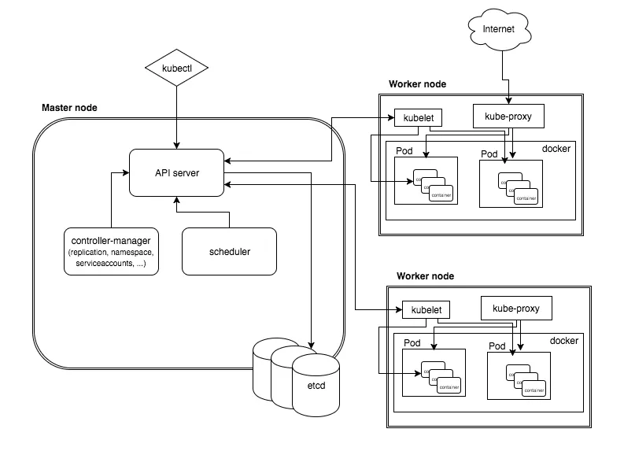

```
kops create cluster --name=crazycoder.shop --state=s3://kops2015 --zones=us-east-1a,us-east-1b --node-count=2 --node-size=t3.small --control-plane-size=t3.medium --dns-zone=crazycoder.shop --node-volume-size=12 --control-plane-volume-size=12 --ssh-public-key ~/.ssh/id_ed25519.pub

kops update cluster --name=crazycoder.shop --state=s3://kops2015 --yes --admin

kops validate cluster --name=crazycoder.shop --state=s3://kops2015
kops delete cluster --name=crazycoder.shop --state=s3://kops2015 --yes 
```
- kube config
- pods
- namespace
```
kubectl get pod
kubectl get pod web2 -o yaml
kubectl logs pod web2 
kubectl delete pod web2 
kubectl apply -f deployment.yaml
kubectl describe pod web2 


kubectl get deploy

```
# Complete Kubernetes Learning Guide

## Table of Contents
1. [Introduction to Kubernetes](#introduction-to-kubernetes)
2. [Core Concepts: Cluster, Node, and Pod](#core-concepts-cluster-node-and-pod)
3. [Control Plane Components](#control-plane-components)
4. [Data Plane (Worker Node) Components](#data-plane-worker-node-components)
5. [Kubernetes Objects and Resources](#kubernetes-objects-and-resources)
6. [Networking in Kubernetes](#networking-in-kubernetes)
7. [Storage in Kubernetes](#storage-in-kubernetes)
8. [Configuration Management](#configuration-management)
9. [Workload Management](#workload-management)
10. [Security and Access Control](#security-and-access-control)
11. [Monitoring and Logging](#monitoring-and-logging)
12. [Best Practices](#best-practices)

---

## Introduction to Kubernetes

**Kubernetes (K8s)** is an open-source container orchestration platform that automates the deployment, scaling, and management of containerized applications. Originally developed by Google, it's now maintained by the Cloud Native Computing Foundation (CNCF).

### Key Benefits:
- **Automated deployment** and scaling of applications
- **Service discovery** and load balancing
- **Self-healing** capabilities (automatic restarts, replacements)
- **Rolling updates** and rollbacks
- **Secret and configuration management**
- **Storage orchestration**

---

## Core Concepts: Cluster, Node, and Pod

### 1. Cluster
**A cluster is the highest-level container in Kubernetes.** It consists of a group of nodes (physical or virtual machines) that work together to run containerized applications.

**Key Characteristics:**
- Contains the control plane components (API server, controller manager, etcd)
- Manages worker nodes that run application workloads
- Provides a unified API for managing all resources
- Can span multiple data centers or cloud regions

**Cluster Architecture:**
```
┌─────────────────────────────────────────────────────────┐
│                    Kubernetes Cluster                   │
├─────────────────────┬───────────────────────────────────┤
│    Control Plane    │           Worker Nodes            │
│                     │                                   │
│  ┌─────────────┐   │  ┌─────────┐  ┌─────────┐         │
│  │ API Server  │   │  │ Node 1  │  │ Node 2  │   ...   │
│  │ Scheduler   │   │  │         │  │         │         │
│  │ ETCD        │   │  │  Pods   │  │  Pods   │         │
│  │ Controller  │   │  │         │  │         │         │
│  └─────────────┘   │  └─────────┘  └─────────┘         │
└─────────────────────┴───────────────────────────────────┘
```

### 2. Node
**A node is a machine (physical or virtual) within the Kubernetes cluster.** It provides the computational resources needed to run pods.

**Types of Nodes:**
- **Control Plane Node (Master Node):** Manages the Kubernetes cluster
- **Worker Node:** Executes containers inside pods

**Node Components:**
- **kubelet:** Primary agent that communicates with the control plane
- **Container runtime:** (Docker, containerd, CRI-O) responsible for running containers
- **kube-proxy:** Manages networking for services on the node

**Node Status Information:**
- CPU and memory capacity
- Number of pods running
- Node conditions (Ready, OutOfDisk, MemoryPressure, etc.)

### 3. Pod
**A pod is the smallest deployable unit in Kubernetes.** It represents one or more tightly coupled containers that share the same network namespace and storage.
- There is similarity in vm and process & pod container.
- vm provide resources to the process
- pop provide resources to the container.
- ideally there should be one container in one pod.

**Key Features:**
- **Shared Network:** All containers in a pod share the same IP address
- **Shared Storage:** Containers can share volumes
- **Lifecycle:** All containers in a pod are scheduled together and die together
- **Communication:** Containers communicate via `localhost`

**Pod Characteristics:**
- Usually contains one main container (single-container pods are most common)
- Can contain helper containers (sidecars, init containers)
- Gets a unique IP address within the cluster
- Ephemeral by nature (pods come and go)

---

## Control Plane Components

The control plane manages the overall state of the cluster and makes global decisions about scheduling, scaling, and responding to cluster events.

### 1. API Server (kube-apiserver)
**The central management entity that exposes the Kubernetes API.**

**Responsibilities:**
- Serves as the front-end for the Kubernetes control plane
- Validates and configures data for API objects (pods, services, controllers, etc.)
- Provides the interface for all cluster communications
- Authenticates and authorizes requests
- Stores cluster state in etcd

**Key Features:**
- RESTful API interface
- Horizontal scalability
- Secure communication (TLS)

### 2. Scheduler (kube-scheduler)
**Responsible for assigning pods to nodes based on resource requirements and constraints.**

**Scheduling Process:**
1. **Filtering:** Eliminates nodes that cannot run the pod
2. **Scoring:** Ranks remaining nodes based on various factors
3. **Binding:** Assigns the pod to the highest-scoring node

**Scheduling Factors:**
- Resource requirements (CPU, memory)
- Hardware/software constraints
- Affinity and anti-affinity rules
- Data locality
- Workload interference

### 3. ETCD
**A distributed, reliable key-value store that stores the current state of the cluster.**

**Characteristics:**
- **Consistency:** Uses Raft consensus algorithm
- **Reliability:** Distributed across multiple nodes
- **Performance:** Optimized for read-heavy workloads
- **Security:** Supports TLS encryption

**Stored Data:**
- Cluster configuration
- Service discovery information
- Current state of all resources
- Secrets and ConfigMaps

### 4. Controller Manager (kube-controller-manager)
**Runs various controllers that regulate the state of the cluster.**

**Built-in Controllers:**
- **Replication Controller:** Ensures desired number of pod replicas
- **Endpoints Controller:** Manages service endpoints
- **Namespace Controller:** Manages namespace lifecycle
- **Service Account Controller:** Creates default service accounts
- **Node Controller:** Monitors node health
- **Deployment Controller:** Manages deployment rollouts

**Controller Pattern:**
```
Current State → Compare → Desired State
      ↑                        ↓
      └────── Take Action ←─────┘
```

---

## Data Plane (Worker Node) Components

The data plane consists of worker nodes that run your application workloads.

### 1. Kubelet
**The primary node agent that ensures containers are running in pods.**

**Key Functions:**
- **Pod Lifecycle Management:** Creates, starts, stops, and destroys pods
- **Health Monitoring:** Reports pod and node status to API server
- **Volume Management:** Mounts and unmounts storage volumes
- **Container Runtime Interface:** Communicates with container runtime

**Communication:**
- Pulls pod specifications from API server
- Reports status back to control plane
- Performs health checks (liveness, readiness probes)

### 2. Kube-proxy
**Responsible for network communication and load balancing.**

**Network Functions:**
- **Service Discovery:** Routes traffic to appropriate pods
- **Load Balancing:** Distributes requests across healthy pods
- **Network Rules:** Maintains iptables or IPVS rules
- **Session Affinity:** Ensures requests from same client go to same pod

**Proxy Modes:**
- **iptables:** Default mode using iptables rules
- **IPVS:** High-performance mode for large clusters
- **userspace:** Legacy mode (rarely used)

### 3. Container Runtime
**The software responsible for running containers.**

**Supported Runtimes:**
- **containerd:** Default runtime, lightweight and efficient
- **Docker:** Popular but being phased out
- **CRI-O:** Lightweight runtime designed for Kubernetes
- **runc:** Low-level runtime

**Container Runtime Interface (CRI):**
- Standardized API between kubelet and container runtime
- Enables pluggable container runtimes
- Handles image management and container lifecycle

---

## Kubernetes Objects and Resources

### Services
**Provide stable network endpoints for accessing pods.**

**Service Types:**
- **ClusterIP:** Internal cluster communication (default)
- **NodePort:** External access via node port
- **LoadBalancer:** External access via cloud load balancer
- **ExternalName:** Maps to external DNS name

### Deployments
**Manage stateless applications with declarative updates.**

**Features:**
- Rolling updates and rollbacks
- Replica management
- Pod template versioning
- Update strategies (RollingUpdate, Recreate)

### ConfigMaps and Secrets
**Manage configuration data and sensitive information.**

**ConfigMaps:** Store non-sensitive configuration data
**Secrets:** Store sensitive data (passwords, tokens, keys)

### Persistent Volumes (PV) and Persistent Volume Claims (PVC)
**Provide persistent storage for applications.**

**Storage Classes:** Define different types of storage
**Volume Types:** hostPath, NFS, cloud storage, etc.

---

## Networking in Kubernetes

### Cluster Networking Model
**Every pod gets a unique IP address within the cluster.**

**Network Requirements:**
- Pod-to-pod communication without NAT
- Node-to-pod communication without NAT
- Service discovery and load balancing

### Container Network Interface (CNI)
**Plugins that implement cluster networking.**

**Popular CNI Plugins:**
- **Calico:** Policy-driven networking and security
- **Flannel:** Simple overlay networking
- **Weave:** Easy-to-use networking solution
- **Cilium:** eBPF-based networking and security

### Ingress
**Manages external HTTP/HTTPS access to services.**

**Features:**
- SSL termination
- Path-based routing
- Host-based routing
- Load balancing

---

## Storage in Kubernetes

### Volume Types
- **emptyDir:** Temporary storage that exists for pod lifetime
- **hostPath:** Mounts directory from host node
- **persistentVolumeClaim:** Claims persistent storage
- **configMap/secret:** Mounts configuration data

### Storage Classes
**Define different classes of storage with different performance characteristics.**

### Dynamic Provisioning
**Automatically creates storage volumes when requested.**

---

## Configuration Management

### Environment Variables
**Pass configuration to containers via environment variables.**

### ConfigMaps
**Store configuration data as key-value pairs or files.**

### Secrets
**Store sensitive information securely.**

**Secret Types:**
- **Opaque:** Arbitrary data
- **kubernetes.io/dockerconfigjson:** Docker registry credentials
- **kubernetes.io/tls:** TLS certificates

---

## Workload Management

### ReplicaSets
**Ensure a specified number of pod replicas are running.**

### Deployments
**Provide declarative updates for pods and ReplicaSets.**

### StatefulSets
**Manage stateful applications with stable network identities.**

### DaemonSets
**Ensure a copy of a pod runs on all (or selected) nodes.**

### Jobs and CronJobs
**Manage batch workloads and scheduled tasks.**

---

## Security and Access Control

### Role-Based Access Control (RBAC)
**Control access to Kubernetes resources.**

**Components:**
- **Roles/ClusterRoles:** Define permissions
- **RoleBindings/ClusterRoleBindings:** Grant permissions to users/groups

### Service Accounts
**Provide identity for processes running in pods.**

### Network Policies
**Control traffic flow between pods.**

### Pod Security Standards
**Define security policies for pods.**

---

## Monitoring and Logging

### Metrics Collection
- **Prometheus:** Time-series database for metrics
- **Grafana:** Visualization and dashboards
- **Metrics Server:** Resource usage metrics

### Logging
- **Centralized logging:** ELK stack (Elasticsearch, Logstash, Kibana)
- **Fluentd/Fluent Bit:** Log forwarding agents
- **Loki:** Log aggregation system

### Health Checks
- **Liveness Probes:** Determine if container is alive
- **Readiness Probes:** Determine if container is ready to receive traffic
- **Startup Probes:** Determine if container has started successfully

---

## Best Practices

### Resource Management
- Set resource requests and limits
- Use horizontal pod autoscaling
- Monitor resource usage

### Security
- Use least privilege principle
- Keep images updated
- Scan for vulnerabilities
- Use network policies

### Configuration
- Use ConfigMaps and Secrets
- Avoid hardcoding values
- Use environment-specific configurations

### Deployment
- Use rolling updates
- Test in staging environments
- Implement proper monitoring
- Have rollback procedures

### Troubleshooting Commands
```bash
# Get cluster information
kubectl cluster-info

# Check node status
kubectl get nodes

# View pod details
kubectl describe pod <pod-name>

# Check logs
kubectl logs <pod-name>

# Execute commands in pod
kubectl exec -it <pod-name> -- /bin/bash

# Port forwarding
kubectl port-forward <pod-name> 8080:80
```

---

## Conclusion

Kubernetes is a powerful platform for container orchestration that provides scalability, reliability, and flexibility for modern applications. Understanding these core concepts and components is essential for effectively deploying and managing containerized applications in production environments.

Continue learning by practicing with tools like minikube, kind, or managed Kubernetes services from cloud providers. The Kubernetes ecosystem is vast and constantly evolving, so staying updated with the latest features and best practices is crucial for success.

---
---
- what is pod . how to define and run
- what is namespce . how to make/delete new namespace. how to run a pod in new namespace.
- if you are working on project then first build and test locally then go to the production. while running locally you will find all the bugs and fix them then run on production so that there will be minimun error on production. 
  
# service
- it is similar to loadbalancer
- there are three type of service (node post/cluster ip/loadbalancer)
# replicaset
```
apiVersion: apps/v1
kind: ReplicaSet
metadata:
  name: nginx-replicaset
spec:
  replicas: 3
  selector:
    matchLabels:
      app: nginx
  template:   # Pod template
    metadata:
      labels:
        app: nginx
    spec:
      containers:
      - name: nginx
        image: nginx:1.25
        ports:
        - containerPort: 80

```
- maintains replicaset in pod
- if you are making n replica then there will be only n pods with the same name of pod. if there are other pods with same name then including all pods with same name will be n. so make pod names different.
  
  ---
  A ReplicaSet is a Kubernetes object that ensures a specified number of identical Pods are always running.

- If a Pod dies → ReplicaSet creates a new one.

- If you delete a Pod manually → ReplicaSet replaces it.

- If there are extra Pods → ReplicaSet deletes them.

So basically, it keeps the desired number of replicas of Pods running at all times.

---
🔹 Why not just use ReplicaSet directly?

You can create ReplicaSets directly, but in practice we rarely do.

Instead, we use Deployments → because Deployments manage ReplicaSets for us and add extra features like rolling updates and rollbacks.

``` 
Deployment = higher-level controller that uses ReplicaSets internally.
```
# deployment
- a deployment controller provides declarative updates for pod and replica set.
- define desired state in a deployment and deployment controller changes actual state to  desired state  with controlled rate.
- deployment creates replica set to manage number of pods.
- kubectl get rs
- you can undo to to current deployment to prevous deployment 
```
apiVersion: v1
kind: Pod
metadata:
  name: my-pod
spec:
  containers:
  - name: nginx
    image: nginx:1.25
    ports:
    - containerPort: 80
#  Deployment YAML for the same Pod
apiVersion: apps/v1
kind: Deployment
metadata:
  name: nginx-deployment
  labels:
    app: nginx
spec:
  replicas: 3   # Number of Pods you want
  selector:
    matchLabels:
      app: nginx
  template:   # Pod template
    metadata:
      labels:
        app: nginx
    spec:
      containers:
      - name: nginx
        image: nginx:1.25
        ports:
        - containerPort: 80

```
# 1. Create a Deployment
```
kubectl create deployment nginx-deployment --image=nginx:1.25
```
Creates a Deployment with 1 replica by default.

If you want multiple replicas:
```
kubectl create deployment nginx-deployment --image=nginx:1.25 --replicas=3
```


Or from a YAML file:
```
kubectl apply -f deployment.yaml
```

## 2. View Deployments
```
kubectl get deployments
```

Shows all deployments in the namespace.
```
kubectl describe deployment nginx-deployment
```

Gives detailed info (events, rollout status, replica count, etc.).

## 3. View Pods created by Deployment
```
kubectl get pods -l app=nginx
```

 -l filters by label (app=nginx in our case).

This shows the Pods managed by the Deployment.

##  4. Scaling

Increase replicas:
```
kubectl scale deployment nginx-deployment --replicas=5
```

Reduce replicas:
```
kubectl scale deployment nginx-deployment --replicas=2
```

## 5. Updating the Deployment

Update the container image:
```
kubectl set image deployment/nginx-deployment nginx=nginx:1.26
```

This triggers a rolling update.

Check rollout status:
```
kubectl rollout status deployment nginx-deployment
```

##  6. Rollback

If the update fails or causes issues:
```
kubectl rollout undo deployment nginx-deployment
```

Roll back to a specific revision:
```
kubectl rollout undo deployment nginx-deployment --to-revision=2
```
## 7. Delete a Deployment
```
kubectl delete deployment nginx-deployment
```

 This also deletes all Pods and ReplicaSets created by it.

##  8. Debugging

View Pods created by the Deployment:
```
kubectl get pods
```

Check logs of a Pod:
```
kubectl logs <pod-name>
```

Open a shell inside a Pod:
```
kubectl exec -it <pod-name> -- /bin/bash
```

## Summary:
```
create / apply → Make a Deployment.

get / describe → Inspect it.

scale → Adjust replicas.

set image → Update containers.

rollout → Manage updates/rollbacks.

delete → Remove Deployment.
```
---
# commands and argument
When you run a container (say with Docker), you know you can override the entrypoint and command arguments. Kubernetes has the same concept, just with slightly different names
```
spec:
  containers:
  - name: my-container
    image: nginx
    command: ["sleep"]        # equivalent to Docker ENTRYPOINT
    args: ["3600"]            # equivalent to Docker CMD

```
command → Overrides the container image’s default ENTRYPOINT.

args → Overrides the container image’s default CMD (or provides extra arguments to the command).

command = ENTRYPOINT in Docker.

args = CMD in Docker.

Both are optional → if you don’t define them, Kubernetes uses whatever the container image defines.

Useful for:

Running debugging commands (sleep, tail -f, etc.).

Overriding the default behavior of an image.

Running scripts or special startup commands.

---
# volumes
A Volume in Kubernetes is a storage resource that can be attached to Pods so containers inside them can store and share data.

By default, when a container in Kubernetes restarts, all its data is lost (container filesystem is ephemeral).

A Volume provides a way to persist data beyond the life of a container.

🔹 Key Features

Persistent storage → Data survives container restarts.

Shared storage → Multiple containers in the same Pod can access the same data.

Different types of backends → Kubernetes supports many volume types (emptyDir, hostPath, NFS, AWS EBS, GCP PD, Azure Disk, Ceph, etc.).

##   Types of Volumes (most common)

### emptyDir

Created when a Pod starts, deleted when the Pod stops.

Useful for temporary storage or for sharing files between containers in a Pod.

volumes:
- name: cache
  emptyDir: {}


### hostPath

Mounts a directory from the Node’s filesystem into the Pod.

Useful for logs or node-local files, but ties Pod to a specific Node.

volumes:
- name: host-storage
  hostPath:
    path: /data


PersistentVolume (PV) & PersistentVolumeClaim (PVC)

The standard way to do persistent storage across Pods and restarts.

Example: Use an NFS share, AWS EBS volume, or cloud storage.

PVC (claim) is what a Pod requests, PV is the actual storage resource.

### configMap / secret

Special volumes to inject config data or sensitive values (like passwords).

---
# configmap
- it is used to set and inject variable in file
- configmap is used to give variable names through command line.
- you can read all the variable from config map 
- you can also selective varible from configmap with the help of key