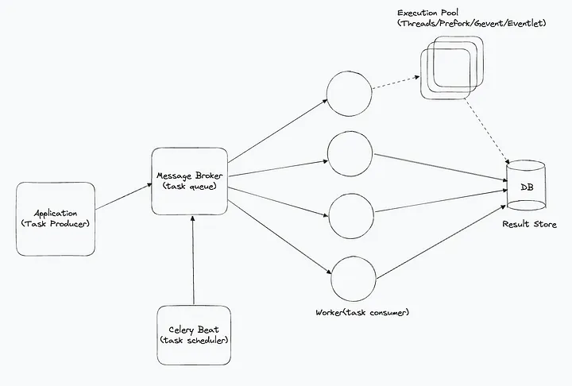

# What is Celery?
Celery is an open-source task queue system that allows you to execute work outside the Python web application’s HTTP request-response cycle.

Key Features of Celery 
Task Scheduling: Schedule tasks to run at specific intervals. 

Concurrency: Run multiple tasks concurrently using multiprocessing or asynchronous I/O. 

Scalability: Easily scale worker processes to meet demand. 

Integration: Compatible with various message brokers and result backends.

There are 6 parts in celery:
# 1. Celery(Core Module): 
The core module is responsible for task management and execution. It defines tasks, sends them to the message broker, and manages worker processes.

Task Definition: Define tasks in your application using decorators.

Task Queuing: Send tasks to a message broker for asynchronous processing.

Worker Coordination: Manage and coordinate worker processes to execute tasks.
# 2.Celery Beat:
An optional scheduler that periodically sends tasks to the Celery worker queue.

Task Scheduling: Schedule tasks to run at specific intervals (e.g., daily, weekly) or at dedicated time.
# 3. Message Broker
An external system that queues and delivers/distibutes tasks to Celery workers. Celery supports several message brokers, such as RabbitMQ, Redis, and Amazon SQS.
# 4. Celery Worker
Execute tasks fetched from the message broker based on the configured execution pool and concurrency settings. When a task is queued, a Celery worker consumes the task and distributes it to an appropriate child process or thread for execution.

The size of the execution pool determines the number of tasks your Celery worker can process concurrently.

When you start a celery worker, you specify the pool, concurrency, autoscale etc. in the command.

Pool: Determines the type of execution (thread, child process, worker itself etc.).
Concurrency: Decides the size of the pool.
Autoscale: Dynamically adjusts the pool size based on the load.
Example command: celery -A <project>.celery worker --pool=prefork --concurrency=5 --autoscale=10,3 -l info

# 5. Result Backend
Celery supports various result backends for storing task results, including Redis, Memcached, Django ORM, Elasticsearch, MongoDB, Amazon S3, File system

# 6. Execution Pools
By default, pool => prefork and concurrency => no. of cores.

Celery worker supports following execution pool implementations:

# a. Prefork Pool(default)
based on Python’s multiprocessing package
allows your Celery worker to side-step Python’s Global Interpreter Lock and fully leverage multiple processors on a given machine.
use the prefork pool if your tasks are CPU bound.
The number of available cores limits the number of concurrent processes.
It only makes sense to run as many CPU bound tasks in parallel as there are CPUs available.
That’s why celery defaults to the number of CPUs available on the machine, if the –concurrency argument is not set.
Command -

celery -A <project>.celery worker -l info

## b. Solo Pool
neither threaded nor process-based
not even a pool as it is always solo
contradicts the principle that the worker itself does not process any tasks

The solo pool runs inside the worker process
runs inline which means there is no bookkeeping overhead
This makes the solo worker fast. But it also blocks the worker while it executes tasks.

But it also blocks the worker while it executes tasks.
In this concurrency doesn’t make any sense.
Command -

celery -A <project>.celery worker --pool=solo -l info

## c. Thread Pool
Uses Python Multithreading concept
Uses threading module of python
Not much official support
Command — celery -A <project>.celery worker --pool=threads -l info

## d. Eventlet/Gevent
Ex — to execute thousands of HTTP GET requests to fetch data from external REST APIs.

The bottleneck is waiting for an Input/Output operation to finish not CPU.
two thread-based execution pools: eventlet and event.

To be precise, both eventlet and gevent use greenlets and not threads.

There are implementation differences between the eventlet and gevent packages.
Command -

pip install gevent/eventlet

celery -A <project>.celery --pool=[gevent/eventlet] worker -l info

## Difference between greenlets and threads
Python’s threading library makes use of the system’s native OS to schedule threads. This general-purpose scheduler is not always very efficient.

It makes use of Python’s global interpreter lock to make sure shared data structures are accessed by only one thread at a time to avoid race conditions.

Greenlets emulate multi-threaded environments without relying on any native operating system capabilities.

Greenlets are managed in application space and not in kernel space.
In greenlets, no scheduler pre-emptively switches between your threads at any given moment. Instead, your greenlets voluntarily or explicitly give up control to one another at specified points in your code.
Thus greenlets are more scalable and efficient.

Less RAM is required in greenlets.

## Optimal Number of Workers and Pool Size
When using the multiprocessing/prefork pool in Celery, having more pool processes is generally better. However, there is a point where adding more pool processes can negatively impact performance. In some cases, running multiple worker instances can perform better than a single worker with many pool processes. For example, three workers with ten pool processes each. The optimal configuration varies based on application specifics, workload, task run times, and other factors. Experimentation is key to finding the best numbers for your setup.

## Usecases of having multiple workers
Horizontal Scaling: Distribute workers across different machines.
CPU Core Utilization: Utilize CPU cores effectively with multiple workers on the same machine, especially when using thread/gevent/eventlet/solo pools.

Dedicated Task Queues: Workers can listen to different queues, allowing for dedicated workers for specific types of tasks.

Load Distribution in Prefork Pool: Distribute the load of child process management across multiple parent worker processes.

## Choosing the Right Execution Pool
I/O-Intensive Tasks: Use threads, gevent, or eventlet.
Preferred Choice: Gevent is highly efficient for I/O-bound tasks due to its widespread use and comprehensive documentation. It offers high concurrency with minimal overhead, making it ideal for tasks like handling numerous simultaneous network requests or other I/O operations.

CPU-Intensive Tasks: Use the prefork pool to leverage multiple processors and bypass Python’s Global Interpreter Lock (GIL).

Windows Platform: Use the solo pool. The Celery documentation explicitly states that “Celery is a project with minimal funding, so we don’t support Microsoft Windows. Please don’t open any issues related to the platform.”