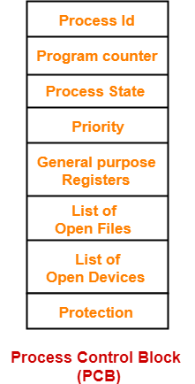
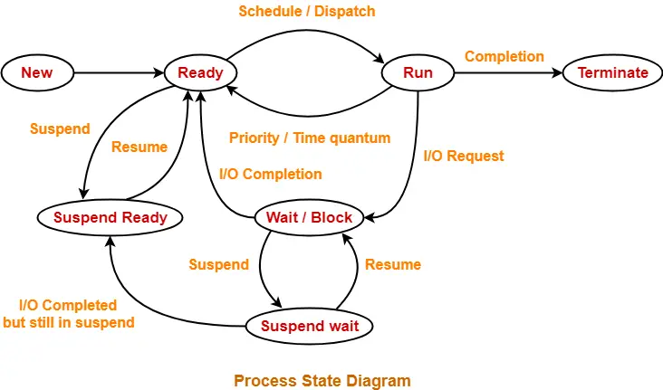
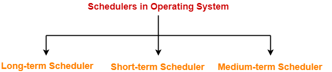
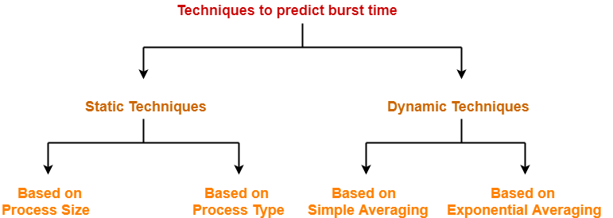
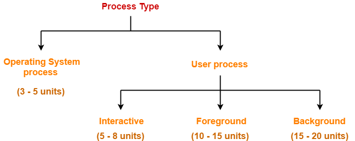
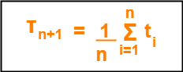
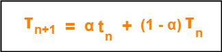
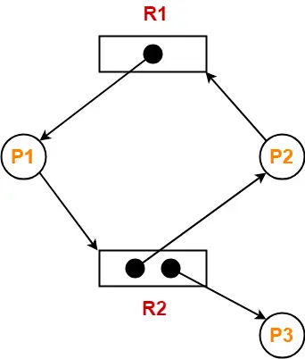

# Operating System Interview Questions & Answers

## 1. What is an Operating System? What are its main functions?

An Operating System (OS) is a system software that acts as an interface between computer hardware and user applications. It manages computer resources and provides a platform for other software to run.

**Main functions of an Operating System:**

- **Process Management**: Creating, scheduling, and terminating processes
- **Memory Management**: Allocating and deallocating memory space to processes
- **File System Management**: Creating, deleting, and managing files and directories
- **Device Management**: Managing input/output devices and their drivers
- **Security and Access Control**: Protecting system resources from unauthorized access
- **User Interface**: Providing command-line or graphical interface for user interaction
- **Network Management**: Managing network connections and protocols
# 1.1 what are different types of operating systems ?

### 1. Batch Operating system
- Firstly, user prepares his job using punch cards.
- Then, he submits the job to the computer operator.
- Operator collects the jobs from different users and sort the jobs into batches with similar needs.
- Then, operator submits the batches to the processor one by one.
- All the jobs of one batch are executed together.
## Advantages
- It saves the time that was being wasted earlier for each individual process in context switching from one environment to another environment.
- No manual intervention is needed.

## Disadvantages
- Priority can not be set for the jobs.
- Batch operating system may lead to starvation.
- CPU may remain idle for a long time.
- There is a lack of interaction between a user and his job.
  
### 2. Multiprogramming Operating System

Description: Multiple programs are loaded into memory and the CPU switches between them to increase CPU utilization.

Example: UNIX.

Use Case: Scientific computing, time-shared systems.

### 3. Multitasking Operating System

Description: Allows a single user to run multiple tasks (programs) at the same time.

Example: Windows, macOS.

Use Case: Personal computing environments.

### 4. Multiprocessing Operating System

Description: Supports two or more processors working simultaneously to execute tasks.

Example: Linux, Windows Server.

Use Case: High-performance computing, servers.

### 5. Real-Time Operating System (RTOS)

Description: Responds to input immediately and is used in time-critical environments.

Example: FreeRTOS, VxWorks.

Use Case: Embedded systems, robotics, medical devices.

# 1.2 Process Control Block | Process Attributes
- Process Control Block (PCB) is a data structure that stores information about a particular process.
- This information is required by the CPU while executing the process.
 

The Process Control Block of a process looks like-



- Each process is identified by its own process control block (PCB).
- It is also called as context of the process.
## Process Attributes-
 
The various attributes of process stored in the PCB are-

## 1. Process Id-
 - Process Id is a unique Id that identifies each process of the system uniquely.
- A process Id is assigned to each process during its creation.
## 2. Program Counter-
- Program counter specifies the address of the instruction to be executed next.
- Before execution, program counter is initialized with the address of the first instruction of the program.
- After executing an instruction, value of program counter is automatically incremented to point to the next instruction.
- This process repeats till the end of the program
## 3. Process State-
- Each process goes through different states during its lifetime.
Process state specifies the current state of the process.
## 4. Priority-
- Priority specifies how urgent is to execute the process.
- Process with the highest priority is allocated the CPU first among all the processes.
## 5. General Purpose Registers-
- General purpose registers are used to hold the data of process generated during its execution.
- Each process has its own set of registers which are maintained by its PCB.
 ## 6. List of Open Files-
 - Each process requires some files which must be present in the main memory during its execution.
- PCB maintains a list of files used by the process during its execution.
## 7. List of Open Devices-
 - PCB maintains a list of open devices used by the process during its execution.
# Important Notes-
- PCB of each process resides in the main memory.
- There exists only one PCB corresponding to each process.
- PCB of all the processes are present in a linked list.
## 2. What is the difference between Process and Thread?

| Process | Thread |
|---------|--------|
| Independent execution unit with its own memory space | Lightweight execution unit within a process |
| Has separate address space | Shares address space with other threads in same process |
| Communication through Inter Process Communication (IPC) | Communication through shared memory |
| Creation is expensive | Creation is less expensive |
| Context switching is slower | Context switching is faster |
| If one process crashes, others are unaffected | If one thread crashes, entire process may crash |
| Example: Each application like browser, notepad | Example: Multiple tabs in a browser |

## 3. Explain Process States and Process State Diagram.


A process can be in one of several states during its lifetime:

**Process States:**
- **1. New State**:
    - Process is being created. 
    - A process is said to be in new state when a program present in the secondary memory is initiated for execution.
- **2. Ready State**:
   -  Process is ready to be assigned to CPU
   -  A process moves from new state to ready state after it is loaded into the main memory and is ready for execution.
   - In ready state, the process waits for its execution by the processor.
   - In multiprogramming environment, many processes may be present in the ready state.
- **3 Running**: 
  - Process is currently being executed by CPU
- **4. Terminate State**: 
  - Process has finished execution
  - After entering the terminate state, context (PCB) of the process is deleted by the operating system.

- **5. Waiting/Blocked**: 
  - Process is waiting for some event (I/O completion)
  - After the I/O operation gets completed or resource becomes available, the process moves to the ready state.
  
- **6. Suspend Ready State**
    - A process moves from ready state to suspend ready state if a process with higher priority has to be executed but the main memory is full.
    - Moving a process with lower priority from ready state to suspend ready state creates a room for higher priority process in the ready state.
    - The process remains in the suspend ready state until the main memory becomes available.
    - When main memory becomes available, the process is brought back to the ready state.

- **7. Suspend Wait State**
    - A process moves from wait state to suspend wait state if a process with higher priority has to be executed but the main memory is full.
    - Moving a process with lower priority from wait state to suspend wait state creates a room for higher priority process in the ready state.
    - After the resource becomes available, the process is moved to the suspend ready state.
    - After main memory becomes available, the process is moved to the ready state.

# Important Notes-
- A process necessarily goes through minimum 4 states.
- A single processor can execute only one process at a time.
- Moving a process from wait state to suspend wait state is a better alternative.
---

## 4. What is CPU Scheduling? Explain different CPU scheduling algorithms.

CPU Scheduling is the process of determining which process should be allocated CPU time when multiple processes are ready to execute.

**Types of scheduler**

# 1. Long-term Scheduler-
- The primary objective of long-term scheduler is to maintain a good degree of multiprogramming.
- Long-term scheduler is also known as Job Scheduler.
- It selects a balanced mix of I/O bound and CPU bound processes from the secondary memory (new state).
- Then, it loads the selected processes into the main memory (ready state) for execution.
# 2. Short-term Scheduler-
- The primary objective of short-term scheduler is to increase the system performance.
- Short-term scheduler is also known as CPU Scheduler.
- It decides which process to execute next from the ready queue.
- After short-term scheduler decides the process, Dispatcher assigns the decided process to the CPU for execution.

 # 3. Medium-term Scheduler-
- The primary objective of medium-term scheduler is to perform swapping.
Medium-term scheduler swaps-out the processes from main memory to secondary memory to free up the main memory when required.
- Thus, medium-term scheduler reduces the degree of multiprogramming.
- After some time when main memory becomes available, medium-term scheduler swaps-in the swapped-out process to the main memory and its execution is resumed from where it left off.
- Swapping may also be required to improve the process mix.

## Degree of Multiprogramming-

In multiprogramming systems,
Multiple processes may be present in the ready state which are all ready for execution.
Degree of multiprogramming is the maximum number of processes that can be present in the ready state.
Long-term scheduler controls the degree of multiprogramming.
Medium-term scheduler reduces the degree of multiprogramming.
## Optimal Degree of Multiprogramming-
An optimal degree of multiprogramming means average rate of process creation is equal to the average departure rate of processes from main memory.
It is the responsibility of long-term scheduler to maintain a good degree of multiprogramming.

# Various Times Related To Process-
1. Arrival Time-
    - Arrival time is the point of time at which a process enters the ready queue.
 
2. Waiting Time-
    - Waiting time is the amount of time spent by a process waiting in the ready queue for getting the CPU.
 
```
    Waiting time = Turn Around time – Burst time
```
3. Response Time-
    - Response time is the amount of time after which a process gets the CPU for the first time after entering the ready queue.
 
```
    Response Time = Time at which process first gets the CPU – Arrival time
 ```
4. Burst Time-
 

    - Burst time is the amount of time required by a process for executing on CPU.
    - It is also called as execution time or running time.
    - Burst time of a process can not be known in advance before executing the process.
    - It can be known only after the process has executed.
5. Completion Time-
 

    - Completion time is the point of time at which a process completes its execution on the CPU and takes exit from the system.
    - It is also called as exit time.
 

6. Turn Around Time-
 

    - Turn Around time is the total amount of time spent by a process in the system.
    - When present in the system, a process is either waiting in the ready queue for getting the CPU or it is executing on the CPU.
 
    ```
    Turn Around time = Burst time + Waiting time
    OR

    Turn Around time = Completion time – Arrival time
    
    ```
## Important Note-
 

While discussing the above definitions,

We have considered that the process does not require an I/O operation.
When process is present in the system, it will be either waiting for the CPU in the ready state or it will be executing on the CPU.
**CPU Scheduling Algorithms:**

### First Come First Serve (FCFS)
- The process which arrives first in the ready queue is firstly assigned the CPU.
- In case of a tie, process with smaller process id is executed first.
- It is always non-preemptive in nature.
## Advantages-
- It is simple and easy to understand.
- It can be easily implemented using queue data structure.
- It does not lead to starvation.
## Disadvantages-
- It does not consider the priority or burst time of the processes.
- It suffers from convoy effect.(
Consider processes with higher burst time arrived before the processes with smaller burst time.Then, smaller processes have to wait for a long time for longer processes to release the CPU.)
### Shortest Job First (SJF)
- Out of all the available processes, CPU is assigned to the process having smallest burst time.
- In case of a tie, it is broken by FCFS Scheduling.
- SJF Scheduling can be used in both preemptive and non-preemptive mode.
- Preemptive mode of Shortest Job First is called as Shortest Remaining Time First (SRTF).
##  Advantages-
- SRTF is optimal and guarantees the minimum average waiting time.
- It provides a standard for other algorithms since no other algorithm performs better than it.
## Disadvantages-
- It can not be implemented practically since burst time of the processes can not be known in advance.
- It leads to starvation for processes with larger burst time.
Priorities can not be set for the processes.
- Processes with larger burst time have poor response time.
## Implementation of Algorithm-
- Practically, the algorithm can not be implemented but theoretically it can be implemented.
- Among all the available processes, the process with smallest burst time has to be selected.
- Min heap is a suitable data structure where root element contains the process with least burst time.
- In min heap, each process will be added and deleted exactly once.
Adding an element takes log(n) time and deleting an element takes log(n) time.
- Thus, for n processes, time complexity = n x 2log(n) = nlog(n)
  
## Techniques to Predict Burst Time-
There are several techniques which try to predict the burst time for the processes so that the algorithm can be implemented.

These techniques are-



### 1. Based on Process Size-
 

This technique predicts the burst time for a process based on its size.
Burst time of the already executed process of similar size is taken as the burst time for the process to be executed.
 
Example-
 

Consider a process of size 200 KB took 20 units of time to complete its execution.
Then, burst time for any future process having size around 200 KB can be taken as 20 units.
```
                        NOTE
The predicted burst time may not always be right.
This is because the burst time of a process also depends on what kind of a process it is.
```
### 2. Based on Process Type-
This technique predicts the burst time for a process based on its type.
The following figure shows the burst time assumed for several kinds of processes.


## Dynamic Techniques-
 

There are two dynamic techniques-

### 1. Based on Simple Averaging-
 
Burst time for the process to be executed is taken as the average of all the processes that are executed till now.
Given n processes P1, P2, … , Pn and burst time of each process Pi as ti, then predicted burst time for process Pn+1 is given as-



### 2. Based on Exponential Averaging-
 

Given n processes P1, P2, … , Pn and burst time of each process Pi as ti. Then, predicted burst time for process Pn+1 is given as-



```
where-
α is called smoothening factor (0<= α <=1)
tn = actual burst time of process Pn
Tn = Predicted burst time for process Pn
```
### Longest Job First Algorithm-
- Out of all the available processes, CPU is assigned to the process having largest burst time.
- In case of a tie, it is broken by FCFS Scheduling.
- LJF Scheduling can be used in both preemptive and non-preemptive mode.
- Preemptive mode of Longest Job First is called as Longest Remaining Time First (LRTF).
## Advantages-
- No process can complete until the longest job also reaches its completion.
- All the processes approximately finishes at the same time.
## Disadvantages-
- The waiting time is high.
- Processes with smaller burst time may starve for CPU.

# HRRN Scheduling 
- Out of all the available processes, CPU is assigned to the process having highest response ratio.
- In case of a tie, it is broken by FCFS Scheduling.
- It operates only in non-preemptive mode.
  Calculating Response Ratio-
Response Ratio (RR) for any process is calculated by using the formula-

```
response ratio = (W+B)/B
where-
W = Waiting time of the process so far
B = Burst time or Service time of the process
```
## Advantages-
- It performs better than SJF Scheduling.
- It not only favors the shorter jobs but also limits the waiting time of longer jobs.
## Disadvantages-
- It can not be implemented practically.
- This is because burst time of the processes can not be known in advance.
 

### Round Robin (RR)
- CPU is assigned to the process on the basis of FCFS for a fixed amount of time.
- This fixed amount of time is called as time quantum or time slice.
- After the time quantum expires, the running process is preempted and sent to the ready queue.
- Then, the processor is assigned to the next arrived process.
- It is always preemptive in nature.
- Round Robin Scheduling is FCFS Scheduling with preemptive mode.
## Advantages-
- It gives the best performance in terms of average response time.
- It is best suited for time sharing system, client server architecture and interactive system.
## Disadvantages-
- It leads to starvation for processes with larger burst time as they have to repeat the cycle many times.
- Its performance heavily depends on time quantum.
- Priorities can not be set for the processes.
## Important Notes-
 

Note-01:
 

With decreasing value of time quantum,

- Number of context switch increases
- Response time decreases
- Chances of starvation decreases
 

Thus, smaller value of time quantum is better in terms of response time.

Note-02:
 

With increasing value of time quantum,

- Number of context switch decreases
- Response time increases
- Chances of starvation increases
 

Thus, higher value of time quantum is better in terms of number of context switch.

## Note-03:
 
- With increasing value of time quantum, Round Robin Scheduling tends to become FCFS Scheduling.
- When time quantum tends to infinity, Round Robin Scheduling becomes FCFS Scheduling.
## Note-04:
 - The performance of Round Robin scheduling heavily depends on the value of time quantum.
- The value of time quantum should be such that it is neither too big nor too small.
 

### Priority Scheduling
- Out of all the available processes, CPU is assigned to the process having the highest priority.
- In case of a tie, it is broken by FCFS Scheduling.
- Priority Scheduling can be used in both preemptive and non-preemptive mode.
## Advantages-
- It considers the priority of the processes and allows the important processes to run first.
- Priority scheduling in preemptive mode is best suited for real time operating system.
 ## Disadvantages-
 - Processes with lesser priority may starve for CPU.
- There is no idea of response time and waiting time.
## Important Notes-
Note-01:
 
- The waiting time for the process having the highest priority will always be zero in preemptive mode.
- The waiting time for the process having the highest priority may not be zero in non-preemptive mode.
  
Note-02:
 
Priority scheduling in preemptive and non-preemptive mode behaves exactly same under following conditions-

- The arrival time of all the processes is same
- All the processes become available
### Multilevel Queue Scheduling
- Multiple queues with different priorities
- Each queue can have its own scheduling algorithm
- Processes are permanently assigned to queues

## 5. What is Deadlock? What are the conditions for deadlock?

The execution of two or more processes is blocked because each process holds some resource and waits for another resource held by some other process.

**Four Necessary Conditions for Deadlock (Coffman Conditions):**

1. **Mutual Exclusion**: At least one resource must be held in non-shareable mode
2. **Hold and Wait**: There must exist a process which holds some resource and waits for another resource held by some other process.
3. **No Preemption**: Resources cannot be forcibly taken away from processes
4. **Circular Wait**: There must be a circular chain of processes, each waiting for a resource held by the next process
## Important Note-
- All these 4 conditions must hold simultaneously for the occurrence of deadlock.
- If any of these conditions fail, then the system can be ensured deadlock free.
# Deadlock Handling-

The various strategies(4) for handling deadlock are-
# 1. Deadlock Prevention-
 - This strategy involves designing a system that violates one of the four necessary conditions required for the occurrence of deadlock.
- This ensures that the system remains free from the deadlock.
- The various conditions of deadlock occurrence may be violated as-

## 1. Mutual Exclusion-
- To violate this condition, all the system resources must be such that they can be used in a shareable mode.
- In a system, there are always some resources which are mutually exclusive by nature.
- So, this condition can not be violated.
 
## 2. Hold and Wait-
 
This condition can be violated in the following ways-

### Approach-01:
In this approach,
- A process has to first request for all the resources it requires for execution.
- Once it has acquired all the resources, only then it can start its execution.
- This approach ensures that the process does not hold some resources and wait for other resources.
 
# Drawbacks-
 
- It is less efficient.
- It is not implementable since it is not possible to predict in advance which resources will be required during execution.
 
## Approach-02:
 

In this approach,

- A process is allowed to acquire the resources it desires at the current moment.
- After acquiring the resources, it start its execution.
- Now before making any new request, it has to compulsorily release all the resources that it holds currently.
- This approach is efficient and implementable.
 
## Approach-03:
 

In this approach,

- A timer is set after the process acquires any resource.
After the timer expires, a process has to compulsorily release the resource.
 
## 3. No Preemption-
 

This condition can by violated by forceful preemption.
Consider a process is holding some resources and request other resources that can not be immediately allocated to it.
Then, by forcefully preempting the currently held resources, the condition can be violated.
 

A process is allowed to forcefully preempt the resources possessed by some other process only if-
It is a high priority process or a system process.
The victim process is in the waiting state.
 

## 4. Circular Wait-
 

This condition can be violated by not allowing the processes to wait for resources in a cyclic manner.
To violate this condition, the following approach is followed-
 

Approach-
 

A natural number is assigned to every resource.
Each process is allowed to request for the resources either in only increasing or only decreasing order of the resource number.
In case increasing order is followed, if a process requires a lesser number resource, then it must release all the resources having larger number and vice versa.
This approach is the most practical approach and implementable.
However, this approach may cause starvation but will never lead to deadlock.
 

# 2. Deadlock Avoidance-
- This strategy involves maintaining a set of data using which a decision is made whether to entertain the new request or not.
- If entertaining the new request causes the system to move in an unsafe state, then it is discarded.
- This strategy requires that every process declares its maximum requirement of each resource type in the beginning.
- The main challenge with this approach is predicting the requirement of the processes before execution.
- Banker’s Algorithm is an example of a deadlock avoidance strategy.
 

# 3. Deadlock Detection and Recovery-
- This strategy involves waiting until a deadlock occurs.
- After deadlock occurs, the system state is recovered.
- The main challenge with this approach is detecting the deadlock.
 
# 4. Deadlock Ignorance-
 - This strategy involves ignoring the concept of deadlock and assuming as if it does not exist.
- This strategy helps to avoid the extra overhead of handling deadlock.
- Windows and Linux use this strategy and it is the most widely used method.
- It is also called as Ostrich approach.

**Deadlock Prevention Methods:**
- Eliminate any one of the four conditions
- Resource ordering to prevent circular wait
- Banker's algorithm for safe state checking
## Important Concept-
Consider there are n processes in the system P1, P2, P3, …… , Pn where-

- Process P1 requires x1 units of resource R
- Process P2 requires x2 units of resource R
- Process P3 requires x3 units of resource R and so on.
  
In worst case,
- The number of units that each process holds = One less than its maximum demand
- Process P1 holds x1 – 1 units of resource R
- Process P2 holds x2 – 1 units of resource R
- Process P3 holds x3 – 1 units of resource R and so on.

Now,
- Had there been one more unit of resource R in the system, system could be ensured deadlock free.
- This is because that unit would be allocated to one of the processes and it would get execute and then release its units.

From here, we have-
# Maximum Number Of Units That Ensures Deadlock-
Maximum number of units of resource R that ensures deadlock
```
= (x1-1) + (x2-1) + (x3-1) + …. + (xn-1)

= ( x1 + x2 + x3 + …. + xn ) – n
= ∑xi – n

= Sum of max needs of all n processes – n
```
# Minimum Number Of Units That Ensures No Deadlock-
Minimum number of units of resource R that ensures no deadlock
```
= One more than maximum number of units of resource R that ensures deadlock
= (∑xi – n) + 1
```
## Banker’s Algorithm | Deadlock Avoidance
- Banker’s Algorithm is a deadlock avoidance strategy.
- It is called so because it is used in banking systems to decide whether a loan can be granted or not.
### Prerequisite-
- Whenever a new process is created, it specifies the maximum number of instances of each resource type that it exactly needs.
### Data Structures Used-

| Data Structure | Definition | Example |
|----------------|------------|---------|
| **Available** | It is a single dimensional array that specifies the number of instances of each resource type currently available. | `Available[R1] = K`<br>It means K instances of resource type R1 are currently available. |
| **Max** | It is a two dimensional array that specifies the maximum number of instances of each resource type that a process can request. | `Max[P1][R1] = K`<br>It means process P1 is allowed to ask for maximum K instances of resource type R1. |
| **Allocation** | It is a two dimensional array that specifies the number of instances of each resource type that has been allocated to the process. | `Allocation[P1][R1] = K`<br>It means K instances of resource type R1 have been allocated to the process P1. |
| **Need** | It is a two dimensional array that specifies the number of instances of each resource type that a process requires for execution. | `Need[P1][R1] = K`<br>It means process P1 requires K more instances of resource type R1 for execution. |

# Working-
 
- Banker’s Algorithm is executed whenever any process puts forward the request for allocating the resources.
- It involves the following steps-
### Step-01:
 
- Banker’s Algorithm checks whether the request made by the process is valid or not.
- If the request is invalid, it aborts the request.
- If the request is valid, it follows step-02.
  
```
                    Valid Request
A request is considered valid if and only if-

The number of requested instances of each resource type is less than the need declared by the process in the beginning.
```
### Step-02:
- Banker’s Algorithm checks if the number of requested instances of each resource type is less than the number of available instances of each type.
- If the sufficient number of instances are not available, it asks the process to wait longer.
- If the sufficient number of instances are available, it follows step-03.
 
 ### Step-03:
- Banker’s Algorithm makes an assumption that the requested resources have been allocated to the process.
- Then, it modifies its data structures accordingly and moves from one state to the other state.
```
Available = Available - Request(i)
Allocation(i) = Allocation(i) + Request(i)
Need(i) = Need(i) - Request(i)

```
- Now, Banker’s Algorithm follows the safety algorithm to check whether the resulting state it has entered in is a safe state or not.
- If it is a safe state, then it allocates the requested resources to the process in actual.
- If it is an unsafe state, then it rollbacks to its previous state and asks the process to wait longer.
```
                    Safe State
A system is said to be in safe state when-

All the processes can be executed in some arbitrary sequence with the available number of resources.
 ```
### Safety Algorithm Data Structures-
To implement safety algorithm, following two data structures are used-

# Banker's Algorithm - Additional Data Structures

| Data Structure | Definition | Example |
|----------------|------------|---------|
| **Work** | It is a single dimensional array that specifies the number of instances of each resource type currently available. | `Work[R1] = K`<br>It means K instances of resource type R1 are currently available. |
| **Finish** | It is a single dimensional array that specifies whether the process has finished its execution or not. | `Finish[P1] = 0`<br>It means process P1 is still left to execute. |
### Safety Algorithm-
Safety Algorithm is executed to check whether the resultant state after allocating the resources is safe or not.

### Step-01:
Initially-

- Number of instances of each resource type currently available = Available
- All the processes are to be executed.
- So, in Step-01, the data structures are initialized as-
 
```
Work = Available
Finish(i) = False for i = 0, 1, 2, ..., n-1
 ```

### Step-02:
 
- Safety Algorithm looks for an unfinished process whose need is less than or equal to work.
- So, Step-02 finds an index i such that-
 ```
Finish[ i ] = False
Need(i) <= Work.
 ```

If such a process exists, then step-03 is followed otherwise step-05 is followed.
 

## Step-03:
 
- After finding the required process, safety algorithm assumes that the requested resources are allocated to the process.
- The process runs, finishes its execution and the resources allocated to it gets free.
- The resources are then added to the work and finish(i) of that process is set as true.
 
```
Work = Work + Allocation
Finish(i) = True
```
## Step-04:
The loop of Step-02 and Step-03 is repeated.
## Step-05:
- If all the processes can be executed in some sequence, then the system is said to be in a safe state.
- In other words, if Finish(i) becomes True for all i, then the system is in a safe state otherwise not.
## Resource Allocation Graph-
```
Resource Allocation Graph (RAG) is a graph that represents the state of a system pictorially.
```
It gives complete information about the state of a system such as-
- How many processes exist in the system?
- How many instances of each resource type exist?
- How many instances of each resource type are allocated?
- How many instances of each resource type are still available?
- How many instances of each resource type are held by each process?
- How many instances of each resource type does each process need for execution?
 
### Components Of RAG-
There are two major components of a Resource Allocation Graph-
### 1. Vertices-
 

There are following types of vertices(Process Vertices & 
Resource Vertices) in a Resource Allocation Graph-
## Process Vertices-
 
- Process vertices represent the processes.
- They are drawn as a circle by mentioning the name of process inside the circle.
## Resource Vertices-
- Resource vertices represent the resources.
- Depending on the number of instances that exists in the system, resource vertices may be single instance or multiple instance.
- They are drawn as a rectangle by mentioning the dots inside the rectangle.
- The number of dots inside the rectangle indicates the number of instances of that resource existing in the system.
## 2. Edges-
There are two types of edges in a Resource Allocation Graph-


## Assign Edges-
- Assign edges represent the assignment of resources to the processes.
-  They are drawn as an arrow where the head of the arrow points to the process and tail of the process points to the instance of the resource.

## Request Edges-
- Request edges represent the waiting state of processes for the resources.
- They are drawn as an arrow where the head of the arrow points to the instance of the resource and tail of the process points to the process.
- If a process requires ‘n’ instances of a resource type, then ‘n’ assign edges will be drawn.
  

The following diagram represents a Resource Allocation Graph-




It gives the following information-

- There exist three processes in the system namely P1, P2 and P3.
- There exist two resources in the system namely R1 and R2.
- There exists a single instance of resource R1 and two instances of resource R2.
- Process P1 holds one instance of resource R1 and is waiting for an instance of resource R2.
- Process P2 holds one instance of resource R2 and is waiting for an instance of resource R1.
- Process P3 holds one instance of resource R2 and is not waiting for anything.
  
## Deadlock Detection-
Using Resource Allocation Graph, it can be easily detected whether system is in a Deadlock state or not.

The rules are-
## Rule-01:
- In a Resource Allocation Graph where all the resources are single instance,
- If a cycle is being formed, then system is in a deadlock state.
- If no cycle is being formed, then system is not in a deadlock state.
 
## Rule-02:
 
- In a Resource Allocation Graph where all the resources are NOT single instance,
- If a cycle is being formed, then system may be in a deadlock state.
- Banker’s Algorithm is applied to confirm whether system is in a deadlock state or not.
- If no cycle is being formed, then system is not in a deadlock state.
- Presence of a cycle is a necessary but not a sufficient condition for the occurrence of deadlock.
 


## 6. Explain Memory Management techniques.

Memory management involves organizing and controlling computer memory allocation.

**Memory Management Techniques:**

### Contiguous Memory Allocation
- **Fixed Partitioning**: Memory divided into fixed-size partitions
- **Variable Partitioning**: Memory divided into variable-size partitions
- Problems: Internal/External fragmentation

### Non-Contiguous Memory Allocation
- **Paging**: Logical memory divided into pages, physical memory into frames
- **Segmentation**: Memory divided into variable-size segments
- **Segmented Paging**: Combination of segmentation and paging

### Virtual Memory
- Allows execution of processes that may not be completely in memory
- Uses demand paging - pages loaded only when needed
- Provides illusion of large memory space

## 7. What is Virtual Memory? How does it work?

Virtual Memory is a memory management technique that provides an abstraction of storage resources, giving the illusion of a very large main memory.

**How Virtual Memory Works:**

1. **Address Translation**: Virtual addresses are translated to physical addresses
2. **Page Tables**: Maintain mapping between virtual and physical pages
3. **Demand Paging**: Pages are loaded into memory only when accessed
4. **Page Replacement**: When memory is full, some pages are swapped to disk

**Benefits:**
- Programs can be larger than physical memory
- Better memory utilization
- Easier programming (no need to manage overlays)
- Better multiprogramming

**Page Replacement Algorithms:**
- FIFO (First In First Out)
- LRU (Least Recently Used)
- Optimal Page Replacement
- Clock Algorithm

## 8. What is Paging and Segmentation?

### Paging
- Logical memory is divided into fixed-size blocks called **pages**
- Physical memory is divided into fixed-size blocks called **frames**
- Pages can be loaded into any available frame
- Uses page table for address translation
- Eliminates external fragmentation but may cause internal fragmentation

### Segmentation
- Memory is divided into variable-size segments based on logical units
- Each segment has a name/number and length
- Segments can grow dynamically
- Uses segment table for address translation
- Eliminates internal fragmentation but may cause external fragmentation

**Comparison:**
| Paging | Segmentation |
|--------|--------------|
| Fixed-size divisions | Variable-size divisions |
| Invisible to programmer | Visible to programmer |
| No external fragmentation | May have external fragmentation |
| May have internal fragmentation | No internal fragmentation |

## 9. Explain Inter Process Communication (IPC) mechanisms.

IPC allows processes to communicate and synchronize with each other.

**IPC Mechanisms:**

### Shared Memory
- Processes share a common memory region
- Fast communication method
- Requires synchronization mechanisms
- Example: POSIX shared memory

### Message Passing
- Processes communicate by sending/receiving messages
- Can be synchronous or asynchronous
- Two models: Direct communication, Indirect communication (mailboxes)

### Pipes
- **Anonymous Pipes**: Communication between parent and child processes
- **Named Pipes (FIFOs)**: Communication between unrelated processes

### Signals
- Software interrupts sent to processes
- Used for notification of events
- Example: SIGKILL, SIGTERM

### Semaphores
- Used for process synchronization
- Binary semaphores (mutex) or counting semaphores

### Sockets
- Communication between processes on same or different machines
- Support network communication

## 10. What are Semaphores? Explain Producer-Consumer problem.

**Semaphores** are synchronization primitives used to control access to shared resources.

**Types of Semaphores:**
- **Binary Semaphore (Mutex)**: Can have values 0 or 1
- **Counting Semaphore**: Can have non-negative integer values

**Semaphore Operations:**
- **Wait (P operation)**: Decrements semaphore value, blocks if value becomes negative
- **Signal (V operation)**: Increments semaphore value, wakes up blocked processes

### Producer-Consumer Problem

**Problem**: Producers generate data and put into buffer, consumers take data from buffer. Need to synchronize access to shared buffer.

**Solution using Semaphores:**

```c
// Shared variables
int buffer[N];
int in = 0, out = 0;
semaphore mutex = 1;      // Binary semaphore for buffer access
semaphore empty = N;      // Count of empty slots
semaphore full = 0;       // Count of full slots

// Producer Process
void producer() {
    while(true) {
        // Produce item
        wait(empty);          // Wait for empty slot
        wait(mutex);          // Lock buffer
        buffer[in] = item;    // Add item to buffer
        in = (in + 1) % N;
        signal(mutex);        // Unlock buffer
        signal(full);         // Signal full slot
    }
}

// Consumer Process
void consumer() {
    while(true) {
        wait(full);           // Wait for full slot
        wait(mutex);          // Lock buffer
        item = buffer[out];   // Remove item from buffer
        out = (out + 1) % N;
        signal(mutex);        // Unlock buffer
        signal(empty);        // Signal empty slot
        // Consume item
    }
}
```

## 11. What is File System? Explain different file allocation methods.

A File System is a method for storing and organizing files on storage devices.

**File Allocation Methods:**

### Contiguous Allocation
- Files are stored in contiguous blocks on disk
- **Advantages**: Simple, fast sequential access
- **Disadvantages**: External fragmentation, file size changes difficult

### Linked Allocation
- Each file is a linked list of disk blocks
- **Advantages**: No external fragmentation, dynamic file size
- **Disadvantages**: No random access, pointer overhead

### Indexed Allocation
- Each file has an index block containing pointers to data blocks
- **Advantages**: Random access, no external fragmentation
- **Disadvantages**: Index block overhead

**File System Components:**
- **Boot Block**: Contains bootstrap code
- **Super Block**: Contains file system metadata
- **Inode Table**: Contains file metadata (Unix-like systems)
- **Data Blocks**: Actual file content

## 12. Explain different types of Operating Systems.

### Batch Operating System
- Jobs are processed in batches without user interaction
- High throughput but no interactivity
- Example: Early mainframe systems

### Time-Sharing Operating System
- Multiple users share CPU time through time slicing
- Provides interactive computing
- Example: Unix, Linux with multiple terminals

### Real-Time Operating System (RTOS)
- **Hard Real-Time**: Strict timing constraints must be met
- **Soft Real-Time**: Timing constraints are important but not critical
- Example: Embedded systems, industrial control

### Distributed Operating System
- Resources are distributed across multiple machines
- Appears as single system to users
- Example: Amoeba, Plan 9

### Network Operating System
- Provides services to computers connected over network
- Each machine maintains its own OS
- Example: Windows Server, Novell NetWare

### Mobile Operating System
- Designed for mobile devices
- Focus on power efficiency and touch interfaces
- Example: Android, iOS

## 13. What is System Call? Give examples.

System Calls are programming interfaces that allow user programs to request services from the operating system kernel.

**Types of System Calls:**

### Process Control
- `fork()`: Create new process
- `exec()`: Execute program
- `wait()`: Wait for child process
- `exit()`: Terminate process

### File Management
- `open()`: Open file
- `read()`: Read from file
- `write()`: Write to file
- `close()`: Close file
- `lseek()`: Move file pointer

### Device Management
- `ioctl()`: Control device
- `read()`: Read from device
- `write()`: Write to device

### Information Maintenance
- `getpid()`: Get process ID
- `time()`: Get current time
- `sleep()`: Suspend process

### Communication
- `pipe()`: Create pipe
- `shmget()`: Get shared memory
- `msgget()`: Get message queue

**System Call Implementation:**
1. User program makes system call
2. Mode switch from user to kernel mode
3. Kernel executes requested service
4. Return to user mode with results

## 14. What is the difference between Multiprogramming and Multiprocessing?

| Multiprogramming | Multiprocessing |
|------------------|-----------------|
| Multiple programs in memory, CPU switches between them | Multiple CPUs/cores execute programs simultaneously |
| Single CPU system | Multiple CPU system |
| Increases CPU utilization | Increases overall system throughput |
| Context switching between processes | Parallel execution of processes |
| Example: Running multiple applications on single-core system | Example: Running applications on multi-core system |

**Multiprogramming Benefits:**
- Better CPU utilization
- Reduced idle time
- Better system throughput

**Multiprocessing Benefits:**
- True parallel execution
- Better performance for CPU-intensive tasks
- Fault tolerance (if one CPU fails, others continue)

## 15. Explain Critical Section Problem and its solutions.

**Critical Section** is a segment of code where shared resources are accessed and must be executed atomically.

**Critical Section Problem Requirements:**
1. **Mutual Exclusion**: Only one process can be in critical section at a time
2. **Progress**: If no process is in critical section, selection of next process should not be postponed indefinitely
3. **Bounded Waiting**: There should be a limit on number of times other processes can enter critical section after a process has made request

**Solutions:**

### Peterson's Solution (Software Solution)
```c
// For two processes P0 and P1
int turn = 0;
boolean flag[2] = {false, false};

// Process Pi (i = 0 or 1)
void process(int i) {
    int j = 1 - i;  // Other process
    
    // Entry section
    flag[i] = true;
    turn = j;
    while(flag[j] && turn == j);
    
    // Critical section
    
    // Exit section
    flag[i] = false;
    
    // Remainder section
}
```

### Hardware Solutions
- **Test and Set**: Atomic instruction to test and modify memory
- **Compare and Swap**: Atomic instruction to compare and exchange values
- **Disable Interrupts**: Prevent context switching during critical section

### Mutex (Mutual Exclusion)
- Binary semaphore used for mutual exclusion
- Only one process can acquire mutex at a time

## 16. What is Thrashing in Operating Systems?

**Thrashing** is a condition where the system spends more time in page swapping than in executing processes.

**Causes of Thrashing:**
- High degree of multiprogramming
- Insufficient physical memory
- Poor page replacement algorithm
- Processes have poor locality of reference

**Effects of Thrashing:**
- Severe performance degradation
- High disk I/O activity
- Low CPU utilization
- System becomes unresponsive

**Solutions to Prevent Thrashing:**
- **Working Set Model**: Keep frequently used pages in memory
- **Page Fault Frequency**: Monitor page fault rate
- **Reduce Degree of Multiprogramming**: Suspend some processes
- **Increase Physical Memory**: Add more RAM
- **Better Page Replacement Algorithm**: Use LRU or optimal algorithm

**Working Set**: Set of pages that a process is actively using. If working set is in memory, thrashing is less likely.

## 17. Explain Memory Protection mechanisms.

Memory Protection prevents processes from accessing memory locations not allocated to them.

**Memory Protection Mechanisms:**

### Base and Limit Registers
- Base register: Starting address of process memory
- Limit register: Size of process memory
- Hardware checks all memory accesses

### Segmentation with Protection
- Each segment has protection bits (read, write, execute)
- Segment table contains protection information
- Hardware checks permissions on each access

### Paging with Protection
- Page table entries contain protection bits
- Translation Lookaside Buffer (TLB) caches protection info
- Memory Management Unit (MMU) enforces protection

### Address Space Layout Randomization (ASLR)
- Randomizes memory layout of processes
- Makes buffer overflow attacks difficult
- Implemented in modern operating systems

**Protection Mechanisms:**
- **User/Kernel Mode**: Separate privilege levels
- **Memory Segmentation**: Logical separation of memory regions
- **Access Control Lists**: Fine-grained permission control
- **Stack Canaries**: Detect buffer overflow attacks

This comprehensive guide covers the most commonly asked operating system interview questions with detailed explanations and examples.

# Process Synchronization - Complete Guide for Software Developers

When multiple processes execute concurrently sharing system resources, then inconsistent results might be produced.

- Process Synchronization is a mechanism that deals with the synchronization of processes.
- It controls the execution of processes running concurrently to ensure that consistent results are produced.

## Need of Synchronization

- When multiple processes execute concurrently sharing some system resources.
- To avoid the inconsistent results.

## Critical Section

- Critical section is a section of the program where a process access the shared resources during its execution.

## Race Condition

- The final output produced depends on the execution order of instructions of different processes.
- Several processes compete with each other.

## Synchronization Mechanisms

```
Synchronization mechanisms allow the processes to access critical section in a synchronized manner to avoid the inconsistent results.
```

For every critical section in the program, a synchronization mechanism adds:

- An entry section before the critical section
- An exit section after the critical section

## Entry Section

- It acts as a gateway for a process to enter inside the critical section.
- It ensures that only one process is present inside the critical section at any time.
- It does not allow any other process to enter inside the critical section if one process is already present inside it.

## Exit Section

- It acts as an exit gate for a process to leave the critical section.
- When a process takes exit from the critical section, some changes are made so that other processes can enter inside the critical section.

## Criteria For Synchronization Mechanisms

Any synchronization mechanism proposed to handle the critical section problem should meet the following criteria:

### 1. Mutual Exclusion

The mechanism must ensure:

- The processes access the critical section in a mutual exclusive manner.
- Only one process is present inside the critical section at any time.
- No other process can enter the critical section until the process already present inside it completes.

### 2. Progress

The mechanism must ensure:
- An entry of a process inside the critical section is not dependent on the entry of another process inside the critical section.
- A process can freely enter inside the critical section if there is no other process present inside it.
- A process enters the critical section only if it wants to enter.
- A process is not forced to enter inside the critical section if it does not want to enter.

### 3. Bounded Wait

The mechanism should ensure:

- The wait of a process to enter the critical section is bounded.
- A process gets to enter the critical section before its wait gets over.

### 4. Architectural Neutral

The mechanism should ensure:
- It can run on any architecture without any problem.
- There is no dependency on the architecture.

## Important Notes

**Note-01:**
- Mutual Exclusion and Progress are the mandatory criteria.
- They must be fulfilled by all the synchronization mechanisms.

**Note-02:**
- Bounded waiting and Architectural neutrality are the optional criteria.
- However, it is recommended to meet these criteria if possible.

## Lock Variable

- Lock variable is a synchronization mechanism.
- It uses a lock variable to provide the synchronization among the processes executing concurrently.
- However, it completely fails to provide the synchronization.

```
Initially, lock value is set to 0.

Lock value = 0 means the critical section is currently vacant and no process is present inside it.
Lock value = 1 means the critical section is currently occupied and a process is present inside it.
```

### Characteristics

The characteristics of this synchronization mechanism are:

- It can be used for any number of processes.
- It is a software mechanism implemented in user mode.
- There is no support required from the operating system.
- It is a busy waiting solution which keeps the CPU busy when the process is actually waiting.
- It does not fulfill any criteria of synchronization mechanism.

**Conclusion:**

- The lock variable synchronization mechanism is a complete failure.
- Thus, it is never used.

## Test and Set Lock

- Test and Set Lock (TSL) is a synchronization mechanism.
- It uses a test and set instruction to provide the synchronization among the processes executing concurrently.

```
Test-and-Set Instruction

It is an instruction that returns the old value of a memory location and sets the memory location value to 1 as a single atomic operation.
If one process is currently executing a test-and-set, no other process is allowed to begin another test-and-set until the first process test-and-set is finished.
```

It is implemented as:
- Initially, lock value is set to 0.
- Lock value = 0 means the critical section is currently vacant and no process is present inside it.
- Lock value = 1 means the critical section is currently occupied and a process is present inside it.

### Characteristics

The characteristics of this synchronization mechanism are:

- It ensures mutual exclusion.
- It is deadlock free.
- It does not guarantee bounded waiting and may cause starvation.
- It suffers from spin lock.
- It is not architectural neutral since it requires the operating system to support test-and-set instruction.
- It is a busy waiting solution which keeps the CPU busy when the process is actually waiting.

### Explanations

- This synchronization mechanism guarantees mutual exclusion.
- This synchronization mechanism guarantees freedom from deadlock.
- This synchronization mechanism does not guarantee bounded waiting.
- This synchronization mechanism suffers from spin lock where the execution of processes is blocked.

## Turn Variable

- Turn variable is a synchronization mechanism that provides synchronization among two processes.
- It uses a turn variable to provide the synchronization.

It is implemented as:

```
Initially, turn value is set to 0.

Turn value = 0 means it is the turn of process P0 to enter the critical section.
Turn value = 1 means it is the turn of process P1 to enter the critical section.
```

### Characteristics

The characteristics of this synchronization mechanism are:

- It ensures mutual exclusion.
- It follows the strict alternation approach.

```
Strict Alternation Approach
In strict alternation approach,
Processes have to compulsorily enter the critical section alternately whether they want it or not.
This is because if one process does not enter the critical section, then other process will never get a chance to execute again.
```

- It does not guarantee progress since it follows strict alternation approach.
- It ensures bounded waiting since processes are executed turn wise one by one and each process is guaranteed to get a chance.
- It ensures processes does not starve for the CPU.
- It is architectural neutral since it does not require any support from the operating system.
- It is deadlock free.
- It is a busy waiting solution which keeps the CPU busy when the process is actually waiting.

## Interest Variable

- Interest variable is a synchronization mechanism that provides synchronization among two processes.
- It uses an interest variable to provide the synchronization.

It is implemented as:

```
Initially, interest [0] and interest [1] are set to False.

Interest value [0] = False means that process P0 is not interested to enter the critical section.
Interest value [0] = True means that process P0 is interested to enter the critical section.
Interest value [1] = False means that process P1 is not interested to enter the critical section.
Interest value [1] = True means that process P1 is interested to enter the critical section.
```

### Characteristics

The characteristics of this synchronization mechanism are:

- It ensures mutual exclusion.
- It does not follow strict alternation approach.
- It ensures progress since if a process is not interested to enter the critical section, it never stops the other process to enter the critical section.
- It is architectural neutral since it does not require any support from the operating system.
- It is a busy waiting solution which keeps the CPU busy when the process is actually waiting.
- It suffers from deadlock.
- Since it suffers from deadlock, it does not guarantee bounded waiting.

## Semaphores in OS

A semaphore is a simple integer variable.
It is used to provide synchronization among multiple processes running concurrently.

### Types of Semaphores

There are mainly two types of semaphores:

## Counting Semaphores

A counting semaphore is implemented as:

```c
struct semaphore
{
   int value;
   Queue type L;
}

Wait (semaphore s)
{
   s.value = s.value - 1;
   if (s.value < 0)
   {
      put process (PCB) in L;
      sleep();
   }
   else
      return;
}

Signal (semaphore s)
{
   s.value = s.value + 1;
   if (s.value <=0 )
   {
       select a process (PCB) from L;
       wake up();
   }
}
```

### Explanation

The above implementation of counting semaphore has been explained in the following points:

**Point-01:**

A counting semaphore has two components:

- An integer value
- An associated waiting list (usually a queue)

**Point-02:**

The value of counting semaphore may be positive or negative.

- Positive value indicates the number of processes that can be present in the critical section at the same time.
- Negative value indicates the number of processes that are blocked in the waiting list.

**Point-03:**

The waiting list of counting semaphore contains the processes that got blocked when trying to enter the critical section.
- In waiting list, the blocked processes are put to sleep.
- The waiting list is usually implemented using a queue data structure.
- Using a queue as waiting list ensures bounded waiting.
- This is because the process which arrives first in the waiting queue gets the chance to enter the critical section first.

**Point-04:**

- The wait operation is executed when a process tries to enter the critical section.
- Wait operation decrements the value of counting semaphore by 1.

Then, following two cases are possible:

**Case-01: Counting Semaphore Value >= 0**

If the resulting value of counting semaphore is greater than or equal to 0, process is allowed to enter the critical section.

**Case-02: Counting Semaphore Value < 0**

If the resulting value of counting semaphore is less than 0, process is not allowed to enter the critical section.
In this case, process is put to sleep in the waiting list.

**Point-05:**

The signal operation is executed when a process takes exit from the critical section.
Signal operation increments the value of counting semaphore by 1.

Then, following two cases are possible:

**Case-01: Counting Semaphore <= 0**

If the resulting value of counting semaphore is less than or equal to 0, a process is chosen from the waiting list and wake up to execute.

**Case-02: Counting Semaphore > 0**

If the resulting value of counting semaphore is greater than 0, no action is taken.

**Point-06:**

By adjusting the value of counting semaphore, the number of processes that can enter the critical section can be adjusted.
If the value of counting semaphore is initialized with N, then maximum N processes can be present in the critical section at any given time.

**Point-07:**

To implement mutual exclusion, the value of counting semaphore is initialized with 1.
It ensures that only one process can be present in the critical section at any given time.

**Point-08:**

In a system:

- Consider n units of a particular non-shareable resource are available.
- Then, n processes can use these n units at the same time.
- So, the access to these units is kept in the critical section.
- The value of counting semaphore is initialized with 'n'.
- When a process enters the critical section, the value of counting semaphore decrements by 1.
- When a process exits the critical section, the value of counting semaphore increments by 1.

```
In such scenarios, value of counting semaphore is initialized with value greater than 1.
```

**Point-09:**

- Other names by which wait operation may be referred: Down operation, P operation.
- Other names by which signal operation may be referred: Up operation, V operation, Release operation.

## Binary Semaphores

A binary semaphore is implemented as:

```c
struct semaphore
{
   enum value (0,1);
   Queue type L;
}

Wait (semaphore s)
{
   if (s.value == 1)
   {
      s.value=0;
   }
   else
   {
      put process (PCB) in s.L;
      sleep();
   }
}

Signal (semaphore s)
{
   if (s.L is empty)
   {
      s.value=1;
   }
   else
   {
       select a process (PCB) from s.L;
       wake up();
   }
}
```

### Explanation

The above implementation of binary semaphore has been explained in the following points:

**Point-01:**

A binary semaphore has two components:

- An integer value which can be either 0 or 1
- An associated waiting list (usually a queue)

**Point-02:**

The waiting list of binary semaphore contains the processes that got blocked when trying to enter the critical section.
- In waiting list, the blocked processes are put to sleep.
- The waiting list is usually implemented using a queue data structure.
- Using a queue as waiting list ensures bounded waiting.
- This is because the process which arrives first in the waiting queue gets the chance to enter the critical section first.

**Point-03:**

The wait operation is executed when a process tries to enter the critical section.
Then, there are two cases possible:

**Case-01: Binary Semaphore Value = 1**

If the value of binary semaphore is 1:

- The value of binary semaphore is set to 0.
- The process is allowed to enter the critical section.

**Case-02: Binary Semaphore Value = 0**

If the value of binary semaphore is 0:

- The process is blocked and not allowed to enter the critical section.
- The process is put to sleep in the waiting list.

**Point-04:**

The signal operation is executed when a process takes exit from the critical section.
Then, there are two cases possible:

**Case-01: Waiting List is Empty**

If the waiting list is empty, the value of binary semaphore is set to 1.

**Case-02: Waiting List is Not Empty**

If the waiting list is not empty, a process is chosen from the waiting list and wake up to execute.

**Point-05:**

Binary semaphores are mainly used for two purposes:

- To ensure mutual exclusion.
- To implement the order in which the processes must execute.

---

# Extended Content for Software Developer Interviews

## Thread vs Process Synchronization

### Key Differences

| Aspect | Process Synchronization | Thread Synchronization |
|--------|------------------------|------------------------|
| **Memory Space** | Separate address spaces | Shared address space |
| **Communication** | IPC mechanisms needed | Direct memory sharing |
| **Overhead** | Higher context switching cost | Lower context switching cost |
| **Failure Impact** | One process crash doesn't affect others | One thread crash can affect entire process |
| **Synchronization Complexity** | More complex due to separate spaces | Simpler due to shared memory |

### Thread-Safe Programming

A piece of code is **thread-safe** if it can be safely executed concurrently by multiple threads without causing race conditions or data corruption.

**Characteristics of Thread-Safe Code:**
- Uses proper synchronization mechanisms
- Avoids shared mutable state when possible
- Uses immutable data structures
- Employs atomic operations for simple operations

## Advanced Synchronization Mechanisms

### Mutex (Mutual Exclusion)

A mutex is a binary semaphore specifically designed for mutual exclusion.

**Implementation Concept:**
```c
struct mutex {
    int locked;        // 0 = unlocked, 1 = locked
    Queue waitingList; // Threads waiting for the mutex
}

lock(mutex m) {
    if (m.locked == 0) {
        m.locked = 1;
    } else {
        add current thread to m.waitingList;
        block current thread;
    }
}

unlock(mutex m) {
    if (m.waitingList is empty) {
        m.locked = 0;
    } else {
        wake up one thread from m.waitingList;
        // The awakened thread will acquire the lock
    }
}
```

**Characteristics:**
- Provides mutual exclusion
- Only the thread that locked can unlock (ownership concept)
- Non-recursive by default (same thread can't lock twice)
- Blocks threads instead of busy waiting

### Monitors

A monitor is a high-level synchronization construct that combines:
- Mutual exclusion (only one thread can execute monitor procedures at a time)
- Condition synchronization (threads can wait for specific conditions)

**Key Components:**
- **Mutual Exclusion:** Automatic locking/unlocking when entering/exiting monitor procedures
- **Condition Variables:** Allow threads to wait for specific conditions
- **Signal/Wait Operations:** For thread coordination

**Conceptual Structure:**
```c
monitor BoundedBuffer {
    // Shared data
    int buffer[MAX_SIZE];
    int count = 0;
    
    // Condition variables
    condition notFull, notEmpty;
    
    // Monitor procedures
    procedure insert(item) {
        while (count == MAX_SIZE) {
            wait(notFull);
        }
        buffer[count] = item;
        count++;
        signal(notEmpty);
    }
    
    procedure remove() {
        while (count == 0) {
            wait(notEmpty);
        }
        item = buffer[count-1];
        count--;
        signal(notFull);
        return item;
    }
}
```

### Condition Variables

Condition variables are used with mutexes to allow threads to wait for specific conditions.

**Operations:**
- **wait(condition, mutex):** Atomically releases mutex and blocks on condition
- **signal(condition):** Wakes up one waiting thread
- **broadcast(condition):** Wakes up all waiting threads

**Typical Usage Pattern:**
```c
// Thread waiting for condition
lock(mutex);
while (!condition_is_true) {
    wait(condVar, mutex);
}
// Critical section - condition is now true
unlock(mutex);

// Thread signaling condition
lock(mutex);
// Make condition true
condition_is_true = true;
signal(condVar);
unlock(mutex);
```

### Read-Write Locks

Read-Write locks allow multiple concurrent readers OR one exclusive writer.

**Rules:**
- Multiple threads can hold read locks simultaneously
- Only one thread can hold a write lock at a time
- Write lock excludes all other locks (both read and write)
- Read locks exclude write locks but not other read locks

**Use Cases:**
- Database systems (multiple queries, exclusive updates)
- Configuration data (frequent reads, rare updates)
- Caching systems

**Implementation Concept:**
```c
struct rwlock {
    int readers;        // Number of active readers
    int writers;        // Number of active writers (0 or 1)
    int waiting_writers; // Number of writers waiting
    mutex lock;         // Protects the rwlock structure
    condition read_ok;  // Signaled when reading is allowed
    condition write_ok; // Signaled when writing is allowed
}
```

### Atomic Operations

Atomic operations are indivisible operations that complete without interruption.

**Common Atomic Operations:**
- **Compare-and-Swap (CAS):** Atomically compares and updates a value
- **Fetch-and-Add:** Atomically adds a value and returns the old value
- **Test-and-Set:** Atomically sets a value and returns the old value

**Compare-and-Swap Example:**
```c
bool compare_and_swap(int* ptr, int expected, int new_value) {
    // This entire operation is atomic
    if (*ptr == expected) {
        *ptr = new_value;
        return true;
    }
    return false;
}
```

## Classical Synchronization Problems

### 1. Producer-Consumer Problem

**Problem:** Multiple producer threads generate data and put it in a buffer, while multiple consumer threads take data from the buffer.

**Challenges:**
- Buffer has limited size (bounded buffer)
- Producers must wait when buffer is full
- Consumers must wait when buffer is empty
- Multiple producers/consumers must not interfere with each other

**Semaphore Solution:**
```c
semaphore mutex = 1;      // Mutual exclusion for buffer access
semaphore empty = N;      // Count of empty slots
semaphore full = 0;       // Count of full slots

// Producer
while (true) {
    item = produce_item();
    
    wait(empty);          // Wait for empty slot
    wait(mutex);          // Enter critical section
    
    insert_item(item);    // Add item to buffer
    
    signal(mutex);        // Exit critical section
    signal(full);         // Signal that buffer has one more item
}

// Consumer
while (true) {
    wait(full);           // Wait for full slot
    wait(mutex);          // Enter critical section
    
    item = remove_item(); // Remove item from buffer
    
    signal(mutex);        // Exit critical section
    signal(empty);        // Signal that buffer has one more empty slot
    
    consume_item(item);
}
```

### 2. Readers-Writers Problem

**Problem:** Multiple threads need to access a shared resource, where some threads only read (readers) and others modify (writers) the resource.

**Rules:**
- Multiple readers can access simultaneously
- Only one writer can access at a time
- Writers have exclusive access (no readers or other writers)

**Reader-Priority Solution:**
```c
semaphore resource = 1;   // Controls access to shared resource
semaphore readCount_mutex = 1; // Protects readCount variable
int readCount = 0;        // Number of active readers

// Reader
wait(readCount_mutex);
readCount++;
if (readCount == 1) {
    wait(resource);       // First reader locks the resource
}
signal(readCount_mutex);

// Reading the resource
read_data();

wait(readCount_mutex);
readCount--;
if (readCount == 0) {
    signal(resource);     // Last reader unlocks the resource
}
signal(readCount_mutex);

// Writer
wait(resource);           // Get exclusive access
write_data();            // Write to the resource
signal(resource);        // Release exclusive access
```

### 3. Dining Philosophers Problem

**Problem:** Five philosophers sit around a circular table with five chopsticks. Each philosopher needs two chopsticks to eat.

**Challenges:**
- Prevent deadlock (all philosophers pick up left chopstick simultaneously)
- Prevent starvation (some philosopher never gets to eat)
- Allow maximum concurrency

**Solution with Semaphores:**
```c
semaphore chopstick[5] = {1, 1, 1, 1, 1}; // One for each chopstick
semaphore room = 4;  // Allow only 4 philosophers at a time

// Philosopher i
while (true) {
    think();
    
    wait(room);          // Enter dining room
    wait(chopstick[i]);  // Pick up left chopstick
    wait(chopstick[(i+1) % 5]); // Pick up right chopstick
    
    eat();
    
    signal(chopstick[(i+1) % 5]); // Put down right chopstick
    signal(chopstick[i]);         // Put down left chopstick
    signal(room);                 // Leave dining room
}
```

## Language-Specific Implementations

### Java Synchronization

**Synchronized Methods:**
```java
public class Counter {
    private int count = 0;
    
    // Synchronized method - only one thread can execute at a time
    public synchronized void increment() {
        count++;
    }
    
    public synchronized int getCount() {
        return count;
    }
}
```

**Synchronized Blocks:**
```java
public class BankAccount {
    private double balance = 0;
    private final Object lock = new Object();
    
    public void deposit(double amount) {
        synchronized(lock) {
            balance += amount;
        }
    }
    
    public boolean withdraw(double amount) {
        synchronized(lock) {
            if (balance >= amount) {
                balance -= amount;
                return true;
            }
            return false;
        }
    }
}
```

**ReentrantLock:**
```java
import java.util.concurrent.locks.ReentrantLock;

public class SafeCounter {
    private final ReentrantLock lock = new ReentrantLock();
    private int count = 0;
    
    public void increment() {
        lock.lock();
        try {
            count++;
        } finally {
            lock.unlock(); // Always unlock in finally block
        }
    }
}
```

**Semaphore Example:**
```java
import java.util.concurrent.Semaphore;

public class ResourcePool {
    private final Semaphore semaphore;
    
    public ResourcePool(int maxResources) {
        semaphore = new Semaphore(maxResources);
    }
    
    public void useResource() throws InterruptedException {
        semaphore.acquire(); // Wait for available resource
        try {
            // Use the resource
            doWork();
        } finally {
            semaphore.release(); // Release the resource
        }
    }
}
```

### C++ Synchronization

**Mutex Example:**
```cpp
#include <mutex>
#include <thread>

class ThreadSafeCounter {
private:
    mutable std::mutex mutex_;
    int count_ = 0;

public:
    void increment() {
        std::lock_guard<std::mutex> lock(mutex_);
        ++count_;
    }
    
    int get() const {
        std::lock_guard<std::mutex> lock(mutex_);
        return count_;
    }
};
```

**Condition Variable Example:**
```cpp
#include <mutex>
#include <condition_variable>
#include <queue>

template<typename T>
class ThreadSafeQueue {
private:
    mutable std::mutex mutex_;
    std::queue<T> queue_;
    std::condition_variable condition_;

public:
    void push(T item) {
        std::unique_lock<std::mutex> lock(mutex_);
        queue_.push(item);
        condition_.notify_one();
    }
    
    T pop() {
        std::unique_lock<std::mutex> lock(mutex_);
        while (queue_.empty()) {
            condition_.wait(lock);
        }
        T result = queue_.front();
        queue_.pop();
        return result;
    }
};
```

**Atomic Operations:**
```cpp
#include <atomic>

class LockFreeCounter {
private:
    std::atomic<int> count_{0};

public:
    void increment() {
        count_.fetch_add(1, std::memory_order_relaxed);
    }
    
    int get() const {
        return count_.load(std::memory_order_relaxed);
    }
};
```

### Python Threading

**Lock Example:**
```python
import threading

class ThreadSafeCounter:
    def __init__(self):
        self._value = 0
        self._lock = threading.Lock()
    
    def increment(self):
        with self._lock:
            self._value += 1
    
    def get_value(self):
        with self._lock:
            return self._value
```

**Semaphore Example:**
```python
import threading
import time

class ResourcePool:
    def __init__(self, max_resources):
        self.semaphore = threading.Semaphore(max_resources)
    
    def use_resource(self):
        self.semaphore.acquire()
        try:
            # Use the resource
            print(f"Using resource in thread {threading.current_thread().name}")
            time.sleep(1)
        finally:
            self.semaphore.release()
```

**Producer-Consumer with Queue:**
```python
import threading
import queue
import time

def producer(q):
    for i in range(10):
        item = f"item-{i}"
        q.put(item)
        print(f"Produced {item}")
        time.sleep(0.1)

def consumer(q):
    while True:
        item = q.get()
        if item is None:
            break
        print(f"Consumed {item}")
        q.task_done()

# Usage
q = queue.Queue(maxsize=5)  # Bounded queue
producer_thread = threading.Thread(target=producer, args=(q,))
consumer_thread = threading.Thread(target=consumer, args=(q,))

producer_thread.start()
consumer_thread.start()
```

### Go Synchronization

**Mutex Example:**
```go
package main

import (
    "fmt"
    "sync"
)

type SafeCounter struct {
    mu    sync.Mutex
    value int
}

func (c *SafeCounter) Increment() {
    c.mu.Lock()
    defer c.mu.Unlock()
    c.value++
}

func (c *SafeCounter) Value() int {
    c.mu.Lock()
    defer c.mu.Unlock()
    return c.value
}
```

**Channel-based Producer-Consumer:**
```go
package main

import (
    "fmt"
    "time"
)

func producer(ch chan<- int) {
    for i := 0; i < 10; i++ {
        ch <- i
        fmt.Printf("Produced %d\n", i)
        time.Sleep(100 * time.Millisecond)
    }
    close(ch)
}

func consumer(ch <-chan int) {
    for item := range ch {
        fmt.Printf("Consumed %d\n", item)
    }
}

func main() {
    ch := make(chan int, 3) // Buffered channel
    go producer(ch)
    go consumer(ch)
    
    // Wait for goroutines to finish
    time.Sleep(2 * time.Second)
}
```

## Performance Considerations

### Synchronization Overhead Comparison

| Mechanism | Overhead Level | Use Case |
|-----------|---------------|----------|
| **Atomic Operations** | Very Low | Simple counters, flags |
| **Spinlocks** | Low (if contention is low) | Short critical sections |
| **Mutex/Semaphore** | Medium | General purpose synchronization |
| **Monitors** | Medium-High | Complex synchronization logic |

### When to Use Each Mechanism

**Use Atomic Operations when:**
- Simple operations (increment, compare-and-swap)
- High performance is critical
- Lock-free algorithms

**Use Spinlocks when:**
- Critical sections are very short
- Thread blocking cost is higher than spinning
- Real-time systems with predictable timing

**Use Mutex when:**
- General mutual exclusion is needed
- Critical sections can be long
- Thread blocking is acceptable

**Use Semaphores when:**
- Counting resources (connection pools, etc.)
- Coordinating multiple threads
- Classic synchronization problems

**Use Read-Write locks when:**
- Many readers, few writers
- Read operations are frequent and long
- Write operations are infrequent

## Common Pitfalls and Best Practices

### Race Condition Example

**Problematic Code:**
```java
public class BankAccount {
    private double balance = 1000.0;
    
    // Race condition: two threads can interleave
    public boolean withdraw(double amount) {
        if (balance >= amount) {        // Thread 1 checks: 1000 >= 500 ✓
            // Context switch - Thread 2 executes same check
            balance -= amount;          // Thread 1: balance = 500
            // Thread 2: balance = 0 (but should fail!)
            return true;
        }
        return false;
    }
}
```

**Fixed Code:**
```java
public class BankAccount {
    private double balance = 1000.0;
    private final Object lock = new Object();
    
    public boolean withdraw(double amount) {
        synchronized(lock) {
            if (balance >= amount) {
                balance -= amount;
                return true;
            }
            return false;
        }
    }
}
```

### Priority Inversion

**Problem:** A high-priority thread is blocked by a low-priority thread that holds a resource needed by the high-priority thread.

**Solution: Priority Inheritance**
- Temporarily raise the priority of the low-priority thread holding the resource
- This prevents medium-priority threads from preempting the resource holder

### Avoiding Common Bugs

**1. Always Release Resources:**
```cpp
// Bad - exception can cause lock to never be released
mutex.lock();
risky_operation(); // might throw exception
mutex.unlock();

// Good - RAII ensures unlock
std::lock_guard<std::mutex> lock(mutex);
risky_operation();
```

**2. Consistent Lock Ordering:**
```cpp
// Bad - can cause deadlock
Thread 1: lock(A); lock(B);
Thread 2: lock(B); lock(A);

// Good - consistent ordering
Thread 1: lock(A); lock(B);
Thread 2: lock(A); lock(B);
```

**3. Avoid Holding Locks Too Long:**
```java
// Bad - holding lock during I/O
synchronized(lock) {
    data = processData();
    writeToDatabase(data); // Slow I/O operation
}

// Good - minimize lock scope
Data processedData;
synchronized(lock) {
    processedData = processData();
}
writeToDatabase(processedData); // I/O outside critical section
```

## Testing Concurrent Code

### Strategies for Testing Synchronization

**1. Stress Testing:**
```java
public void testConcurrentIncrement() {
    SafeCounter counter = new SafeCounter();
    int numThreads = 10;
    int incrementsPerThread = 1000;
    
    ExecutorService executor = Executors.newFixedThreadPool(numThreads);
    CountDownLatch latch = new CountDownLatch(numThreads);
    
    for (int i = 0; i < numThreads; i++) {
        executor.submit(() -> {
            for (int j = 0; j < incrementsPerThread; j++) {
                counter.increment();
            }
            latch.countDown();
        });
    }
    
    latch.await();
    assertEquals(numThreads * incrementsPerThread, counter.getValue());
}
```

**2. Timing-based Tests:**
```java
@Test(timeout = 5000) // Test should complete within 5 seconds
public void testNoDeadlock() {
    // Test code that might deadlock
}
```

**3. Property-based Testing:**
- Test invariants that should always hold
- Use tools like QuickCheck for property-based testing

### Debugging Synchronization Issues

**Common Debugging Techniques:**

1. **Logging Thread IDs:**
```java
System.out.println("Thread " + Thread.currentThread().getId() + 
                  " entering critical section");
```

2. **Thread Dumps:**
- Use `jstack` (Java) or debugger to analyze thread states
- Look for threads in BLOCKED or WAITING states

3. **Race Condition Detection:**
- Use tools like ThreadSanitizer (C++) or FindBugs (Java)
- Enable runtime race detection

## Real-World Applications

### Database Transaction Isolation

**ACID Properties and Synchronization:**

- **Atomicity:** All operations in a transaction succeed or fail together
- **Consistency:** Database remains in valid state
- **Isolation:** Concurrent transactions don't interfere
- **Durability:** Committed changes persist

**Isolation Levels:**

| Level | Read Uncommitted | Read Committed | Repeatable Read | Serializable |
|-------|-----------------|----------------|-----------------|--------------|
| **Dirty Read** | Possible | Not Possible | Not Possible | Not Possible |
| **Non-repeatable Read** | Possible | Possible | Not Possible | Not Possible |
| **Phantom Read** | Possible | Possible | Possible | Not Possible |

### Web Server Request Handling

**Thread Pool Pattern:**
```java
public class WebServer {
    private final ExecutorService threadPool;
    private final Semaphore connectionSemaphore;
    
    public WebServer(int maxThreads, int maxConnections) {
        this.threadPool = Executors.newFixedThreadPool(maxThreads);
        this.connectionSemaphore = new Semaphore(maxConnections);
    }
    
    public void handleRequest(HttpRequest request) {
        try {
            connectionSemaphore.acquire();
            threadPool.submit(() -> {
                try {
                    processRequest(request);
                } finally {
                    connectionSemaphore.release();
                }
            });
        } catch (InterruptedException e) {
            Thread.currentThread().interrupt();
        }
    }
}
```

### Connection Pool Management

**Database Connection Pool:**
```java
public class ConnectionPool {
    private final BlockingQueue<Connection> pool;
    private final Semaphore semaphore;
    
    public ConnectionPool(int poolSize) {
        this.pool = new LinkedBlockingQueue<>();
        this.semaphore = new Semaphore(poolSize);
        
        // Initialize pool with connections
        for (int i = 0; i < poolSize; i++) {
            pool.offer(createConnection());
        }
    }
    
    public Connection acquireConnection() throws InterruptedException {
        semaphore.acquire();
        return pool.take();
    }
    
    public void releaseConnection(Connection conn) {
        if (conn != null && pool.offer(conn)) {
            semaphore.release();
        }
    }
}
```

### Caching with Read-Write Locks

**Cache Implementation:**
```java
public class ThreadSafeCache<K, V> {
    private final Map<K, V> cache = new HashMap<>();
    private final ReadWriteLock lock = new ReentrantReadWriteLock();
    private final Lock readLock = lock.readLock();
    private final Lock writeLock = lock.writeLock();
    
    public V get(K key) {
        readLock.lock();
        try {
            return cache.get(key);
        } finally {
            readLock.unlock();
        }
    }
    
    public void put(K key, V value) {
        writeLock.lock();
        try {
            cache.put(key, value);
        } finally {
            writeLock.unlock();
        }
    }
    
    public void evict(K key) {
        writeLock.lock();
        try {
            cache.remove(key);
        } finally {
            writeLock.unlock();
        }
    }
}
```

## Modern Synchronization Patterns

### Lock-Free Programming Basics

**Compare-and-Swap based Counter:**
```java
public class LockFreeCounter {
    private final AtomicInteger count = new AtomicInteger(0);
    
    public void increment() {
        int current;
        int updated;
        do {
            current = count.get();
            updated = current + 1;
        } while (!count.compareAndSet(current, updated));
    }
    
    public int getValue() {
        return count.get();
    }
}
```

**ABA Problem and Solutions:**
The ABA problem occurs when a value changes from A to B and back to A, making CAS think nothing changed.

**Solution - Use Version Numbers:**
```java
public class VersionedReference<T> {
    private final AtomicReference<VersionedValue<T>> ref;
    
    private static class VersionedValue<T> {
        final T value;
        final long version;
        
        VersionedValue(T value, long version) {
            this.value = value;
            this.version = version;
        }
    }
    
    public boolean compareAndSet(T expect, T update) {
        VersionedValue<T> current = ref.get();
        return current.value.equals(expect) && 
               ref.compareAndSet(current, 
                   new VersionedValue<>(update, current.version + 1));
    }
}
```

### Message Passing Concurrency

**Actor Model Concept:**
```java
// Simplified Actor implementation
public abstract class Actor {
    private final BlockingQueue<Message> mailbox = new LinkedBlockingQueue<>();
    private final Thread thread;
    
    public Actor() {
        this.thread = new Thread(this::run);
        this.thread.start();
    }
    
    public void send(Message message) {
        mailbox.offer(message);
    }
    
    private void run() {
        while (!Thread.currentThread().isInterrupted()) {
            try {
                Message message = mailbox.take();
                handleMessage(message);
            } catch (InterruptedException e) {
                Thread.currentThread().interrupt();
                break;
            }
        }
    }
    
    protected abstract void handleMessage(Message message);
}
```

### Reactive Streams and Backpressure

**Producer-Consumer with Backpressure:**
```java
public class BackpressureExample {
    private final BlockingQueue<Item> buffer;
    private final Semaphore producerSemaphore;
    
    public BackpressureExample(int bufferSize) {
        this.buffer = new LinkedBlockingQueue<>(bufferSize);
        this.producerSemaphore = new Semaphore(bufferSize);
    }
    
    public void produce(Item item) throws InterruptedException {
        producerSemaphore.acquire(); // Backpressure: wait if buffer full
        buffer.put(item);
    }
    
    public Item consume() throws InterruptedException {
        Item item = buffer.take();
        producerSemaphore.release(); // Signal producer that space is available
        return item;
    }
}
```

## Interview Questions and Answers

### Common Interview Questions

**Q1: What's the difference between a mutex and a semaphore?**

**Answer:**
- **Mutex:** Binary lock for mutual exclusion. Only the thread that acquired it can release it. Provides ownership.
- **Semaphore:** Counting mechanism that can allow multiple threads (up to its count value). Any thread can signal it.

**Q2: How would you implement a thread-safe singleton?**

**Answer:**
```java
// Double-checked locking pattern
public class Singleton {
    private static volatile Singleton instance;
    
    private Singleton() {}
    
    public static Singleton getInstance() {
        if (instance == null) {
            synchronized (Singleton.class) {
                if (instance == null) {
                    instance = new Singleton();
                }
            }
        }
        return instance;
    }
}

// Better approach - Initialization-on-demand holder idiom
public class Singleton {
    private Singleton() {}
    
    private static class SingletonHolder {
        private static final Singleton INSTANCE = new Singleton();
    }
    
    public static Singleton getInstance() {
        return SingletonHolder.INSTANCE;
    }
}
```

**Q3: What causes deadlock and how do you prevent it?**

**Answer:**
**Causes:**
- Mutual exclusion
- Hold and wait
- No preemption
- Circular wait

**Prevention:**
- Always acquire locks in the same order
- Use timeouts on lock acquisition
- Avoid nested locks when possible
- Use higher-level abstractions (like actors)

**Q4: Explain the producer-consumer problem and provide a solution.**

**Answer:** (Refer to the detailed solution provided earlier in the document)

**Q5: What's a race condition? Give an example.**

**Answer:**
A race condition occurs when the outcome depends on the timing/ordering of thread execution.

Example:
```java
// Non-thread-safe counter
class Counter {
    private int count = 0;
    
    public void increment() {
        count++; // This is actually: read count, add 1, write count
    }
}
```

Two threads can interleave:
- Thread 1 reads count (0)
- Thread 2 reads count (0)  
- Thread 1 writes count + 1 (1)
- Thread 2 writes count + 1 (1)
- Result: count = 1 instead of 2

### Practical Coding Problems

**Problem 1: Implement a blocking queue**
```java
public class BlockingQueue<T> {
    private final Queue<T> queue = new LinkedList<>();
    private final int maxSize;
    private final Object lock = new Object();
    
    public BlockingQueue(int maxSize) {
        this.maxSize = maxSize;
    }
    
    public void put(T item) throws InterruptedException {
        synchronized (lock) {
            while (queue.size() == maxSize) {
                lock.wait();
            }
            queue.offer(item);
            lock.notifyAll();
        }
    }
    
    public T take() throws InterruptedException {
        synchronized (lock) {
            while (queue.isEmpty()) {
                lock.wait();
            }
            T item = queue.poll();
            lock.notifyAll();
            return item;
        }
    }
}
```

**Problem 2: Rate Limiter Implementation**
```java
public class RateLimiter {
    private final int maxRequests;
    private final long windowSizeMs;
    private final Queue<Long> requests = new LinkedList<>();
    private final Object lock = new Object();
    
    public RateLimiter(int maxRequests, long windowSizeMs) {
        this.maxRequests = maxRequests;
        this.windowSizeMs = windowSizeMs;
    }
    
    public boolean allowRequest() {
        synchronized (lock) {
            long now = System.currentTimeMillis();
            
            // Remove old requests outside the window
            while (!requests.isEmpty() && 
                   now - requests.peek() > windowSizeMs) {
                requests.poll();
            }
            
            if (requests.size() < maxRequests) {
                requests.offer(now);
                return true;
            }
            
            return false;
        }
    }
}
```

## Summary and Best Practices

### Key Takeaways for Interviews

1. **Understand the fundamentals:** Know what race conditions, critical sections, and synchronization mechanisms are.

2. **Know when to use what:** Different synchronization mechanisms for different scenarios.

3. **Practice classic problems:** Producer-consumer, readers-writers, dining philosophers.

4. **Understand language-specific features:** Know the synchronization primitives in your target language.

5. **Think about performance:** Understand the trade-offs between different approaches.

6. **Consider real-world applications:** How synchronization applies to databases, web servers, etc.

### Best Practices Checklist

- [ ] Always release resources (use RAII, try-finally blocks)
- [ ] Maintain consistent lock ordering to prevent deadlock
- [ ] Minimize critical section size
- [ ] Prefer higher-level abstractions when possible
- [ ] Use immutable objects to reduce synchronization needs
- [ ] Test concurrent code thoroughly
- [ ] Document synchronization requirements clearly
- [ ] Consider using thread-safe library classes
- [ ] Profile and measure performance impact
- [ ] Handle interruptions properly in blocking operations

### Common Mistakes to Avoid

1. **Forgetting to synchronize:** Not protecting shared mutable state
2. **Over-synchronization:** Synchronizing more than necessary
3. **Inconsistent locking:** Different lock orders in different places
4. **Ignoring exceptions:** Not releasing locks in exception scenarios
5. **Busy waiting:** Using spinlocks inappropriately
6. **Not handling interruptions:** Ignoring InterruptedException
7. **Assuming atomicity:** Thinking compound operations are atomic
8. **Shared mutable state:** Not minimizing shared state between threads

This comprehensive guide covers the essential synchronization concepts that software developers need to understand for interviews and practical development work. The key is to understand not just the mechanisms, but when and how to apply them effectively.

# Disc
## Disk Scheduling | Disk Scheduling Algorithms
Disk scheduling is a technique used by the operating system to schedule multiple requests for accessing the disk.
## Disk Scheduling Algorithms-
 - The algorithms used for disk scheduling are called as disk scheduling algorithms.
- The purpose of disk scheduling algorithms is to reduce the total seek time.
 
### Various disk scheduling algorithms are-
## FCFS Disk Scheduling Algorithm-
- As the name suggests, this algorithm entertains requests in the order they arrive in the disk queue.
- It is the simplest disk scheduling algorithm.
### Advantages-
- It is simple, easy to understand and implement.
- It does not cause starvation to any request.
 

### Disadvantages-
 

- It results in increased total seek time.
- It is inefficient.
## SSTF Disk Scheduling Algorithm-
 
- SSTF stands for Shortest Seek Time First.
- This algorithm services that request next which requires least number of head movements from its current position regardless of the direction.
- It breaks the tie in the direction of head movement.
## Advantages-
 

- It reduces the total seek time as compared to FCFS.
- It provides increased throughput.
- It provides less average response time and waiting time.
 

## Disadvantages-
- There is an overhead of finding out the closest request.
- The requests which are far from the head might starve for the CPU.
- It provides high variance in response time and waiting time.
- Switching the direction of head frequently slows down the algorithm.
## SCAN Disk Scheduling Algorithm-
- As the name suggests, this algorithm scans all the cylinders of the disk back and forth.
- Head starts from one end of the disk and move towards the other end servicing all the requests in between.
- After reaching the other end, head reverses its direction and move towards the starting end servicing all the requests in between.
- The same process repeats.
## NOTE-
- SCAN Algorithm is also called as Elevator Algorithm.
- This is because its working resembles the working of an elevator.
## Advantages-
 
- It is simple, easy to understand and implement.
- It does not lead to starvation.
- It provides low variance in response time and waiting time.
 
## Disadvantages-
- It causes long waiting time for the cylinders just visited by the head.
- It causes the head to move till the end of the disk even if there are no requests to be serviced.

### C-SCAN Disk Scheduling Algorithm-
- Circular-SCAN Algorithm is an improved version of the SCAN Algorithm.
- Head starts from one end of the disk and move towards the other end servicing all the requests in between.
- After reaching the other end, head reverses its direction.
- It then returns to the starting end without servicing any request in between.
- The same process repeats.
## Advantages-
- The waiting time for the cylinders just visited by the head is reduced as compared to the SCAN Algorithm.
- It provides uniform waiting time.
- It provides better response time.
 

## Disadvantages-
 

- It causes more seek movements as compared to SCAN Algorithm.
- It causes the head to move till the end of the disk even if there are no requests to be serviced.
 
 ## LOOK Disk Scheduling Algorithm-
 

- LOOK Algorithm is an improved version of the SCAN Algorithm.
- Head starts from the first request at one end of the disk and moves towards the last request at the other end servicing all the requests in between.
- After reaching the last request at the other end, head reverses its direction.
- It then returns to the first request at the starting end servicing all the requests in between.
- The same process repeats.
## NOTE-
The main difference between SCAN Algorithm and LOOK Algorithm is-

- SCAN Algorithm scans all the cylinders of the disk starting from one end to the other end even if there are no requests at the ends.
- LOOK Algorithm scans all the cylinders of the disk starting from the first request at one end to the last request at the other end.
 
## Advantages-
 

- It does not causes the head to move till the ends of the disk when there are no requests to be serviced.
- It provides better performance as compared to SCAN Algorithm.
- It does not lead to starvation.
- It provides low variance in response time and waiting time.
 

## Disadvantages-
 

- There is an overhead of finding the end requests.
- It causes long waiting time for the cylinders just visited by the head.
  
## C-LOOK Disk Scheduling Algorithm-
 

- Circular-LOOK Algorithm is an improved version of the LOOK Algorithm.
- Head starts from the first request at one end of the disk and moves towards the last request at the other end servicing all the requests in between.
- After reaching the last request at the other end, head reverses its direction.
- It then returns to the first request at the starting end without servicing any request in between.
- The same process repeats.
## Advantages-
- It does not causes the head to move till the ends of the disk when there are no requests to be serviced.
- It reduces the waiting time for the cylinders just visited by the head.
- It provides better performance as compared to LOOK Algorithm.
- It does not lead to starvation.
- It provides low variance in response time and waiting time.
 

## Disadvantages-
- There is an overhead of finding the end requests.
# Memory management