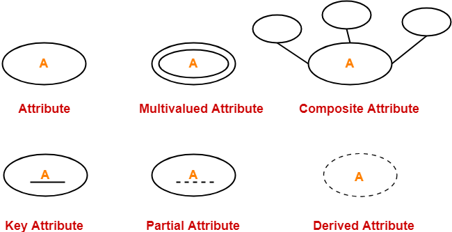
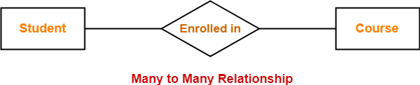
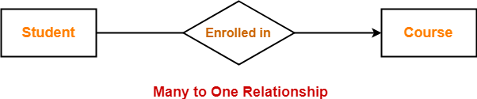
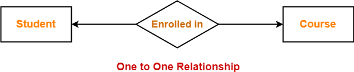
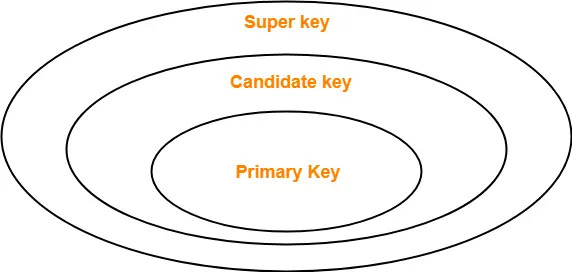

what is data

types of data

what is information

what is database

what is file system. why we do not use file system. there will be redundency and inconsistancy and probelm of integrity. difficulti in data access.

dbms provides an abstract view of data.

what is 3 schema arcitecture(physical/logical/view)
logical schema is same as db schema.

what is data model

what is dbms languages

how an app access db

---
# ER Diagrams | ER Diagram Symbols
- ER diagram or Entity Relationship diagram is a conceptual model that gives the graphical representation of the logical structure of the database.
- It shows all the constraints and relationships that exist among the different components.
  
# Components of ER diagram-
 
- An ER diagram is mainly composed of following three components-(Entity sets,attributes and relationship set)
- A table is reffered as entity set and a row in table is called entity.
- Attributes are associated with an entity set.
- Attributes describe the properties of entities in the entity set.
- Based on the values of certain attributes, an entity can be identified uniquely.
  
# ER Diagram Symbols-
An ER diagram is composed of several components and each component in ER diagram is represented using a specific symbol.

## 1. For Entity Sets-
An entity set is a set of same type of entities.

An entity refers to any object having-

- Either a physical existence such as a particular person, office, house or car.
- Or a conceptual existence such as a school or a company.
  
An entity set may be of the following two types-

## 1.1. Strong Entity Set-
- A strong entity set possess its own primary key.
- It is represented using a single rectangle.
- A diamond symbol is used for representing the relationship that exists between two strong entity sets.
- A single line is used for representing the connection of the strong entity set with the relationship set.
- A double line is used for representing the total participation of an entity set with the relationship set.
- Total participation may or may not exist in the relationship.
## 1.2. Weak Entity Set-
- A weak entity set do not possess its own primary key.
- It is represented using a double rectangle.
- However, it contains a partial key called as a discriminator.
- Discriminator can identify a group of entities from the entity set.
- Discriminator is represented by underlining with a dashed line.
##  NOTE-
 
- The combination of discriminator and primary key of the strong entity set makes it possible to uniquely identify all entities of the weak entity set.
- Thus, this combination serves as a primary key for the weak entity set.
- Clearly, this primary key is not formed by the weak entity set completely.

## 2. For Relationship Sets-
- Relationship defines an association among several entities.
- A relationship set is a set of same type of relationships.
  
A relationship set may be of the following two types-

### 1. Strong Relationship Set-
 - A strong relationship exists between two strong entity sets.
- It is represented using a diamond symbol.
## 2. Weak Relationship Set-
 - A weak or identifying relationship exists between the strong and weak entity set.
- It is represented using a double diamond symbol.
## Degree of a relationship set = Number of entity sets participating in a relationship set
types of relationship
```
Unary relationship set #  only 1 entity set participates in a relationship set.
Binary relationship set #2 entity set participates in a relationship set.
Ternary relationship set # 3 entity set participates in a relationship set.
N-ary relationship set #N entity set participates in a relationship set.
```
## 3. For Attributes-
 
- Attributes are the properties which describes the entities of an entity set.
- There are several types of attributes.
  

## Simple Attributes-
- Simple attributes are those attributes which can not be divided further.
## 2. Composite Attributes-
- Composite attributes are those attributes which are composed of many other simple attributes.

## 3. Single Valued Attributes-
- Single valued attributes are those attributes which can take only one value for a given entity from an entity set.
## 4. Multi Valued Attributes-
 - Multi valued attributes are those attributes which can take more than one value for a given entity from an entity set.
## 5. Derived Attributes-
 - Derived attributes are those attributes which can be derived from other attribute(s).

## 6. Key Attributes-
- Key attributes are those attributes which can identify an entity uniquely in an entity set.

 
## 4. For Participation Constraints-
 

Participation constraint defines the least number of relationship instances in which an entity has to necessarily participate.

There are two types of participation constraints-
## 1. Partial Participation-
Partial participation is represented using a single line between the entity set and relationship set.
## 2. Total Participation-
Total participation is represented using a double line between the entity set and relationship set.
## Important Note-
 
In ER diagram, weak entity set is always present in total participation with the identifying relationship set.

## 5. For Specialization and Generalization-
- Generalization is a process of forming a generalized super class by extracting the common characteristics from two or more classes.
- Specialization is a reverse process of generalization where a super class is divided into sub classes by assigning the specific characteristics of sub classes to them.

## 6. For Cardinality Constraints / Ratios-
 
Cardinality constraint defines the maximum number of relationship instances in which an entity can participate.

There are 4 types of cardinality ratios-
### 1. Many-to-Many Cardinality-
- An entity in set A can be associated with any number (zero or more) of entities in set B.
- An entity in set B can be associated with any number (zero or more) of entities in set A.

 
Here,

- One student can enroll in any number (zero or more) of courses.
- One course can be enrolled by any number (zero or more) of students.
## 2. Many-to-One Cardinality-
 
- An entity in set A can be associated with at most one entity in set B.
- An entity in set B can be associated with any number (zero or more) of entities in set A.

Here,

- One student can enroll in at most one course.
- One course can be enrolled by any number (zero or more) of students.
## 3. One-to-Many Cardinality-
- An entity in set A can be associated with any number (zero or more) of entities in set B.
- An entity in set B can be associated with at most one entity in set A.
  
## 4. One-to-One Cardinality-
- An entity in set A can be associated with at most one entity in set B.
- An entity in set B can be associated with at most one entity in set A.

Here,
- One student can enroll in at most one course.
- One course can be enrolled by at most one student.
  
---
# ER Diagrams to Tables
## Rule-01: For Strong Entity Set With Only Simple Attributes-
A strong entity set with only simple attributes will require only one table in relational model.
- Attributes of the table will be the attributes of the entity set.
- The primary key of the table will be the key attribute of the entity set.
 
## Rule-02: For Strong Entity Set With Composite Attributes-
- A strong entity set with any number of composite attributes will require only one table in relational model.
- While conversion, simple attributes of the composite attributes are taken into account and not the composite attribute itself.
## Rule-03: For Strong Entity Set With Multi Valued Attributes-
A strong entity set with any number of multi valued attributes will require two tables in relational model.

- One table will contain all the simple attributes with the primary key.
- Other table will contain the primary key and all the multi valued attributes.

## Rule-04: Translating Relationship Set into a Table-
 

A relationship set will require one table in the relational model.

Attributes of the table are-

- Primary key attributes of the participating entity sets
- Its own descriptive attributes if any.
- Set of non-descriptive attributes will be the primary key.
## Rule-05: For Binary Relationships With Cardinality Ratios-
```
                            Thumb Rules to Remember
 

While determining the minimum number of tables required for binary relationships with given cardinality ratios, following thumb rules must be kept in mind-

For binary relationship with cardinality ration m : n , separate and individual tables will be drawn for each entity set and relationship.
For binary relationship with cardinality ratio either m : 1 or 1 : n , always remember “many side will consume the relationship” i.e. a combined table will be drawn for many side entity set and relationship set.
For binary relationship with cardinality ratio 1 : 1 , two tables will be required. You can combine the relationship set with any one of the entity sets.
```
## Rule-06: For Binary Relationship With Both Cardinality Constraints and Participation Constraints-
 

- Cardinality constraints will be implemented as discussed in Rule-05.
- Because of the total participation constraint, foreign key acquires NOT NULL constraint i.e. now foreign key can not be null.

### Case-01: 
- For Binary Relationship With Cardinality Constraint and Total Participation Constraint From One Side-
- Because cardinality ratio = 1 : n , so we will combine the entity set B and relationship set R.

Then, two tables will be required-

### Case-02:
 For Binary Relationship With Cardinality Constraint and Total Participation Constraint From Both Sides-
 

If there is a key constraint from both the sides of an entity set with total participation, then that binary relationship is represented using only single table.
  
## Rule-07: For Binary Relationship With Weak Entity Set-
- Weak entity set always appears in association with identifying relationship with total participation constraint.

---
---
# Constraints in DBMS-
- Relational constraints are the restrictions imposed on the database contents and operations.
- They ensure the correctness of data in the database.
  
Types of Constraints in DBMS-
## 1. Domain Constraint-
- Domain constraint defines the domain or set of values for an attribute.
- It specifies that the value taken by the attribute must be the atomic value from its domain.
## 2. Tuple Uniqueness Constraint-
- Tuple Uniqueness constraint specifies that all the tuples must be necessarily unique in any relation.

## 3. Key Constraint-
 
Key constraint specifies that in any relation-

- All the values of primary key must be unique.
- The value of primary key must not be null.
## 4. Entity Integrity Constraint-
 - Entity integrity constraint specifies that no attribute of primary key must contain a null value in any relation.
- This is because the presence of null value in the primary key violates the uniqueness property.
 
 ## 5. Referential Integrity Constraint-
 
- This constraint is enforced when a foreign key references the primary key of a relation.
- It specifies that all the values taken by the foreign key must either be available in the relation of the primary key or be null.
  
Important Results-
 

The following two important results emerges out due to referential integrity constraint-

- We can not insert a record into a referencing relation if the corresponding record does not exist in the referenced relation.
- We can not delete or update a record of the referenced relation if the corresponding record exists in the referencing relation.

## Referential Integrity Constraint Violation-
 
There are following three possible causes of violation of referential integrity constraint-

### Cause-01: Insertion in a Referencing Relation-
 - It is allowed to insert only those values in the referencing attribute which are already present in the value of the referenced attribute.
- Inserting a value in the referencing attribute which is not present in the value of the referenced attribute violates the referential integrity constraint.

## Cause-02: Deletion from a Referenced Relation-
- It is not allowed to delete a row from the referenced relation if the referencing attribute uses the value of the referenced attribute of that row.
- Such a deletion violates the referential integrity constraint.
  
### Handling the Violation-
 
The violation caused due to a deletion from the referenced relation can be handled in the following three ways-

## Method-01:
 
- This method involves simultaneously deleting those tuples from the referencing relation where the referencing attribute uses the value of referenced attribute being deleted.
- This method of handling the violation is called as On Delete Cascade.
 
## Method-02:
 - This method involves aborting or deleting the request for a deletion from the referenced relation if the value is used by the referencing relation.
 

## Method-03:
- This method involves setting the value being deleted from the referenced relation to NULL or some other value in the referencing relation if the referencing attribute uses that value.

## Cause-03: Updation in a Referenced Relation-
 
- It is not allowed to update a row of the referenced relation if the referencing attribute uses the value of the referenced attribute of that row.
- Such an updation violates the referential integrity constraint.
### Handling the Violation-
 
The violation caused due to an updation in the referenced relation can be handled in the following three ways-

## Method-01:
 - This method involves simultaneously updating those tuples of the referencing relation where the referencing attribute uses the referenced attribute value being updated.
- This method of handling the violation is called as On Update Cascade.
 

## Method-02:
- This method involves aborting or deleting the request for an updation of the referenced relation if the value is used by the referencing relation.
 

## Method-03:
- This method involves setting the value being updated in the referenced relation to NULL or some other value in the referencing relation if the referencing attribute uses that value.
  
---
---
# Closure in DBMS 
Closure of an Attribute Set-
- The set of all those attributes which can be functionally determined from an attribute set is called as a closure of that attribute set.
- Closure of attribute set {X} is denoted as {X}+.

Steps to Find Closure of an Attribute Set-
## Step-01:
- Add the attributes contained in the attribute set for which closure is being calculated to the result set.
## Step-02:
- Recursively add the attributes to the result set which can be functionally determined from the attributes already contained in the result set.
## Finding the Keys Using Closure-
## Super Key-
 
- If the closure result of an attribute set contains all the attributes of the relation, then that attribute set is called as a super key of that relation.
```
Thus, we can say-
“The closure of a super key is the entire relation schema.”
```
## Candidate Key-
- If there exists no subset of an attribute set whose closure contains all the attributes of the relation, then that attribute set is called as a candidate key of that relation.
  
---
---
# Types of Keys in DBMS 
A key is a set of attributes that can identify each tuple uniquely in the given relation.
```
NOTE-
 
Before proceeding further, Kindly note-

The terms ‘relation’ and ‘table’ are used interchangeably.
The terms ‘tuple’ and ‘record’ are used interchangeably.
So, don’t get confused!
```
## 1. Super Key-
- A super key is a set of attributes that can identify each tuple uniquely in the given relation.
- A super key is not restricted to have any specific number of attributes.
- Thus, a super key may consist of any number of attributes.
```
                                NOTE-
 
All the attributes in a super key are definitely sufficient to identify each tuple uniquely in the given relation but all of them may not be necessary.
```
## 2. Candidate Key-
```
A minimal super key is called as a candidate key.

OR

A set of minimal attribute(s) that can identify each tuple uniquely in the given relation is called as a candidate key.
```
```
                            NOTES-
 

All the attributes in a candidate key are sufficient as well as necessary to identify each tuple uniquely.
Removing any attribute from the candidate key fails in identifying each tuple uniquely.
The value of candidate key must always be unique.
The value of candidate key can never be NULL.
It is possible to have multiple candidate keys in a relation.
Those attributes which appears in some candidate key are called as prime attributes.

```
## 3. Primary Key-
 - A primary key is a candidate key that the database designer selects while designing the database.

OR

- Candidate key that the database designer implements is called as a primary key.


NOTES-
 
- The value of primary key can never be NULL.
- The value of primary key must always be unique.
- The values of primary key can never be changed i.e. no updation is possible.
- The value of primary key must be assigned when inserting a record.
A relation is allowed  to have only one primary key.



## 4. Alternate Key-
 - Candidate keys that are left unimplemented or unused after implementing the primary key are called as alternate keys.

OR

- Unimplemented candidate keys are called as alternate keys.

## 5. Foreign Key-
 
- An attribute ‘X’ is called as a foreign key to some other attribute ‘Y’ when its values are dependent on the values of attribute ‘Y’.
The attribute ‘X’ can assume only those values which are assumed by the attribute ‘Y’.
- Here, the relation in which attribute ‘Y’ is present is called as the referenced relation.
- The relation in which attribute ‘X’ is present is called as the referencing relation.
- The attribute ‘Y’ might be present in the same table or in some other table.

### NOTES-
 

- Foreign key references the primary key of the table.
- Foreign key can take only those values which are present in the primary key of the referenced relation.
- Foreign key may have a name other than that of a primary key.
- Foreign key can take the NULL value.
- There is no restriction on a foreign key to be unique.
- In fact, foreign key is not unique most of the time.
- Referenced relation may also be called as the master table or primary table.
- Referencing relation may also be called as the foreign table.
## 7. Composite Key-

- A primary key comprising of multiple attributes and not just a single attribute is called as a composite key.

## 8. Unique Key-
 

Unique key is a key with the following properties-

- It is unique for all the records of the table.
- Once assigned, its value can not be changed i.e. it is non-updatable.
It may have a NULL value.
## 9. Surrogate Key-
Surrogate key is a key with the following properties-

- It is unique for all the records of the table.
- It is updatable.
- It can not be NULL i.e. it must have some value.
## 10. Secondary Key-
 
- Secondary key is required for the indexing purpose for better and faster searching.

 