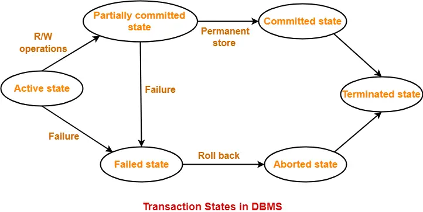
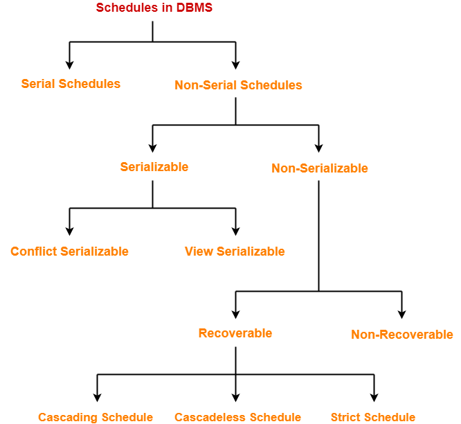
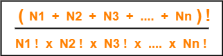
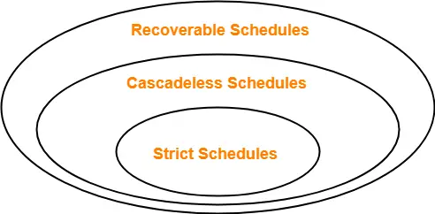
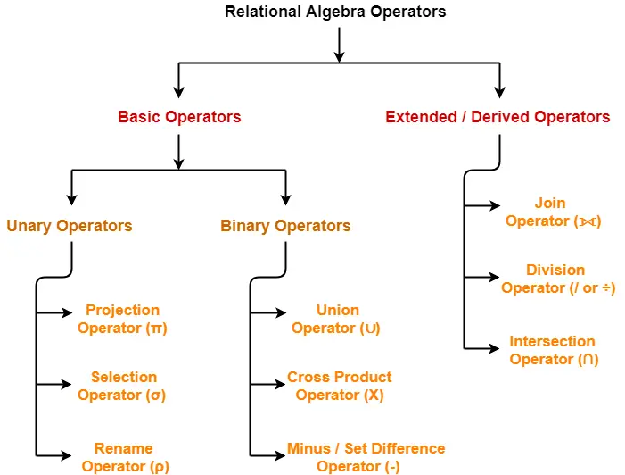

what is data

types of data

what is information

what is database

what is file system. why we do not use file system. there will be redundency and inconsistancy and probelm of integrity. difficulti in data access.

dbms provides an abstract view of data.

what is 3 schema arcitecture(physical/logical/view)
logical schema is same as db schema.

what is data model

what is dbms languages

how an app access db

---
# ER Diagrams | ER Diagram Symbols
- ER diagram or Entity Relationship diagram is a conceptual model that gives the graphical representation of the logical structure of the database.
- It shows all the constraints and relationships that exist among the different components.
  
# Components of ER diagram-
 
- An ER diagram is mainly composed of following three components-(Entity sets,attributes and relationship set)
- A table is reffered as entity set and a row in table is called entity.
- Attributes are associated with an entity set.
- Attributes describe the properties of entities in the entity set.
- Based on the values of certain attributes, an entity can be identified uniquely.
  
# ER Diagram Symbols-
An ER diagram is composed of several components and each component in ER diagram is represented using a specific symbol.

## 1. For Entity Sets-
An entity set is a set of same type of entities.

An entity refers to any object having-

- Either a physical existence such as a particular person, office, house or car.
- Or a conceptual existence such as a school or a company.
  
An entity set may be of the following two types-

## 1.1. Strong Entity Set-
- A strong entity set possess its own primary key.
- It is represented using a single rectangle.
- A diamond symbol is used for representing the relationship that exists between two strong entity sets.
- A single line is used for representing the connection of the strong entity set with the relationship set.
- A double line is used for representing the total participation of an entity set with the relationship set.
- Total participation may or may not exist in the relationship.
## 1.2. Weak Entity Set-
- A weak entity set do not possess its own primary key.
- It is represented using a double rectangle.
- However, it contains a partial key called as a discriminator.
- Discriminator can identify a group of entities from the entity set.
- Discriminator is represented by underlining with a dashed line.
##  NOTE-
 
- The combination of discriminator and primary key of the strong entity set makes it possible to uniquely identify all entities of the weak entity set.
- Thus, this combination serves as a primary key for the weak entity set.
- Clearly, this primary key is not formed by the weak entity set completely.

## 2. For Relationship Sets-
- Relationship defines an association among several entities.
- A relationship set is a set of same type of relationships.
  
A relationship set may be of the following two types-

### 1. Strong Relationship Set-
 - A strong relationship exists between two strong entity sets.
- It is represented using a diamond symbol.
## 2. Weak Relationship Set-
 - A weak or identifying relationship exists between the strong and weak entity set.
- It is represented using a double diamond symbol.
## Degree of a relationship set = Number of entity sets participating in a relationship set
types of relationship
```
Unary relationship set #  only 1 entity set participates in a relationship set.
Binary relationship set #2 entity set participates in a relationship set.
Ternary relationship set # 3 entity set participates in a relationship set.
N-ary relationship set #N entity set participates in a relationship set.
```
## 3. For Attributes-
 
- Attributes are the properties which describes the entities of an entity set.
- There are several types of attributes.
  

## Simple Attributes-
- Simple attributes are those attributes which can not be divided further.
## 2. Composite Attributes-
- Composite attributes are those attributes which are composed of many other simple attributes.

## 3. Single Valued Attributes-
- Single valued attributes are those attributes which can take only one value for a given entity from an entity set.
## 4. Multi Valued Attributes-
 - Multi valued attributes are those attributes which can take more than one value for a given entity from an entity set.
## 5. Derived Attributes-
 - Derived attributes are those attributes which can be derived from other attribute(s).

## 6. Key Attributes-
- Key attributes are those attributes which can identify an entity uniquely in an entity set.

 
## 4. For Participation Constraints-
 

Participation constraint defines the least number of relationship instances in which an entity has to necessarily participate.

There are two types of participation constraints-
## 1. Partial Participation-
Partial participation is represented using a single line between the entity set and relationship set.
## 2. Total Participation-
Total participation is represented using a double line between the entity set and relationship set.
## Important Note-
 
In ER diagram, weak entity set is always present in total participation with the identifying relationship set.

## 5. For Specialization and Generalization-
- Generalization is a process of forming a generalized super class by extracting the common characteristics from two or more classes.
- Specialization is a reverse process of generalization where a super class is divided into sub classes by assigning the specific characteristics of sub classes to them.

## 6. For Cardinality Constraints / Ratios-
 
Cardinality constraint defines the maximum number of relationship instances in which an entity can participate.

There are 4 types of cardinality ratios-
### 1. Many-to-Many Cardinality-
- An entity in set A can be associated with any number (zero or more) of entities in set B.
- An entity in set B can be associated with any number (zero or more) of entities in set A.

 
Here,

- One student can enroll in any number (zero or more) of courses.
- One course can be enrolled by any number (zero or more) of students.
## 2. Many-to-One Cardinality-
 
- An entity in set A can be associated with at most one entity in set B.
- An entity in set B can be associated with any number (zero or more) of entities in set A.

Here,

- One student can enroll in at most one course.
- One course can be enrolled by any number (zero or more) of students.
## 3. One-to-Many Cardinality-
- An entity in set A can be associated with any number (zero or more) of entities in set B.
- An entity in set B can be associated with at most one entity in set A.
  
## 4. One-to-One Cardinality-
- An entity in set A can be associated with at most one entity in set B.
- An entity in set B can be associated with at most one entity in set A.

Here,
- One student can enroll in at most one course.
- One course can be enrolled by at most one student.
  
---
# ER Diagrams to Tables
## Rule-01: For Strong Entity Set With Only Simple Attributes-
A strong entity set with only simple attributes will require only one table in relational model.
- Attributes of the table will be the attributes of the entity set.
- The primary key of the table will be the key attribute of the entity set.
 
## Rule-02: For Strong Entity Set With Composite Attributes-
- A strong entity set with any number of composite attributes will require only one table in relational model.
- While conversion, simple attributes of the composite attributes are taken into account and not the composite attribute itself.
## Rule-03: For Strong Entity Set With Multi Valued Attributes-
A strong entity set with any number of multi valued attributes will require two tables in relational model.

- One table will contain all the simple attributes with the primary key.
- Other table will contain the primary key and all the multi valued attributes.

## Rule-04: Translating Relationship Set into a Table-
 

A relationship set will require one table in the relational model.

Attributes of the table are-

- Primary key attributes of the participating entity sets
- Its own descriptive attributes if any.
- Set of non-descriptive attributes will be the primary key.
## Rule-05: For Binary Relationships With Cardinality Ratios-
```
                            Thumb Rules to Remember
 

While determining the minimum number of tables required for binary relationships with given cardinality ratios, following thumb rules must be kept in mind-

For binary relationship with cardinality ration m : n , separate and individual tables will be drawn for each entity set and relationship.
For binary relationship with cardinality ratio either m : 1 or 1 : n , always remember “many side will consume the relationship” i.e. a combined table will be drawn for many side entity set and relationship set.
For binary relationship with cardinality ratio 1 : 1 , two tables will be required. You can combine the relationship set with any one of the entity sets.
```
## Rule-06: For Binary Relationship With Both Cardinality Constraints and Participation Constraints-
 

- Cardinality constraints will be implemented as discussed in Rule-05.
- Because of the total participation constraint, foreign key acquires NOT NULL constraint i.e. now foreign key can not be null.

### Case-01: 
- For Binary Relationship With Cardinality Constraint and Total Participation Constraint From One Side-
- Because cardinality ratio = 1 : n , so we will combine the entity set B and relationship set R.

Then, two tables will be required-

### Case-02:
 For Binary Relationship With Cardinality Constraint and Total Participation Constraint From Both Sides-
 

If there is a key constraint from both the sides of an entity set with total participation, then that binary relationship is represented using only single table.
  
## Rule-07: For Binary Relationship With Weak Entity Set-
- Weak entity set always appears in association with identifying relationship with total participation constraint.

---
---
# Constraints in DBMS-
- Relational constraints are the restrictions imposed on the database contents and operations.
- They ensure the correctness of data in the database.
  
Types of Constraints in DBMS-
## 1. Domain Constraint-
- Domain constraint defines the domain or set of values for an attribute.
- It specifies that the value taken by the attribute must be the atomic value from its domain.
## 2. Tuple Uniqueness Constraint-
- Tuple Uniqueness constraint specifies that all the tuples must be necessarily unique in any relation.

## 3. Key Constraint-
 
Key constraint specifies that in any relation-

- All the values of primary key must be unique.
- The value of primary key must not be null.
## 4. Entity Integrity Constraint-
 - Entity integrity constraint specifies that no attribute of primary key must contain a null value in any relation.
- This is because the presence of null value in the primary key violates the uniqueness property.
 
 ## 5. Referential Integrity Constraint-
 
- This constraint is enforced when a foreign key references the primary key of a relation.
- It specifies that all the values taken by the foreign key must either be available in the relation of the primary key or be null.
  
Important Results-
 

The following two important results emerges out due to referential integrity constraint-

- We can not insert a record into a referencing relation if the corresponding record does not exist in the referenced relation.
- We can not delete or update a record of the referenced relation if the corresponding record exists in the referencing relation.

## Referential Integrity Constraint Violation-
 
There are following three possible causes of violation of referential integrity constraint-

### Cause-01: Insertion in a Referencing Relation-
 - It is allowed to insert only those values in the referencing attribute which are already present in the value of the referenced attribute.
- Inserting a value in the referencing attribute which is not present in the value of the referenced attribute violates the referential integrity constraint.

## Cause-02: Deletion from a Referenced Relation-
- It is not allowed to delete a row from the referenced relation if the referencing attribute uses the value of the referenced attribute of that row.
- Such a deletion violates the referential integrity constraint.
  
### Handling the Violation-
 
The violation caused due to a deletion from the referenced relation can be handled in the following three ways-

## Method-01:
 
- This method involves simultaneously deleting those tuples from the referencing relation where the referencing attribute uses the value of referenced attribute being deleted.
- This method of handling the violation is called as On Delete Cascade.
 
## Method-02:
 - This method involves aborting or deleting the request for a deletion from the referenced relation if the value is used by the referencing relation.
 

## Method-03:
- This method involves setting the value being deleted from the referenced relation to NULL or some other value in the referencing relation if the referencing attribute uses that value.

## Cause-03: Updation in a Referenced Relation-
 
- It is not allowed to update a row of the referenced relation if the referencing attribute uses the value of the referenced attribute of that row.
- Such an updation violates the referential integrity constraint.
### Handling the Violation-
 
The violation caused due to an updation in the referenced relation can be handled in the following three ways-

## Method-01:
 - This method involves simultaneously updating those tuples of the referencing relation where the referencing attribute uses the referenced attribute value being updated.
- This method of handling the violation is called as On Update Cascade.
 

## Method-02:
- This method involves aborting or deleting the request for an updation of the referenced relation if the value is used by the referencing relation.
 

## Method-03:
- This method involves setting the value being updated in the referenced relation to NULL or some other value in the referencing relation if the referencing attribute uses that value.
  
---
---
# Closure in DBMS 
Closure of an Attribute Set-
- The set of all those attributes which can be functionally determined from an attribute set is called as a closure of that attribute set.
- Closure of attribute set {X} is denoted as {X}+.

Steps to Find Closure of an Attribute Set-
## Step-01:
- Add the attributes contained in the attribute set for which closure is being calculated to the result set.
## Step-02:
- Recursively add the attributes to the result set which can be functionally determined from the attributes already contained in the result set.
## Finding the Keys Using Closure-
## Super Key-
 
- If the closure result of an attribute set contains all the attributes of the relation, then that attribute set is called as a super key of that relation.
```
Thus, we can say-
“The closure of a super key is the entire relation schema.”
```
## Candidate Key-
- If there exists no subset of an attribute set whose closure contains all the attributes of the relation, then that attribute set is called as a candidate key of that relation.
  
---
---
# Types of Keys in DBMS 
A key is a set of attributes that can identify each tuple uniquely in the given relation.
```
NOTE-
 
Before proceeding further, Kindly note-

The terms ‘relation’ and ‘table’ are used interchangeably.
The terms ‘tuple’ and ‘record’ are used interchangeably.
So, don’t get confused!
```
## 1. Super Key-
- A super key is a set of attributes that can identify each tuple uniquely in the given relation.
- A super key is not restricted to have any specific number of attributes.
- Thus, a super key may consist of any number of attributes.
```
                                NOTE-
 
All the attributes in a super key are definitely sufficient to identify each tuple uniquely in the given relation but all of them may not be necessary.
```
## 2. Candidate Key-
```
A minimal super key is called as a candidate key.

OR

A set of minimal attribute(s) that can identify each tuple uniquely in the given relation is called as a candidate key.
```
```
                            NOTES-
 

All the attributes in a candidate key are sufficient as well as necessary to identify each tuple uniquely.
Removing any attribute from the candidate key fails in identifying each tuple uniquely.
The value of candidate key must always be unique.
The value of candidate key can never be NULL.
It is possible to have multiple candidate keys in a relation.
Those attributes which appears in some candidate key are called as prime attributes.

```
## 3. Primary Key-
 - A primary key is a candidate key that the database designer selects while designing the database.

OR

- Candidate key that the database designer implements is called as a primary key.


NOTES-
 
- The value of primary key can never be NULL.
- The value of primary key must always be unique.
- The values of primary key can never be changed i.e. no updation is possible.
- The value of primary key must be assigned when inserting a record.
A relation is allowed  to have only one primary key.


## 4. Alternate Key-
 - Candidate keys that are left unimplemented or unused after implementing the primary key are called as alternate keys.

OR

- Unimplemented candidate keys are called as alternate keys.

## 5. Foreign Key-
 
- An attribute ‘X’ is called as a foreign key to some other attribute ‘Y’ when its values are dependent on the values of attribute ‘Y’.
The attribute ‘X’ can assume only those values which are assumed by the attribute ‘Y’.
- Here, the relation in which attribute ‘Y’ is present is called as the referenced relation.
- The relation in which attribute ‘X’ is present is called as the referencing relation.
- The attribute ‘Y’ might be present in the same table or in some other table.

### NOTES-
 

- Foreign key references the primary key of the table.
- Foreign key can take only those values which are present in the primary key of the referenced relation.
- Foreign key may have a name other than that of a primary key.
- Foreign key can take the NULL value.
- There is no restriction on a foreign key to be unique.
- In fact, foreign key is not unique most of the time.
- Referenced relation may also be called as the master table or primary table.
- Referencing relation may also be called as the foreign table.
# 6. Partial Key-
 
- Partial key is a key using which all the records of the table can not be identified uniquely.
- However, a bunch of related tuples can be selected from the table using the partial key.

## 7. Composite Key-

- A primary key comprising of multiple attributes and not just a single attribute is called as a composite key.

## 8. Unique Key-
 

Unique key is a key with the following properties-

- It is unique for all the records of the table.
- Once assigned, its value can not be changed i.e. it is non-updatable.
It may have a NULL value.
## 9. Surrogate Key-
Surrogate key is a key with the following properties-

- It is unique for all the records of the table.
- It is updatable.
- It can not be NULL i.e. it must have some value.
## 10. Secondary Key-
 
- Secondary key is required for the indexing purpose for better and faster searching.

 ---
 ---
 # Functional Dependency in DBMS
 ```
In any relation, a functional dependency α → β holds if-
Two tuples having same value of attribute α also have same value for attribute β.
 ```
 ```
 If α and β are the two sets of attributes in a relational table R where-

α ⊆ R
β ⊆ R
Then, for a functional dependency to exist from α to β,

If t1[α] = t2[α], then t1[β] = t2[β]
 ```
##  Types Of Functional Dependencies-
### 1. Trivial Functional Dependencies-
 
- A functional dependency X → Y is said to be trivial if and only if Y ⊆ X.
- Thus, if RHS of a functional dependency is a subset of LHS, then it is called as a trivial functional depend
```
AB → A
AB → B
AB → AB
  ```
### 2. Non-Trivial Functional Dependencies-
- A functional dependency X → Y is said to be non-trivial if and only if Y ⊄ X.
- Thus, if there exists at least one attribute in the RHS of a functional dependency that is not a part of LHS, then it is called as a non-trivial functional dependency.
```
AB → BC
AB → CD
```
## Inference Rules-
### Reflexivity-
If B is a subset of A, then A → B always holds.
### Transitivity-
If A → B and B → C, then A → C always holds.

### Augmentation-
If A → B, then AC → BC always holds.

## Decomposition-
If A → BC, then A → B and A → C always holds.

### Composition-
If A → B and C → D, then AC → BD always holds.

### Additive-
If A → B and A → C, then A → BC always holds.

## Rules for Functional Dependency-

### Rule-01:
 
A functional dependency X → Y will always hold if all the values of X are unique (different) irrespective of the values of Y.
### Rule-02:
 
A functional dependency X → Y will always hold if all the values of Y are same irrespective of the values of X.

## Rule-03:
 
For a functional dependency X → Y to hold, if two tuples in the table agree on the value of attribute X, then they must also agree on the value of attribute Y.

## Rule-04:
 
For a functional dependency X → Y, violation will occur only when for two or more same values of X, the corresponding Y values are different.
## Equivalence of Two Sets of Functional Dependencies-
- Two different sets of functional dependencies for a given relation may or may not be equivalent.
- If F and G are the two sets of functional dependencies, then following 3 cases are possible-
 ```
Case-01: F covers G (F ⊇ G)
Case-02: G covers F (G ⊇ F)
Case-03: Both F and G cover each other (F = G)
 ```
## Case-01: Determining Whether F Covers G-
 

Following steps are followed to determine whether F covers G or not-

### Step-01:
 
- Take the functional dependencies of set G into consideration.
- For each functional dependency X → Y, find the closure of X using the functional dependencies of set G.
 
### Step-02:
 
- Take the functional dependencies of set G into consideration.
- For each functional dependency X → Y, find the closure of X using the functional dependencies of set F.
 

### Step-03:
 
- Compare the results of Step-01 and Step-02.
- If the functional dependencies of set F has determined all those attributes that were determined by the functional dependencies of set G, then it means F covers G.
- Thus, we conclude F covers G (F ⊇ G) otherwise not.
 

## Case-02: Determining Whether G Covers F-
 
Following steps are followed to determine whether G covers F or not-

### Step-01:

- Take the functional dependencies of set F into consideration.
- For each functional dependency X → Y, find the closure of X using the functional dependencies of set F.
 
### Step-02:
 
- Take the functional dependencies of set F into consideration.
For each functional dependency X → Y, find the closure of X using the functional dependencies of set G.
 

### Step-03:
 
- Compare the results of Step-01 and Step-02.
- If the functional dependencies of set G has determined all those attributes that were determined by the functional dependencies of set F, then it means G covers F.
- Thus, we conclude G covers F (G ⊇ F) otherwise not.
 

### Case-03: Determining Whether Both F and G Cover Each Other-
 
- If F covers G and G covers F, then both F and G cover each other.
Thus, if both the above cases hold true, we conclude both F and G cover each other (F = G).

# Canonical Cover in DBMS-
- A canonical cover is a simplified and reduced version of the given set of functional dependencies.
- Since it is a reduced version, it is also called as Irreducible set.
##  Characteristics-

- Canonical cover is free from all the extraneous functional dependencies.
- The closure of canonical cover is same as that of the given set of functional dependencies.
- Canonical cover is not unique and may be more than one for a given set of functional dependencies.

## Need-
- Working with the set containing extraneous functional dependencies increases the computation time.
- Therefore, the given set is reduced by eliminating the useless functional dependencies.
- This reduces the computation time and working with the irreducible set becomes easier.

## Steps To Find Canonical Cover-
## Step-01:
 
- Write the given set of functional dependencies in such a way that each functional dependency contains exactly one attribute on its right side.
## Step-02:
 - Consider each functional dependency one by one from the set obtained in Step-01.
- Determine whether it is essential or non-essential.
 

To determine whether a functional dependency is essential or not, compute the closure of its left side-

- Once by considering that the particular functional dependency is present in the set
- Once by considering that the particular functional dependency is not present in the set

Then following two cases are possible-

## Case-01: Results Come Out to be Same-
 

If results come out to be same,

- It means that the presence or absence of that functional dependency does not create any difference.
- Thus, it is non-essential.
- Eliminate that functional dependency from the set.
 
NOTE-
 

- Eliminate the non-essential functional dependency from the set as soon as it is discovered.
- Do not consider it while checking the essentiality of other functional dependencies.
 

# Case-01: Results Come Out to be Different-
 

If results come out to be different,

- It means that the presence or absence of that functional dependency creates a difference.
- Thus, it is essential.
- Do not eliminate that functional dependency from the set.
- Mark that functional dependency as essential.
 

## Step-03:
 

- Consider the newly obtained set of functional dependencies after performing Step-02.
- Check if there is any functional dependency that contains more than one attribute on its left side.
 

Then following two cases are possible-

 

## Case-01: No-
 


- There exists no functional dependency containing more than one attribute on its left side.
- In this case, the set obtained in Step-02 is the canonical cover.
 

##  Case-01: Yes-
 

- There exists at least one functional dependency containing more than one attribute on its left side.
- In this case, consider all such functional dependencies one by one.
Check if their left side can be reduced.
 

Use the following steps to perform a check-

- Consider a functional dependency.
- Compute the closure of all the possible subsets of the left side of that functional dependency.
- If any of the subsets produce the same closure result as produced by the entire left side, then replace the left side with that subset.
- After this step is complete, the set obtained is the canonical cover.

# Decomposition of a Relation-
```
The process of breaking up or dividing a single relation into two or more sub relations is called as decomposition of a relation.
```
## Properties of Decomposition-
 

The following two properties must be followed when decomposing a given relation-
## 1. Lossless decomposition-
 

Lossless decomposition ensures-
- No information is lost from the original relation during decomposition.
- When the sub relations are joined back, the same relation is obtained that was decomposed.
- Every decomposition must always be lossless.
## 2. Dependency Preservation-
Dependency preservation ensures-

- None of the functional dependencies that holds on the original relation are lost.
- The sub relations still hold or satisfy the functional dependencies of the original relation.
 ## Types of Decomposition-
## 1. Lossless Join Decomposition-
 
- Consider there is a relation R which is decomposed into sub relations R1 , R2 , …. , Rn.
- This decomposition is called lossless join decomposition when the join of the sub relations results in the same relation R that was decomposed.
- For lossless join decomposition, we always have-
```
R1 ⋈ R2 ⋈ R3 ……. ⋈ Rn = R 
where ⋈ is a natural join operator
```
NOTE-
 
- Lossless join decomposition is also known as non-additive join decomposition.
- This is because the resultant relation after joining the sub relations is same as the decomposed relation.
- No extraneous tuples appear after joining of the sub-relations.
## 2. Lossy Join Decomposition-
 
- Consider there is a relation R which is decomposed into sub relations R1 , R2 , …. , Rn.
- This decomposition is called lossy join decomposition when the join of the sub relations does not result in the same relation R that was decomposed.
- The natural join of the sub relations is always found to have some extraneous tuples.
- For lossy join decomposition, we always have-
 
```
R1 ⋈ R2 ⋈ R3 ……. ⋈ Rn ⊃ R 
where ⋈ is a natural join operator
```
## NOTE-
 

- Lossy join decomposition is also known as careless decomposition.
- This is because extraneous tuples get introduced in the natural join of the sub-relations.
- Extraneous tuples make the identification of the original tuples difficult.

## Determine Decomposition Is Lossless Or Lossy
- Consider a relation R is decomposed into two sub relations R1 and R2.

Then,
- If all the following conditions satisfy, then the decomposition is lossless.
- If any of these conditions fail, then the decomposition is lossy.
## Condition-01:
 

Union of both the sub relations must contain all the attributes that are present in the original relation R.

Thus,
```
R1 ∪ R2 = R
 ```

## Condition-02:
- Intersection of both the sub relations must not be null.
- In other words, there must be some common attribute which is present in both the sub relations.
Thus,
```
R1 ∩ R2 ≠ ∅
```
## Condition-03:
- Intersection of both the sub relations must be a super key of either R1 or R2 or both.

Thus,
```
R1 ∩ R2 = Super key of R1 or R2
```
---
---
# Normalization in DBMS-
 

In DBMS, database normalization is a process of making the database consistent by-

- Reducing the redundancies
- Ensuring the integrity of data through lossless decomposition
- Normalization is done through normal forms.

 ## Normal Forms-
 
- The standard normal forms used are-
- There exists several other normal forms even after BCNF but generally we normalize till BCNF only.
## First Normal Form-
```
A given relation is called in First Normal Form (1NF) if each cell of the table contains only an atomic value.

OR

A given relation is called in First Normal Form (1NF) if the attribute of every tuple is either single valued or a null value.
```
## NOTE-
 
```
By default, every relation is in 1NF.
This is because formal definition of a relation states that value of all the attributes must be atomic.
```

## Second Normal Form-

- A given relation is called in Second Normal Form (2NF) if and only if-

- Relation already exists in 1NF.
- No partial dependency exists in the relation.
  
```
Partial Dependency
 

A partial dependency is a dependency where few attributes of the candidate key determines non-prime attribute(s).

OR

A partial dependency is a dependency where a portion of the candidate key or incomplete candidate key determines non-prime attribute(s).

 

In other words,

A → B is called a partial dependency if and only if-

A is a subset of some candidate key
B is a non-prime attribute.
If any one condition fails, then it will not be a partial dependency.

 

NOTE-
 

To avoid partial dependency, incomplete candidate key must not determine any non-prime attribute.
However, incomplete candidate key can determine prime attributes.
```
## Third Normal Form-

 

- A given relation is called in Third Normal Form (3NF) if and only if-

- Relation already exists in 2NF.
- No transitive dependency exists for non-prime attributes.
```
Transitive Dependency
 

A → B is called a transitive dependency if and only if-

A is not a super key.
B is a non-prime attribute.
If any one condition fails, then it is not a transitive dependency.

 

NOTE-
 

Transitive dependency must not exist for non-prime attributes.
However, transitive dependency can exist for prime attributes.
```
- A relation is called in Third Normal Form (3NF) if and only if-

- Any one condition holds for each non-trivial functional dependency A → B

-  A is a super key
- B is a prime attribute
## Boyce-Codd Normal Form-
 

- A given relation is called in BCNF if and only if-

- Relation already exists in 3NF.
- For each non-trivial functional dependency A → B, A is a super key of the relation.
  
# important point
## Point-01:
 

Remember the following diagram which implies-

- A relation in BCNF will surely be in all other normal forms.
- A relation in 3NF will surely be in 2NF and 1NF.
- A relation in 2NF will surely be in 1NF.
 

## Point-02:
 

The above diagram also implies-

```
BCNF is stricter than 3NF.
3NF is stricter than 2NF.
2NF is stricter than 1NF.
```

## Point-03:
 
- While determining the normal form of any given relation,

- Start checking from BCNF.
- This is because if it is found to be in BCNF, then it will surely be in all other normal forms.
- If the relation is not in BCNF, then start moving towards the outer circles and check for other normal forms in the order they appear.
 

## Point-04:
 
- In a relational database, a relation is always in First Normal Form (1NF) at least.
 

## Point-05:
 
- Singleton keys are those that consist of only a single attribute.
If all the candidate keys of a relation are singleton candidate keys, then it will always be in 2NF at least.
- This is because there will be no chances of existing any partial dependency.
- The candidate keys will either fully appear or fully disappear from the dependencies.
- Thus, an incomplete candidate key will never determine a non-prime attribute.
 

## Point-06:
- If all the attributes of a relation are prime attributes, then it will always be in 2NF at least.
- This is because there will be no chances of existing any partial dependency.
- Since there are no non-prime attributes, there will be no Functional Dependency which determines a non-prime attribute.
 

## Point-07:
- If all the attributes of a relation are prime attributes, then it will always be in 3NF at least.
- This is because there will be no chances of existing any transitive dependency for non-prime attributes.
 

## Point-08:
- Third Normal Form (3NF) is considered adequate for normal relational database design.
 

## Point-09:

- Every binary relation (a relation with only two attributes) is always in BCNF.
 


## Point-10:
- BCNF is free from redundancies arising out of functional dependencies (zero redundancy).
 

## Point-11:
- A relation with only trivial functional dependencies is always in BCNF.
- In other words, a relation with no non-trivial functional dependencies is always in BCNF.
 

## Point-12:
- BCNF decomposition is always lossless but not always dependency preserving.
 

## Point-13:
 - Sometimes, going for BCNF may not preserve functional dependencies.
So, go for BCNF only if the lost functional dependencies are not required else normalize till 3NF only.
 

## Point-14:
- There exist many more normal forms even after BCNF like 4NF and more.
But in the real world database systems, it is generally not required to go beyond BCNF.
 

## Point-15:
- Lossy decomposition is not allowed in 2NF, 3NF and BCNF.
- So, if the decomposition of a relation has been done in such a way that it is lossy, then the decomposition will never be in 2NF, 3NF and BCNF.
 

## Point-16:
- Unlike BCNF, Lossless and dependency preserving decomposition into 3NF and 2NF is always possible.
 
## Point-17:
 
- A prime attribute can be transitively dependent on a key in a 3NF relation.
- A prime attribute can not be transitively dependent on a key in a BCNF relation.
 

## Point-18:
 
- If a relation consists of only singleton candidate keys and it is in 3NF, then it must also be in BCNF. 
 

## Point-19:
 - If a relation consists of only one candidate key and it is in 3NF, then the relation must also be in BCNF. 
 
 ---
 ---
 # Transaction States in DBMS
 ```
 “Transaction is a set of operations which are all logically related.”

OR

“Transaction is a single logical unit of work formed by a set of operations.”
```
# Operations in Transaction-
The main operations in a transaction are-

## 1. Read Operation-
 
- Read operation reads the data from the database and then stores it in the buffer in main memory.
- For example- Read(A) instruction will read the value of A from the database and will store it in the buffer in main memory.
 
## 2. Write Operation-
 
- Write operation writes the updated data value back to the database from the buffer.
- For example- Write(A) will write the updated value of A from the buffer to the database.
  
## Transaction States-
A transaction goes through many different states throughout its life cycle.

These states are called as transaction states.

Transaction states are as follows-

## 1. Active State-
 
- This is the first state in the life cycle of a transaction.
- A transaction is called in an active state as long as its instructions are getting executed.
- All the changes made by the transaction now are stored in the buffer in main memory.
 
## 2. Partially Committed State-
- After the last instruction of transaction has executed, it enters into a partially committed state.
- After entering this state, the transaction is considered to be partially committed.
- It is not considered fully committed because all the changes made by the transaction are still stored in the buffer in main memory.
 

## 3. Committed State-
 

- After all the changes made by the transaction have been successfully stored into the database, it enters into a committed state.
- Now, the transaction is considered to be fully committed.
NOTE-
```

After a transaction has entered the committed state, it is not possible to roll back the transaction.
In other words, it is not possible to undo the changes that has been made by the transaction.
This is because the system is updated into a new consistent state.
The only way to undo the changes is by carrying out another transaction called as compensating transaction that performs the reverse operations.
```
## 4. Failed State-
- When a transaction is getting executed in the active state or partially committed state and some failure occurs due to which it becomes impossible to continue the execution, it enters into a failed state.
 

## 5. Aborted State-
 

- After the transaction has failed and entered into a failed state, all the changes made by it have to be undone.
To undo the changes made by the transaction, it becomes necessary to roll back the transaction.
- After the transaction has rolled back completely, it enters into an aborted state.
 
## 6. Terminated State-
 
- This is the last state in the life cycle of a transaction.
- After entering the committed state or aborted state, the transaction finally enters into a terminated state where its life cycle finally comes to an end.
## ACID Properties-
- It is important to ensure that the database remains consistent before and after the transaction.
- To ensure the consistency of database, certain properties are followed by all the transactions occurring in the system.
- These properties are called as ACID Properties of a transaction.
  
## 1. Atomicity-
- This property ensures that either the transaction occurs completely or it does not occur at all.
- In other words, it ensures that no transaction occurs partially.
That is why, it is also referred to as “All or nothing rule“.
- It is the responsibility of Transaction Control Manager to ensure atomicity of the transactions.
 
## 2. Consistency-
 - This property ensures that integrity constraints are maintained.
- In other words, it ensures that the database remains consistent before and after the transaction.
- It is the responsibility of DBMS and application programmer to ensure consistency of the database.
 

## 3. Isolation-
- This property ensures that multiple transactions can occur simultaneously without causing any inconsistency.
- During execution, each transaction feels as if it is getting executed alone in the system.
- A transaction does not realize that there are other transactions as well getting executed parallely.
- Changes made by a transaction becomes visible to other transactions only after they are written in the memory.
- The resultant state of the system after executing all the transactions is same as the state that would be achieved if the transactions were executed serially one after the other.
- It is the responsibility of concurrency control manager to ensure isolation for all the transactions.
 
## 4. Durability-
 
- This property ensures that all the changes made by a transaction after its successful execution are written successfully to the disk.
- It also ensures that these changes exist permanently and are never lost even if there occurs a failure of any kind.
- It is the responsibility of recovery manager to ensure durability in the database.
 
## Concurrency Problems in DBMS-
- When multiple transactions execute concurrently in an uncontrolled or unrestricted manner, then it might lead to several problems.
- Such problems are called as concurrency problems.
  
## 1. Dirty Read Problem-
- Reading the data written by an uncommitted transaction is called as dirty read.
 
This read is called as dirty read because-

- There is always a chance that the uncommitted transaction might roll back later.
- Thus, uncommitted transaction might make other transactions read a value that does not even exist.
- This leads to inconsistency of the database.
 

## NOTE-
 
- Dirty read does not lead to inconsistency always.
- It becomes problematic only when the uncommitted transaction fails and roll backs later due to some reason.

## 2. Unrepeatable Read Problem-

- This problem occurs when a transaction gets to read unrepeated i.e. different values of the same variable in its different read operations even when it has not updated its value.
## 3. Lost Update Problem-
- This problem occurs when multiple transactions execute concurrently and updates from one or more transactions get lost.
## NOTE-
 
- This problem occurs whenever there is a write-write conflict.
- In write-write conflict, there are two writes one by each transaction on the same data item without any read in the middle.

## 4. Phantom Read Problem-
 
- This problem occurs when a transaction reads some variable from the buffer and when it reads the same variable later, it finds that the variable does not exist.

## Avoiding Concurrency Problems-
- To ensure consistency of the database, it is very important to prevent the occurrence of above problems.
- Concurrency Control Protocols help to prevent the occurrence of above problems and maintain the consistency of the database.

---
---
# Schedules in DBMS
The order in which the operations of multiple transactions appear for execution is called as a schedule.
## Types of Schedules-


## 1. Serial Schedules-
- All the transactions execute serially one after the other.
- When one transaction executes, no other transaction is allowed to execute.
### Characteristics-
Serial schedules are always-
- Consistent
- Recoverable
- Cascadeless
- Strict
## 2. Non-Serial Schedules-
In non-serial schedules,

- Multiple transactions execute concurrently.
- Operations of all the transactions are inter leaved or mixed with each other.
## Characteristics-
 

Non-serial schedules are NOT always-

- Consistent
- Recoverable
- Cascadeless
- Strict
 
## Finding Number Of Schedules-
 

Consider there are n number of transactions T1, T2, T3 …. , Tn with N1, N2, N3 …. , Nn number of operations respectively.

 

Total Number of Schedules-
 

Total number of possible schedules (serial + non-serial) is given by-



Total Number of Serial Schedules-
 
```
Total number of serial schedules

= Number of different ways of arranging n transactions

= n!

 

Total Number of Non-Serial Schedules-
 

Total number of non-serial schedules

= Total number of schedules – Total number of serial schedules
```
## Serializability in DBMS-
- Some non-serial schedules may lead to inconsistency of the database.
- Serializability is a concept that helps to identify which non-serial schedules are correct and will maintain the consistency of the database.
## Serializable Schedules-
 

If a given non-serial schedule of ‘n’ transactions is equivalent to some serial schedule of ‘n’ transactions, then it is called as a serializable schedule.

## Characteristics-
 
- Serializable schedules behave exactly same as serial schedules.

- Thus, serializable schedules are always-
```
Consistent
Recoverable
Casacadeless
Strict
```

## Types of Serializability-
Serializability is mainly of two types-
### Conflict Serializability-
 
- If a given non-serial schedule can be converted into a serial schedule by swapping its non-conflicting operations, then it is called as a conflict serializable schedule.

 

## Conflicting Operations-
 - Two operations are called as conflicting operations if all the following conditions hold true for them-

- Both the operations belong to different transactions
- Both the operations are on the same data item
- At least one of the two operations is a write operation

# Checking Whether a Schedule is Conflict Serializable Or Not-
 

Follow the following steps to check whether a given non-serial schedule is conflict serializable or not-

 

## Step-01:
 

Find and list all the conflicting operations.

 

## Step-02:
 

Start creating a precedence graph by drawing one node for each transaction.

 

## Step-03:
 

Draw an edge for each conflict pair such that if Xi (V) and Yj (V) forms a conflict pair then draw an edge from Ti to Tj.
This ensures that Ti gets executed before Tj.
 

## Step-04:
 

Check if there is any cycle formed in the graph.
If there is no cycle found, then the schedule is conflict serializable otherwise not.
 

## NOTE-
 

By performing the Topological Sort of the Directed Acyclic Graph so obtained, the corresponding serial schedule(s) can be found.
Such schedules can be more than 1.

## View Serializability-
If a given schedule is found to be view equivalent to some serial schedule, then it is called as a view serializable schedule.
## View Equivalent Schedules-
- Consider two schedules S1 and S2 each consisting of two transactions T1 and T2.
- Schedules S1 and S2 are called view equivalent if the following three conditions hold true for them-

## Condition-01:
- For each data item X, if transaction Ti reads X from the database initially in schedule S1, then in schedule S2 also, Ti must perform the initial read of X from the database.

```
                    Thumb Rule
“Initial readers must be same for all the data items”.
```
 
## Condition-02:
 

- If transaction Ti reads a data item that has been updated by the transaction Tj in schedule S1, then in schedule S2 also, transaction Ti must read the same data item that has been updated by the transaction Tj.

 ```
Thumb Rule
“Write-read sequence must be same.”.

 ```

## Condition-03:
 
- For each data item X, if X has been updated at last by transaction Ti in schedule S1, then in schedule S2 also, X must be updated at last by transaction Ti.

```
Thumb Rule
“Final writers must be same for all the data items”.

 ```

## Checking Whether a Schedule is View Serializable Or Not-
 

## Method-01:
 

Check whether the given schedule is conflict serializable or not.

- If the given schedule is conflict serializable, then it is surely view serializable. Stop and report your answer.
- If the given schedule is not conflict serializable, then it may or may not be view serializable. Go and check using other methods.
```

                            Thumb Rules
All conflict serializable schedules are view serializable.
All view serializable schedules may or may not be conflict serializable.
 ```

# Method-02:
 

Check if there exists any blind write operation.

(Writing without reading is called as a blind write).

If there does not exist any blind write, then the schedule is surely not view serializable. Stop and report your answer.
If there exists any blind write, then the schedule may or may not be view serializable. Go and check using other methods.
 
```
Thumb Rule
No blind write means not a view serializable schedule.
```
 

## Method-03:
 

In this method, try finding a view equivalent serial schedule.

- By using the above three conditions, write all the dependencies.
- Then, draw a graph using those dependencies.
- If there exists no cycle in the graph, then the schedule is view serializable otherwise not.
 
 
# Non-Serializable Schedules-
- A non-serial schedule which is not serializable is called as a non-serializable schedule.
- A non-serializable schedule is not guaranteed to produce the the same effect as produced by some serial schedule on any consistent database.
  
## Characteristics-
 

Non-serializable schedules-

- may or may not be consistent
- may or may not be recoverable

## Irrecoverable Schedules-
 

If in a schedule,

- A transaction performs a dirty read operation from an uncommitted transaction
- And commits before the transaction from which it has read the value
then such a schedule is known as an Irrecoverable Schedule.

## Recoverable Schedules-
If in a schedule,

- A transaction performs a dirty read operation from an uncommitted transaction
- And its commit operation is delayed till the uncommitted transaction either commits or roll backs
- then such a schedule is known as a Recoverable Schedule.

 

Here,

- The commit operation of the transaction that performs the dirty read is delayed.
- This ensures that it still has a chance to recover if the uncommitted transaction fails later.

If in a schedule,

A transaction performs a dirty read operation from an uncommitted transaction
And its commit operation is delayed till the uncommitted transaction either commits or roll backs
then such a schedule is known as a Recoverable Schedule.

 

Here,

The commit operation of the transaction that performs the dirty read is delayed.
This ensures that it still has a chance to recover if the uncommitted transaction fails later.
 
## Checking Whether a Schedule is Recoverable or Irrecoverable-
 

### Method-01:
 

Check whether the given schedule is conflict serializable or not.

If the given schedule is conflict serializable, then it is surely recoverable. Stop and report your answer.
If the given schedule is not conflict serializable, then it may or may not be recoverable. Go and check using other methods.
 
```
Thumb Rules
All conflict serializable schedules are recoverable.
All recoverable schedules may or may not be conflict serializable.
 ```

### Method-02:
 

Check if there exists any dirty read operation.

(Reading from an uncommitted transaction is called as a dirty read)

If there does not exist any dirty read operation, then the schedule is surely recoverable. Stop and report your answer.
If there exists any dirty read operation, then the schedule may or may not be recoverable.
 

If there exists a dirty read operation, then follow the following cases-

 

### Case-01:
 

If the commit operation of the transaction performing the dirty read occurs before the commit or abort operation of the transaction which updated the value, then the schedule is irrecoverable.

 

### Case-02:
 

If the commit operation of the transaction performing the dirty read is delayed till the commit or abort operation of the transaction which updated the value, then the schedule is recoverable.

 
```
Thumb Rule
No dirty read means a recoverable schedule.
 ```

# Types of Recoverable Schedules-
## 1. Cascading Schedule-
- If in a schedule, failure of one transaction causes several other dependent transactions to rollback or abort, then such a schedule is called as a Cascading Schedule or Cascading Rollback or Cascading Abort.
- It simply leads to the wastage of CPU time.
  
NOTE-
 
```
If the transactions T2, T3 and T4 would have committed before the failure of transaction T1, then the schedule would have been irrecoverable.
```
### 2.  Cascadeless Schedule-
 

- If in a schedule, a transaction is not allowed to read a data item until the last transaction that has written it is committed or aborted, then such a schedule is called as a Cascadeless Schedule.

In other words,

- Cascadeless schedule allows only committed read operations.
Therefore, it avoids cascading roll back and thus saves CPU time.

NOTE-
 

- Cascadeless schedule allows only committed read operations.
- However, it allows uncommitted write operations.
## 3. Strict Schedule-
 

If in a schedule, a transaction is neither allowed to read nor write a data item until the last transaction that has written it is committed or aborted, then such a schedule is called as a Strict Schedule.

In other words,

- Strict schedule allows only committed read and write operations.
- Clearly, strict schedule implements more restrictions than cascadeless schedule.
  
Remember-

 
```
Strict schedules are more strict than cascadeless schedules.
All strict schedules are cascadeless schedules.
All cascadeless schedules are not strict schedules.
```


# Equivalence of Schedules-
In DBMS, schedules may have the following three different kinds of equivalence relations among them-

## 1. Result Equivalent Schedules-
- If any two schedules generate the same result after their execution, then they are called as result equivalent schedules.
- This equivalence relation is considered of least significance.
- This is because some schedules might produce same results for some set of values and different results for some other set of values.
## 2. Conflict Equivalent Schedules-
 
- If any two schedules satisfy the following two conditions, then they are called as conflict equivalent schedules-

- The set of transactions present in both the schedules is same.
- The order of pairs of conflicting operations of both the schedules is same.
## 3. View Equivalent Schedules-

---
---
# Relational Algebra-
--- 
Relational Algebra is a procedural query language which takes a relation as an input and generates a relation as an output.
## Relational Algebra Operators-


## Characteristics-
Following are the important characteristics of relational operators-

- Relational Operators always work on one or more relational tables.
- Relational Operators always produce another relational table.
- The table produced by a relational operator has all the properties of a relational model.

## Selection Operator-
- Selection Operator (σ) is a unary operator in relational algebra that performs a selection operation.
- It selects those rows or tuples from the relation that satisfies the selection condition.
  
Syntax-
 
```
σ<selection_condition>(R)
```
## Important Points-

### Point-01:
 

We may use logical operators like ∧ , ∨ , ! and relational operators like  = , ≠ , > , < , <= , >= with the selection condition.
 

### Point-02:
 

- Selection operator only selects the required tuples according to the selection condition.
- It does not display the selected tuples.
- To display the selected tuples, projection operator is used.
 

## Point-03:
 

- Selection operator always selects the entire tuple. It can not select a section or part of a tuple.
 

## Point-04:
 
```
Selection operator is commutative in nature i.e.
σ A ∧ B (R) = σ B ∧ A (R)

OR


σ B (σ A(R)) = σ A (σ B(R))
```
 

## Point-05:
 

Degree of the relation from a selection operation is same as degree of the input relation.
 

## Point-06:
 

- The number of rows returned by a selection operation is obviously less than or equal to the number of rows in the original table.
Thus,
```
Minimum Cardinality = 0
Maximum Cardinality = |R|
```
## Projection Operator-
- Projection Operator (π) is a unary operator in relational algebra that performs a projection operation.
- It displays the columns of a relation or table based on the specified attributes.
 
```
Syntax-
 
π<attribute list>(R)
```
# Important Points-
 

##Point-01:
 

The degree of output relation (number of columns present) is equal to the number of attributes mentioned in the attribute list.
 

## Point-02:
 

Projection operator automatically removes all the duplicates while projecting the output relation.
So, cardinality of the original relation and output relation may or may not be same.
If there are no duplicates in the original relation, then the cardinality will remain same otherwise it will surely reduce.
 


## Point-03:
 

If attribute list is a super key on relation R, then we will always get the same number of tuples in the output relation.
This is because then there will be no duplicates to filter.
 

## Point-04:
 

Projection operator does not obey commutative property i.e.
π <list2> (π <list1> (R)) ≠ π <list1> (π <list2> (R))

 

## Point-05:
 

Following expressions are equivalent because both finally projects columns of list-1
π <list1> (π <list2> (R)) = π <list1> (R)

 

## Point-06:
 

- Selection Operator performs horizontal partitioning of the relation.
- Projection operator performs vertical partitioning of the relation.
 

## Point-07:
 

- There is only one difference between projection operator of relational algebra and SELECT operation of SQL.
- Projection operator does not allow duplicates while SELECT operation allows duplicates.
- To avoid duplicates in SQL, we use “distinct” keyword and write SELECT distinct.
- Thus, projection operator of relational algebra is equivalent to SELECT operation of SQL.

# Set Theory Operators-
Following operators are called as set theory operators-
```
Union Operator (∪)
Intersection Operator (∩)
Difference Operator (-)
```
```
Condition For Using Set Theory Operators
 

To use set theory operators on two relations,

The two relations must be union compatible.

Union compatible property means-

Both the relations must have same number of attributes.
The attribute domains (types of values accepted by attributes) of both the relations must be compatible.
```
## 1. Union Operator (∪)-
 

Let R and S be two relations.

Then-
```
R ∪ S is the set of all tuples belonging to either R or S or both.
In R ∪ S, duplicates are automatically removed.
Union operation is both commutative and associative.
```
## 2. Intersection Operator (∩)-
 

Let R and S be two relations.

Then-
```
R ∩ S is the set of all tuples belonging to both R and S.
In R ∩ S, duplicates are automatically removed.
Intersection operation is both commutative and associative.
```
# 3. Difference Operator (-)-
 

Let R and S be two relations.

Then-
```
R – S is the set of all tuples belonging to R and not to S.
In R – S, duplicates are automatically removed.
Difference operation is associative but not commutative.
 ```

